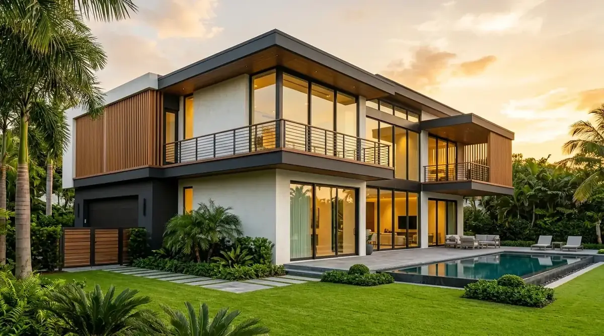
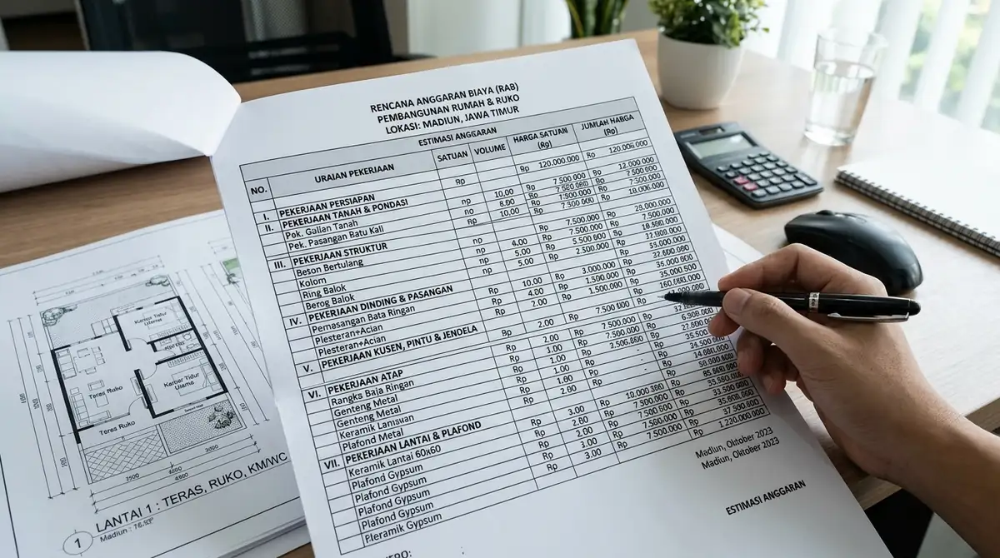
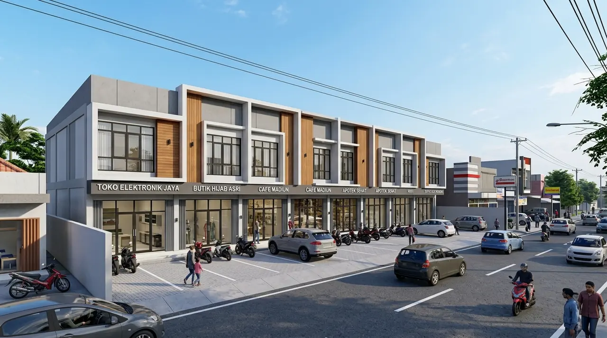
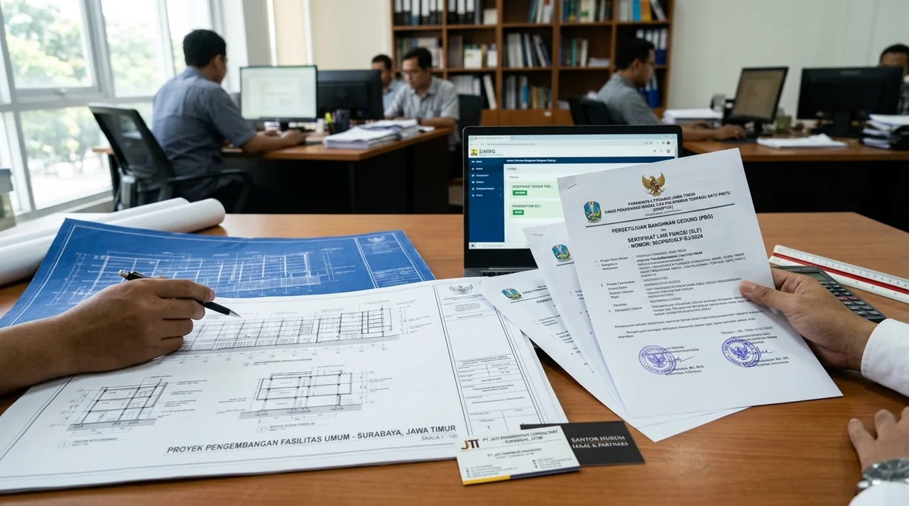
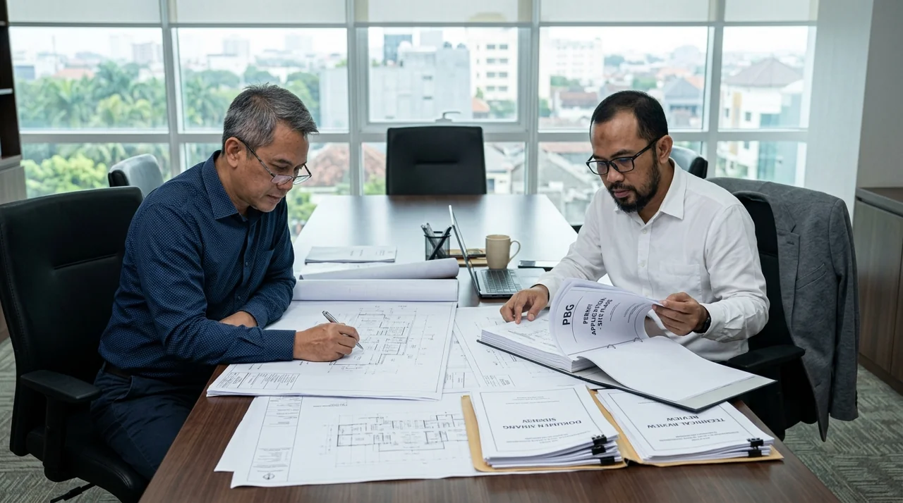

# Master SEO Content (3 Articles Konstruksi Madiun & Legalitas PBG/SLF Jawa Timur)
*Diterbitkan otomatis untuk publikasi 01 Oktober 2026*

---

# ARTIKEL 1: Jasa Kontraktor Bangunan & Rumah Tinggal Terpercaya di Madiun

```
Meta Title: Kontraktor Bangunan & Rumah Madiun Terpercaya Bergaransi
Slug: /blog/kontraktor-rumah-bangunan-madiun
Meta Description: Butuh jasa kontraktor bangunan dan rumah di Kota & Kab Madiun? Melayani bangun baru, renovasi hunian, ruko, kantor bergaransi SPK & desain arsitek gratis.
Focus Keyphrase: kontraktor bangunan madiun
Search Intent: Commercial / Transactional
Answer Intent: Rekomendasi Jasa / Portofolio / Rancang Bangun Rumah & Komersial
Primary Entity: Jasa Kontraktor Bangunan di Madiun
Secondary Entities: Kontraktor Rumah Tinggal Madiun, Jasa Renovasi Rumah Caruban Madiun, Bangun Ruko Madiun, Kontraktor Gedung Kantor Karesidenan Madiun
Query Fan-Out:
- Berapa tarif borongan jasa kontraktor rumah di wilayah Kota dan Kabupaten Madiun?
- Bagaimana cara memilih kontraktor bangunan terpercaya dengan perjanjian kontrak SPK di Madiun?
- Apa saja layanan yang ditawarkan kontraktor bangunan di koridor Madiun, Caruban, dan sekitarnya?
Audience: Pemilik tanah di Madiun, perantau asal Madiun yang ingin membangun rumah di kampung halaman, pengusaha lokal, dan instansi swasta di Madiun, Caruban, Magetan, Ngawi.
Suggested Schema: Article, Product, FAQPage, BreadcrumbList
Author: Tim Spesialis Kontraktor Bangunan
Last Updated: 2026-10-01
Images:
- /blog/kontraktor-rumah-bangunan-madiun-01.webp | Alt: Kontraktor bangunan madiun rancang bangun rumah minimalis modern berkualitas di Kota Madiun
- /blog/kontraktor-rumah-bangunan-madiun-02.webp | Alt: Pengerjaan struktur pondasi batu kali sloof beton bertulang dan dinding bata rumah di Madiun
```

# Jasa Kontraktor Bangunan & Rumah Tinggal Terpercaya di Madiun

**Jasa kontraktor bangunan di Madiun melayani rancang bangun rumah tinggal impian, ruko komersial, dan kantor dengan sistem borongan material berkualitas, gambar kerja DED lengkap, dan komitmen jadwal tepat waktu.**

Kota dan Kabupaten Madiun kini telah bertransformasi menjadi salah satu episentrum pertumbuhan ekonomi dan hunian modern di bagian barat Jawa Timur. Didukung oleh keterhubungan akses Tol Trans Jawa (Gerbang Tol Madiun dan Caruban), pembangunan properti di Madiun melonjak pesat. Masyarakat Madiun kian mengapresiasi pentingnya bekerja sama dengan perusahaan kontraktor berlegalitas resmi daripada mengandalkan tukang harian lepas yang sering kali berisiko mangkir atau menghasilkan struktur bangunan yang tidak terstandar.

### Ringkasan Inti
* **Layanan Terpadu One-Stop Solution:** Meliputi survei lahan, perancangan arsitektur 3D dan DED, pengurusan PBG, penyusunan RAB presisi, hingga pelaksanaan pembangunan bergaransi.
* **Material Standar SNI:** Pemilihan besi beton tulangan ulir SNI, semen gresik/holcim, batu bata merah bakar lokal berkualitas atau bata ringan berdaya isolasi tinggi.
* **Solusi Khusus Pemilik Luar Kota (Perantau):** Fasilitas pelaporan kemajuan proyek via video conference, foto dokumentasi berkala beresolusi tinggi, dan transparansi laporan mingguan.
* **Perjanjian SPK Mengikat Secara Hukum:** Melindungi hak dan kewajiban kedua belah pihak dengan kepastian jadwal penyelesaian kalender, rincian termin, dan klausul garansi retensi.

---

<h2 id="keunggulan-kontraktor-madiun">Mengapa Memilih Kontraktor Bangunan Profesional di Wilayah Madiun?</h2>

**Membangun bersama kontraktor resmi memberikan ketenangan pikiran, garansi kualitas struktur, dan efisiensi waktu pelaksanaan proyek.**

Keunggulan layanan Kontraktor Bangunan di wilayah Madiun Raya:
1. **Desain Arsitektur Modern Adaptif Iklim:** Perancangan rumah bernuansa tropis modern dengan ventilasi silang (*cross ventilation*), plafon tinggi peredam hawa panas, dan bukaan cahaya alami yang sehat.
2. **Pondasi Tahan Gempa Sesuai SNI 1726:** Perhitungan beban gempa zona Madiun menggunakan kombinasi pondasi batu belah menerus dan telapak cakar ayam bertulang.
3. **Komitmen Tanpa Biaya Tersembunyi:** Rencana Anggaran Biaya (RAB) disusun berdasarkan volume fisik riil dan Analisa Harga Satuan Pekerjaan (AHSP) yang jelas sebelum kontrak ditandatangani.


*Gambar 1: Hasil rancang bangun hunian minimalis modern 2 lantai berkualitas di wilayah Madiun.*

---

<h2 id="cakupan-layanan-madiun">Cakupan Layanan Konstruksi di Kota & Kabupaten Madiun</h2>

* **Pembangunan Rumah Tinggal Baru:** Bangun rumah 1 lantai atau 2 lantai dari nol di atas kavling perumahan maupun tanah pekarangan pribadi di Madiun, Jiwan, Taman, Kartoharjo, Manguharjo, hingga Caruban.
* **Pembangunan Ruko & Toko Komersial:** Konstruksi tempat usaha 2-3 lantai di jalan protokol Madiun dengan bukaan display kaca luas dan area parkir rapi.
* **Renovasi Total Rumah Tua:** Merombak rumah lama bergaya kolonial atau tradisional menjadi hunian modern fungsional tanpa merusak integritas struktur yang masih kokoh.
* **Pembangunan Fasilitas Publik & Gudang:** Workshop, tempat ibadah, klinik kesehatan, serta gudang penyimpanan komoditas agrobisnis di Madiun dan sekitarnya.


*Gambar 2: Proses pekerjaan pondasi dan pengecoran sloof beton bertulang rumah tinggal di Madiun.*

---

<h2 id="tabel-komparasi-madiun">Tabel Komparasi Bangun Rumah: Kontraktor Resmi vs Mandor Harian di Madiun</h2>

**Tabel perbandingan keamanan investasi pembangunan di wilayah Karesidenan Madiun.**

| Parameter Penilaian | Tukang / Mandor Harian Tradisional | Kontraktor Bangunan Profesional |
| :--- | :--- | :--- |
| **Dokumen Kontrak (SPK)** | Hanya janji lisan tanpa ikatan hukum sah | Kontrak resmi bermaterai lengkap dengan gambar teknis DED |
| **Kepastian Total Biaya** | Sering overbudget hingga 30% - 50% dari rencana | Biaya fix price terikat sesuai BoQ yang telah disetujui |
| **Ketepatan Waktu Kerja** | Rawan molor berbulan-bulan karena absensi tukang | Jadwal terkontrol Kurva S dengan target serah terima pasti |
| **Jaminan Garansi Purna Jual** | Tukang sulit dihubungi jika terjadi retak/bocor | Sertifikat masa retensi perbaikan gratis selama 6-12 bulan |
| **Bantuan Perizinan PBG** | Tidak menguasai gambar arsitektur standar SIMBG | Pendampingan penuh hingga sertifikat izin PBG resmi terbit |

---

<h2 id="faq">Pertanyaan yang Sering Diajukan (FAQ)</h2>

### Saya tinggal di luar kota/luar pulau, apakah bisa memantau pembangunan rumah di Madiun?
Sangat bisa! Banyak klien kami adalah warga asal Madiun yang berdinas di Jakarta, Kalimantan, atau luar negeri. Kami menyediakan laporan progres mingguan via foto, video drone, dan rapat evaluasi via Zoom/WhatsApp secara transparan.

### Berapa estimasi lama pembangunan rumah tinggal 1 lantai tipe 70 di Madiun?
Pembangunan rumah 1 lantai tipe 70 rata-rata memakan waktu 3 hingga 3,5 bulan kalender hingga selesai tahap pengecatan dan siap serah terima kunci.

### Bagaimana sistem pembayaran yang berlaku di Kontraktor Bangunan?
Pembayaran dilakukan secara bertahap (termin) sesuai prestasi progres fisik yang telah tercapai di lapangan (misal: termin pondasi, termin dinding & atap, termin finishing), sehingga sangat aman bagi pemilik rumah.

---

<h2 id="kesimpulan">Kesimpulan Praktis</h2>

Wujudkan bangunan impian Anda di Madiun bersama mitra kontraktor yang berpengalaman, berintegritas, dan menjamin kepuasan hasil akhir. Konsultasikan denah dan anggaran Anda hari ini bersama tim Kontraktor Bangunan!

---

# ARTIKEL 2: Estimasi Biaya Bangun Rumah & Ruko di Madiun per Meter Persegi 2026

```
Meta Title: Biaya Bangun Rumah & Ruko di Madiun 2026 per Meter Persegi
Slug: /blog/biaya-bangun-rumah-ruko-madiun
Meta Description: Cek estimasi biaya bangun rumah dan ruko di Madiun terbaru 2026. Analisa harga upah tukang lokal, material pondasi batu kali, bata merah vs ringan & simulasi RAB.
Focus Keyphrase: biaya bangun rumah madiun
Search Intent: Commercial / Informational
Answer Intent: Estimasi Harga / Rincian RAB per Meter / Simulasi Anggaran
Primary Entity: Estimasi Biaya Bangun Rumah di Madiun
Secondary Entities: Biaya Bangun Ruko Madiun 2026, Harga Borongan Rumah per m2 Madiun, Analisa RAB Rumah Minimalis Madiun, Harga Upah Tukang Bangunan Madiun
Query Fan-Out:
- Berapa rincian biaya bangun rumah per meter persegi di wilayah Madiun tahun 2026?
- Apa perbandingan biaya menggunakan bata merah lokal Madiun dibandingkan bata ringan?
- Berapa estimasi total anggaran untuk membangun rumah tipe 60 atau ruko 2 lantai di Madiun?
Audience: Calon pembangun rumah, pemilik tanah kavling di Madiun, pengusaha ruko komersial, dan keluarga yang sedang merencanakan RAB pembangunan hunian.
Suggested Schema: Article, Product, FAQPage, BreadcrumbList
Author: Tim Spesialis Kontraktor Bangunan
Last Updated: 2026-10-01
Images:
- /blog/biaya-bangun-rumah-ruko-madiun-01.webp | Alt: Biaya bangun rumah madiun rincian lembar estimasi rencana anggaran biaya rab rumah dan ruko
- /blog/biaya-bangun-rumah-ruko-madiun-02.webp | Alt: Jasa bangun ruko komersial modern 2 lantai di koridor perniagaan Madiun Jawa Timur
```

# Estimasi Biaya Bangun Rumah & Ruko di Madiun per Meter Persegi 2026

**Estimasi biaya bangun rumah dan ruko di wilayah Madiun pada tahun 2026 berkisar antara Rp 3.200.000 hingga Rp 4.500.000 per meter persegi, memberikan nilai efisiensi investasi yang sangat menarik berkat ketersediaan material lokal dan upah kerja kompetitif di Jawa Timur bagian barat.**

Menghitung estimasi biaya konstruksi secara cermat adalah langkah paling mendasar sebelum memulai pembangunan di Madiun. Tingkat harga di Madiun dipengaruhi oleh aksesibilitas material semen dan besi dari distributor Jawa Timur, serta keberadaan material agregat lokal seperti batu kali lereng Gunung Wilis dan industri genteng serta bata merah tradisional di sekitar Karesidenan Madiun.

### Ringkasan Inti
* **Klasifikasi Biaya per Meter:** Rumah standar minimalis Rp 3.200.000 – Rp 3.800.000/m², rumah menengah modern Rp 3.900.000 – Rp 4.500.000/m², dan ruko komersial Rp 3.400.000 – Rp 4.200.000/m².
* **Efisiensi Material Lokal:** Penggunaan bata merah lokal atau bata ringan berkualitas serta pasir pasang lokal dapat menekan biaya dinding dan pasangan plesteran.
* **Pondasi Batu Kali Kokoh:** Kondisi tanah Madiun yang umumnya stabil di area perkotaan memungkinkan optimalisasi pondasi batu belah menerus dengan efisiensi biaya yang tinggi.
* **Sistem Borongan All-In:** Menghindarkan risiko kenaikan harga material di toko bangunan lokal dengan mengunci harga kontrak di awal.

---

<h2 id="faktor-biaya-madiun">Faktor yang Mempengaruhi Biaya Bangun di Wilayah Madiun</h2>

1. **Topografi & Akses Jalan Lokasi:** Kavling di perumahan kota Madiun dengan jalan lebar mempermudah truk molen Ready Mix masuk, sedangkan lahan di gang sempit memerlukan pengadukan beton manual dengan rasio terukur.
2. **Pilihan Penutup Dinding (Bata Merah vs Bata Ringan):** Bata merah lokal Madiun memiliki kekokohan alami dan peredaman panas baik, sementara bata ringan memberikan kecepatan pasang dan kerataan dinding yang lebih presisi.
3. **Tipe Rangka & Penutup Atap:** Penggunaan rangka baja ringan galvalum tebal 0.75 mm SNI dipadukan genteng beton flat atau genteng tanah liat morando menjadi opsi paling diminati di Madiun.


*Gambar 1: Rincian estimasi anggaran biaya konstruksi rumah tinggal terencana di Madiun.*

---

<h2 id="simulasi-rab-tipe-60-madiun">Simulasi RAB Rumah Tinggal Tipe 60 di Kota Madiun</h2>

**Simulasi biaya pembangunan rumah 1 lantai dengan luas bangunan 60 m² (luas tanah 100 m²) kelas Menengah Nyaman di Madiun.**

| No | Pos Pekerjaan | Volume | Satuan | Harga Satuan (Rp) | Subtotal (Rp) |
| :---: | :--- | :---: | :---: | :---: | :---: |
| 1 | Pekerjaan Persiapan & Pengukuran Lahan | 1 | Ls | 7.500.000 | 7.500.000 |
| 2 | Pondasi Batu Belah & Kolom Praktis K-200 | 60 | m² | 420.000 | 25.200.000 |
| 3 | Struktur Beton Bertulang (Sloof, Kolom, Ringbalk) | 60 | m² | 650.000 | 39.000.000 |
| 4 | Pasangan Dinding Bata Ringan Citicon + Plester Aci | 180 | m² | 165.000 | 29.700.000 |
| 5 | Rangka Atap Baja Ringan C75 + Genteng Beton Flat | 75 | m² | 260.000 | 19.500.000 |
| 6 | Plafon Gypsum Rangka Hollow Galvalum | 60 | m² | 110.000 | 6.600.000 |
| 7 | Lantai Granit Tile 60x60 Polished & Keramik Kamar Mandi | 60 | m² | 340.000 | 20.400.000 |
| 8 | Kusen Aluminium 3 Inch & Pintu Kayu Solid | 1 | Ls | 18.000.000 | 18.000.000 |
| 9 | Instalasi Air, Pipa PVC, Kloset Duduk & Septic Tank | 1 | Ls | 16.500.000 | 16.500.000 |
| 10 | Instalasi Listrik Titik Lampu & Pengecatan Interior/Eksterior | 1 | Ls | 21.600.000 | 21.600.000 |
| **TOTAL** | **Estimasi Total Nilai Proyek (Turnkey Siap Huni)** | | | | **Rp 204.000.000** |

*Rata-rata biaya diperoleh adalah sekitar **Rp 3.400.000 / m²**, sangat rasional untuk spesifikasi hunian berkualitas tinggi di Madiun.*


*Gambar 2: Konstruksi ruko 2 lantai komersial berdaya tarik tinggi di jalur strategis perniagaan Madiun.*

---

<h2 id="faq">Pertanyaan yang Sering Diajukan (FAQ)</h2>

### Apakah harga per meter di atas bisa disesuaikan dengan bujet yang saya miliki?
Bisa. Tim estimator Kontraktor Bangunan dapat melakukan penyesuaian (*engineering cost tailoring*) pada tipe material finishing keramik, merk sanitari, atau ketebalan kusen agar sesuai dengan pagu anggaran Anda.

### Apakah ada biaya tambahan untuk survei lokasi kavling di Madiun?
Tidak ada. Layanan survei lokasi kavling dan konsultasi awal di seluruh wilayah Kota & Kabupaten Madiun kami berikan secara gratis tanpa komitmen.

### Bagaimana jika ada kenaikan harga material di toko selama proyek berjalan?
Dalam kontrak SPK sistem borongan turnkey, harga telah terkunci (*fixed price*). Kenaikan harga material di pasaran menjadi tanggung jawab kontraktor, sehingga anggaran Anda 100% terlindungi.

---

<h2 id="kesimpulan">Kesimpulan Praktis</h2>

Membangun hunian atau ruko impian di Madiun kini lebih mudah dan terkontrol bersama Kontraktor Bangunan. Dapatkan draf RAB resmi dan rancangan denah awal secara gratis dengan menghubungi konsultan kami sekarang juga!

---

# ARTIKEL 3: Jasa Pengurusan Izin PBG & SLF Bangunan Gedung di Seluruh Jawa Timur

```
Meta Title: Jasa Pengurusan Izin PBG & SLF Gedung Jawa Timur Terpercaya
Slug: /blog/jasa-pengurusan-pbg-slf-gedung-jatim
Meta Description: Jasa pengurusan PBG & SLF bangunan gedung di Jawa Timur (Surabaya, Gresik, Sidoarjo, Malang, Pasuruan). Gambar teknis arsitek STRA, perhitungan struktur SKA resmi.
Focus Keyphrase: pengurusan pbg slf jatim
Search Intent: Commercial / B2B Legal Consultation
Answer Intent: Panduan Legalitas / Rekomendasi Jasa Pengurusan / Syarat SIMBG
Primary Entity: Jasa Pengurusan PBG dan SLF Jawa Timur
Secondary Entities: Konsultan SIMBG Jawa Timur, Biaya Urus PBG Rumah Tinggal Jatim, Sertifikat Laik Fungsi SLF Gedung Surabaya Malang, Jasa Gambar DED Sidang PBG
Query Fan-Out:
- Berapa rincian biaya jasa pengurusan PBG dan SLF bangunan gedung di Jawa Timur?
- Apa saja persyaratan dokumen teknis yang wajib diunggah ke portal SIMBG Kementerian PUPR?
- Bagaimana tahapan sidang Tim Profesi Ahli (TPA) / Tim Penilai Teknis (TPT) untuk SLF gedung di Jatim?
Audience: Pemilik gedung perkantoran, hotel, rumah sakit, pabrik, gudang, ruko, dan pengembang perumahan di seluruh wilayah kabupaten/kota Jawa Timur.
Suggested Schema: Article, Product, FAQPage, BreadcrumbList
Author: Tim Spesialis Kontraktor Bangunan
Last Updated: 2026-10-01
Images:
- /blog/jasa-pengurusan-pbg-slf-gedung-jatim-01.webp | Alt: Pengurusan pbg slf jatim dokumen cetak biru arsitektur dan perizinan sistem simbg kementerian pupr
- /blog/jasa-pengurusan-pbg-slf-gedung-jatim-02.webp | Alt: Konsultan teknis arsitektur stra dan ahli struktur ska memeriksa kelengkapan berkas sidang izin pbg di Jawa Timur
```

# Jasa Pengurusan Izin PBG & SLF Bangunan Gedung di Seluruh Jawa Timur

**Jasa pengurusan PBG (Persetujuan Bangunan Gedung) dan SLF (Sertifikat Laik Fungsi) di Jawa Timur mendampingi pemilik gedung melewati verifikasi sistem SIMBG dengan berkas DED arsitektur, kalkulasi struktur tahan gempa, dan dokumen teknis MEP lengkap berlegalitas resmi.**

Sejak berlakunya Undang-Undang Cipta Kerja dan Peraturan Pemerintah No. 16 Tahun 2021, Izin Mendirikan Bangunan (IMB) telah resmi digantikan oleh Persetujuan Bangunan Gedung (PBG) serta kewajiban Sertifikat Laik Fungsi (SLF) bagi setiap bangunan yang beroperasi. Di berbagai kota dan kabupaten di Jawa Timur seperti Surabaya, Sidoarjo, Gresik, Pasuruan, Mojokerto, hingga Malang Raya, penegakan regulasi PBG dan SLF kini semakin ketat. Bangunan usaha atau gedung komersial tanpa SLF berisiko terkena sanksi administratif, denda operasional, hingga pencabutan izin usaha operasional.

### Ringkasan Inti
* **Layanan Terpadu SIMBG PUPR:** Pembuatan akun pemohon, pengunggahan berkas teknis, pendampingan sidang penilaian Tim Profesi Ahli (TPA/TPT), hingga terbit surat keputusan retribusi dan dokumen PBG/SLF.
* **Kelengkapan Dokumen Berkeabsahan Resmi:** Berkas gambar arsitektur ditandatangani arsitek berlisensi Surat Tanda Registrasi Arsitek (STRA), analisa struktur bertanda tangan SKA Struktur, dan berkas MEP ber-SKA Elektrikal/Mekanikal.
* **Kajian Teknis Laik Fungsi (*Technical Assessment*):** Uji keselamatan kebakaran (fire safety), uji beban plat lantai, uji kelayakan instalasi petir, serta uji kualitas air dan kelistrikan untuk penerbitan SLF gedung eksisting.
* **Jaminan Bebas Kendala Administratif:** Menghindarkan revisi berulang di dinas teknis Cipta Karya/PUPR setempat melalui standarisasi gambar format CAD/PDF yang sesuai pedoman SIMBG.

---

<h2 id="perbedaan-pbg-slf">Perbedaan Esensial Antara Dokumen PBG dan Dokumen SLF</h2>

**PBG adalah izin mendirikan atau merenovasi bangunan sebelum konstruksi fisik dimulai, sedangkan SLF adalah sertifikat kelaikan fungsi setelah bangunan selesai dan siap digunakan.**

1. **Persetujuan Bangunan Gedung (PBG):** Wajib dimiliki sebelum peletakan batu pertama pembangunan gedung baru, renovasi perubahan struktur, atau penambahan luas lantai bangunan.
2. **Sertifikat Laik Fungsi (SLF):** Wajib dimiliki sebelum gedung dioperasikan secara komersial. SLF membuktikan bahwa bangunan memenuhi standar keandalan keselamatan, kesehatan, kenyamanan, dan kemudahan sesuai fungsi tata ruang.
3. **Masa Berlaku SLF:** Berlaku selama 20 tahun untuk rumah tinggal tunggal, dan 5 tahun untuk bangunan gedung umum/komersial (pabrik, ruko, hotel, rumah sakit, mall) yang wajib diperpanjang berkala.


*Gambar 1: Dokumen teknis perencanaan arsitektur dan pengesahan perizinan bangunan gedung di portal SIMBG.*

---

<h2 id="dokumen-syarat-simbg">Persyaratan Dokumen Teknis Pengajuan PBG & SLF di Jawa Timur</h2>

**Daftar berkas teknis yang disiapkan oleh tim konsultan Kontraktor Bangunan:**

### 1. Dokumen Arsitektur
* Gambar denah tata ruang, tampak 4 sisi, potongan melintang & memanjang skala 1:100.
* Rencana denah pola lantai, denah plafon, rencana pintu dan jendela.
* Spesifikasi teknis arsitektur (*RKS Arsitektur*) bertanda tangan Arsitek berlisensi STRA.

### 2. Dokumen Struktur Bangunan
* Gambar denah pondasi, denah sloof, denah kolom, balok, dan plat lantai.
* Detail penulangan pembesian (*reinforcement details*) dan sambungan baja WF.
* Laporan kalkulasi rekayasa struktur software SAP2000 / ETABS / Tekla bertanda tangan Tenaga Ahli Struktur SKA/SKK.
* Hasil penyelidikan tanah (*Soil Investigation Report* / Uji Sondir CPT).

### 3. Dokumen Mekanikal, Elektrikal & Plambing (MEP)
* Gambar instalasi listrik, jalur penerangan, stop kontak, dan diagram satu garis (*Single Line Diagram*).
* Gambar instalasi air bersih, air kotor, pipa vent, dan detail septic tank biofil.
* Sistem proteksi petir konvensional/elektrostatik dan proteksi kebakaran (APAR, hidran sprinkler).


*Gambar 2: Pemeriksaan kelengkapan dokumen teknis DED bersama tenaga ahli berlisensi resmi.*

---

<h2 id="tabel-komparasi-biaya-pbg-slf">Tabel Estimasi Biaya Konsultan Pengurusan PBG & SLF di Jawa Timur</h2>

**Tabel acuan tarif jasa konsultan penyusunan berkas teknis dan pendampingan sidang SIMBG di kota/kabupaten Jawa Timur.**

| Klasifikasi Bangunan Gedung | Luas Bangunan | Dokumen Teknis yang Disiapkan | Estimasi Biaya Jasa Konsultan |
| :--- | :--- | :--- | :--- |
| **Rumah Tinggal Sederhana (1-2 Lantai)** | < 150 m² | DED Arsitektur, Struktur Sederhana, MEP Dasar | Rp 4.500.000 – Rp 8.000.000 |
| **Rumah Tinggal Mewah / Villa** | 150 – 500 m² | DED Lengkap STRA, Laporan Analisa Struktur SAP2000 | Rp 9.000.000 – Rp 18.000.000 |
| **Ruko Komersial (2-3 Lantai)** | 150 – 400 m² | DED Arsitektur, Struktur, MEP, Kajian Proteksi Damkar | Rp 12.000.000 – Rp 22.000.000 |
| **Gudang & Bangunan Pabrik** | 500 – 3.000 m² | DED Baja/Beton, Uji Tanah Sondir, Kajian Lingkungan | Rp 25.000.000 – Rp 50.000.000+ |
| **SLF Gedung Eksisting (Komersial/Kantor)**| > 1.000 m² | As-Built Drawing, NDT Hammer Test, Uji Kelaikan | Rp 30.000.000 – Rp 70.000.000+ |

*Catatan: Biaya di atas adalah biaya jasa konsultansi penyusunan gambar dan pendampingan sidang teknis; belum termasuk retribusi resmi daerah ke kas Pemkab/Pemkot setempat.*

---

<h2 id="faq">Pertanyaan yang Sering Diajukan (FAQ)</h2>

### Berapa lama proses pengurusan PBG melalui sistem SIMBG hingga terbit?
Jika dokumen teknis sudah lengkap dan sesuai standar sejak awal, proses verifikasi hingga sidang TPA/TPT dan penerbitan PBG di Jawa Timur rata-rata memakan waktu 20 hingga 30 hari kerja.

### Apakah bangunan yang sudah terlanjur berdiri tanpa IMB bisa mengurus PBG atau SLF?
Bisa! Untuk bangunan yang sudah berdiri eksisting, pengurusannya langsung diarahkan ke penerbitan Sertifikat Laik Fungsi (SLF) dengan melampirkan kajian audit kelaikan bangunan (*As-Built Drawing* dan uji keandalan struktur).

### Apakah jasa konsultan ini mencakup pengurusan izin lingkungan (SPPL / AMDAL)?
Ya, kami menyediakan paket lengkap yang mengintegrasikan penyusunan dokumen SPPL, UKL-UPL, atau AMDAL sesuai dengan Klasifikasi Baku Lapangan Usaha Indonesia (KBLI) peruntukan gedung Anda.

---

<h2 id="kesimpulan">Kesimpulan Praktis</h2>

Legalitas PBG dan SLF adalah pilar perlindungan hukum serta syarat mutlak kelancaran operasional bisnis properti Anda di Jawa Timur. Jangan biarkan investasi Anda terkendala masalah birokrasi perizinan. Percayakan penyusunan dokumen teknis dan pengurusan SIMBG Anda kepada tim konsultan berlisensi resmi Kontraktor Bangunan!
