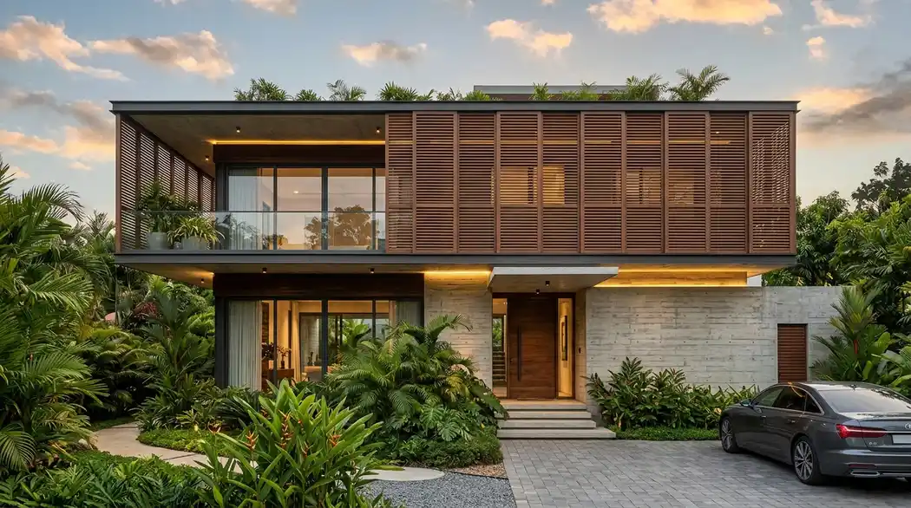
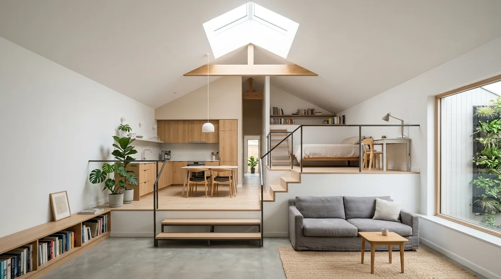
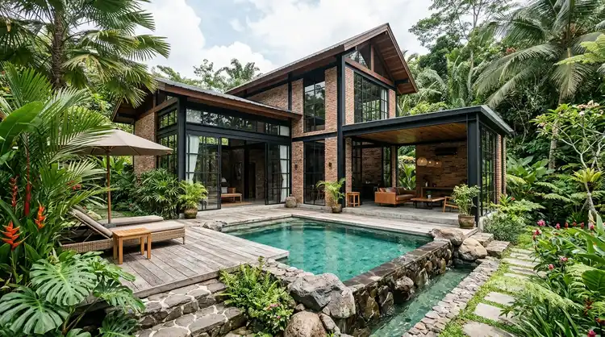

# Master SEO Content (3 Articles: Arsitektur Tropis Modern, Desain Split Level Lahan Sempit & Panduan Bangun Villa Bisnis)
*Diterbitkan untuk stok publikasi 05 Oktober 2026*

---

# ARTIKEL 1: Desain Rumah Tropis Modern Hemat Energi: Trik Ventilasi Silang & Secondary Skin

```
Meta Title: Desain Rumah Tropis Modern Hemat Energi: Tips Ventilasi & Fasad
Slug: /blog/desain-rumah-tropis-modern-hemat-energi
Meta Description: Inspirasi desain rumah tropis modern hemat energi. Trik sirkulasi ventilasi silang, secondary skin penangkal panas, inner courtyard & penghematan listrik AC.
Focus Keyphrase: desain rumah tropis modern
Focus Keyphrase In Title: Ya
Focus Keyphrase In Meta Description: Ya
Focus Keyphrase In First Paragraph: Ya
Search Intent: Informational / Design Inspiration
Answer Intent: Panduan Arsitektur Tropis Pasif / Strategi Pengurangan Suhu Ruangan Alami
Primary Entity: Desain Rumah Tropis Modern Hemat Energi
Secondary Entities: Ventilasi Silang (Cross Ventilation), Secondary Skin Fasad (Kisi Kayu/Aluminium), Inner Courtyard (Taman Tengah), Overhang Atap Lebar, Pencahayaan Alami Skylight
Query Fan-Out:
- Bagaimana cara merancang ventilasi silang agar rumah tetap sejuk tanpa AC menyala seharian?
- Apa material terbaik untuk secondary skin fasad rumah tropis tahan cuaca?
- Berapa derajat penurunan suhu ruangan dengan aplikasi inner courtyard terbuka di tengah rumah?
Audience: Pemilik rumah yang ingin membangun hunian sejuk ramah lingkungan, arsitek muda, dan pemerhati efisiensi energi.
Suggested Schema: Article, Service, FAQPage, BreadcrumbList
Author: Tim Spesialis Kontraktor Bangunan
Last Updated: 2026-10-05
Images:
- /blog/desain-rumah-tropis-modern-hemat-energi-01.webp | Alt: Desain rumah tropis modern fasad secondary skin kayu dan bukaan ventilasi silang asri
- /blog/desain-rumah-tropis-modern-hemat-energi-02.webp | Alt: Area inner courtyard taman tengah terbuka dengan void pencahayaan alami rumah tropis
```

# Desain Rumah Tropis Modern Hemat Energi: Trik Ventilasi Silang & Secondary Skin

**Penerapan konsep desain rumah tropis modern dengan optimalisasi ventilasi silang dan fasad secondary skin mampu menurunkan suhu ruangan hingga 3–5°C dan memangkas tagihan listrik AC secara signifikan.**

Tinggal di iklim tropis khatulistiwa dengan kelembapan tinggi dan paparan terik sinar matahari sepanjang tahun sering kali membuat penghuni rumah terjebak pada ketergantungan pendingin udara (AC) selama 24 jam penuh. Pola desain konvensional yang tertutup rapat tanpa mempertimbangkan orientasi pergerakan matahari dan aliran angin tidak hanya memicu pemborosan energi listrik, tetapi juga menciptakan ruangan yang pengap dan lembap. Arsitektur tropis modern mengombinasikan estetika kontemporer yang elegan dengan prinsip rekayasa bangunan pasif (*passive cooling system*) untuk kenyamanan termal optimal.

### Ringkasan Inti
* **Ventilasi Silang (Cross Ventilation):** Merancang bukaan jendela inlet (masuk) dan outlet (keluar) secara berseberangan untuk menciptakan sirkulasi udara dinamis yang terus berganti.
* **Fasad Secondary Skin:** Lapisan kisi-kisi terluar berbahan WPC, aluminium louvre, atau bata terakota yang memecah radiasi sinar matahari langsung tanpa menghalangi cahaya masuk.
* **Inner Courtyard & Void Terbuka:** Menghadirkan taman terbuka di area tengah rumah yang berfungsi sebagai paru-paru hunian dan pemicu efek cerobong udara panas (*stack effect*).
* **Overhang Atap Lebar:** Tritisan atap minimal 1,2–1,5 meter untuk memayungi dinding dari tampias hujan lebat dan sengatan radiasi panas siang hari.

---

<h2 id="elemen-arsitektur-tropis">4 Pilar Utama Arsitektur Rumah Tropis Hemat Energi</h2>

1. **Orientasi Massa Bangunan Terhadap Matahari:** Minimalkan bukaan dinding kaca besar yang menghadap langsung ke sisi barat (matahari sore). Sisi barat idealnya dilindungi oleh dinding masif, area servis, atau deretan tanaman peneduh.
2. **Fasad Lapisan Ganda (Secondary Skin):** Berfungsi sebagai tameng termal (*heat shield*) yang menyerap panas sebelum menyentuh dinding kaca kamar tidur.
3. **Plafon Tinggi (High Ceiling 3,8 – 4,5 Meter):** Udara panas memiliki massa jenis lebih ringan sehingga akan naik ke atas. Plafon tinggi menjaga area aktivitas lantai dasar tetap berhawa sejuk.
4. **Material Bernapas Ramah Lingkungan:** Penggunaan bata terakota ekspos, roster beton dekoratif, lantai teraso, dan panel kayu sintetis yang lambat menyerap panas.


*Gambar 1: Visualisasi fasad rumah tropis modern dengan elemen secondary skin kisi-kisi kayu sintetis.*

---

<h2 id="tabel-komparasi-suhu">Tabel Komparasi: Rumah Konvensional Tertutup vs Rumah Tropis Pasif</h2>

**Tabel perbandingan kenyamanan termal, kualitas udara, dan konsumsi energi rumah tangga.**

| Parameter Kinerja | Rumah Konvensional Tertutup | Rumah Tropis Modern (Passive Cooling) |
| :--- | :--- | :--- |
| **Sirkulasi Aliran Angin** | Statis, udara terjebak di dalam ruangan | Dinamis & mengalir lancar via ventilasi silang |
| **Ketergantungan AC Siang Hari** | Wajib menyala sepanjang hari (Boros listrik) | Minimal, udara alami sejuk terasa di dalam rumah |
| **Pencahayaan Alami Siang** | Gelap di area tengah, butuh lampu menyala | Terang benderang merata melalui void & skylight |
| **Kelembapan Udara Ruangan** | Cenderung lembap, rawan jamur dinding | Kering seimbang, pergantian udara segar konstan |
| **Estimasi Penghematan Listrik** | Tagihan listrik standar / tinggi | Penghematan daya listrik 30% – 50% per bulan |

---

<h2 id="faq">Pertanyaan yang Sering Diajukan (FAQ)</h2>

### Apakah rumah dengan banyak bukaan ventilasi silang akan mudah berdebu?
Tidak jika posisi bukaan dilengkapi dengan kawat nyamuk jaring *stainless steel* magnetik dan disaring oleh filter vegetasi hijau di taman depan serta area *inner courtyard*.

### Berapa biaya tambahan untuk membuat secondary skin pada fasad depan rumah?
Biaya pembuatan secondary skin berkisar antara Rp 650.000 hingga Rp 1.400.000 per m² tergantung material rangka (hollow galvanis) dan bahan bilah kisi-kisi (WPC Wood Plastic Composite atau perforated aluminium).

---

<h2 id="kesimpulan">Wujudkan Hunian Sejuk & Bernilai Estetika Tinggi</h2>

Mendesain rumah tropis membutuhkan sentuhan arsitektur yang paham perilaku iklim lokal. Rencanakan denah rumah tropis modern impian keluarga Anda bersama tim arsitek Kontraktor Bangunan!

---

# ARTIKEL 2: Desain Rumah Split Level di Lahan 6x12: Maksimalkan Ruang & Estetika Hunian Sempit

```
Meta Title: Desain Rumah Split Level Lahan 6x12: Solusi Lahan Sempit
Slug: /blog/desain-rumah-split-level-lahan-sempit
Meta Description: Panduan desain rumah split level di lahan sempit 6x12 meter. Trik pembagian zona tanpa sekat masif, ilusi ruang luas, tangga 1/2 lantai & efisiensi biaya struktur.
Focus Keyphrase: desain rumah split level lahan sempit
Focus Keyphrase In Title: Ya
Focus Keyphrase In Meta Description: Ya
Focus Keyphrase In First Paragraph: Ya
Search Intent: Informational / Architectural Ideas
Answer Intent: Panduan Tata Ruang Split Level / Denah Rumah Kompak Lahan Terbatas
Primary Entity: Desain Rumah Split Level Lahan Sempit (6x12 m)
Secondary Entities: Elevasi Setengah Lantai (Ketinggian 1.2 - 1.5 m), Konsep Open Space Tanpa Sekat, Mezzanine Serbaguna, Pencahayaan Void Tengah, Efisiensi Pondasi Lereng
Query Fan-Out:
- Apa keuntungan konsep split level dibanding rumah 2 lantai konvensional di lahan 6x12?
- Berapa perbedaan ketinggian lantai ideal untuk rumah split level agar tidak melelahkan saat naik tangga?
- Bagaimana menyiasati tata udara dan akustik rumah split level open space?
Audience: Pasangan muda pemilik kavling perkotaan 6x12 / 6x15 m, arsitek hunian urban, dan investor properti kompak.
Suggested Schema: Article, Service, FAQPage, BreadcrumbList
Author: Tim Spesialis Kontraktor Bangunan
Last Updated: 2026-10-05
Images:
- /blog/desain-rumah-split-level-lahan-sempit-01.webp | Alt: Desain rumah split level lahan sempit interior tangga setengah lantai dan void terbuka luas
- /blog/desain-rumah-split-level-lahan-sempit-02.webp | Alt: Denah tata ruang rumah split level ukuran 6x12 meter tampak samping arsitektur modern
```

# Desain Rumah Split Level di Lahan 6x12: Maksimalkan Ruang & Estetika Hunian Sempit

**Pilihan konsep desain rumah split level di lahan sempit 6x12 meter mampu menciptakan hingga 4–5 zona fungsi ruang berbeda dalam ketinggian 2 lantai tanpa terasa sempit dan sumpek.**

Tantangan utama memiliki lahan kavling berukuran 6x12 meter atau 6x15 meter di area perkotaan adalah keterbatasan luas tapak tanah. Jika dibangun dengan denah 2 lantai konvensional berpembatas dinding tebal, ruangan sering kali terasa sempit, gelap seperti lorong, dan terisolasi satu sama lain. Konsep *split level* menghadirkan pembagian zona ruang berdasarkan perbedaan elevasi ketinggian lantai setengah tingkat (sekitar 1,2 hingga 1,5 meter), sehingga menciptakan dinamika visual yang lapang, koneksi visual antar anggota keluarga yang hangat, dan sirkulasi cahaya alami yang melimpah.

### Ringkasan Inti
* **Definisi Split Level:** Penataan lantai di mana setiap tingkatan dinaikkan setengah tingkat ketinggian standar (berkisar 5–8 anak tangga per bordes).
* **Solusi Zonasi Tanpa Sekat Dinding:** Zona publik (ruang tamu/carport), semi-privat (ruang keluarga/dapur makan), dan privat (kamar tidur/ruang kerja) terpisah alami oleh elevasi lantai.
* **Pemanfaatan Ruang Bawah Tangga & Mezzanine:** Area bawah elevasi lantai 1,5 meter dapat dialihfungsikan secara cerdas menjadi gudang tersembunyi, area laundry, atau ruang baca anak (*reading nook*).
* **Hemat Biaya Urugan Tanah pada Kontur Miring:** Jika lahan Anda memiliki kemiringan kontur alami (*sloping land*), split level menghilangkan kebutuhan pekerjaan *cut and fill* tanah urug yang mahal.

---

<h2 id="keunggulan-split-level">Keunggulan Konsep Split Level untuk Lahan Kompak</h2>

* **Ilusi Ruang Jauh Lebih Luas:** Ketiadaan dinding masif penuh membuat mata memandang bebas dari ruang makan di lantai 1,5 hingga ke ruang santai keluarga di lantai 2.
* **Interaksi Keluarga yang Lebih Terjalin:** Orang tua di ruang dapur dapat tetap mengawasi anak yang sedang belajar di area mezzanine tanpa harus berteriak menaiki lantai atas.
* **Efisiensi Sirkulasi Tangga:** Tangga yang pendek (hanya 6–7 anak tangga per tingkat) terasa jauh lebih ringan dan tidak melelahkan didaki dibandingkan tangga 2 lantai biasa yang memiliki 18–20 anak tangga curam.


*Gambar 1: Interior rumah split level di lahan 6x12 meter dengan tangga pendek dan pencahayaan skylight.*

---

<h2 id="tabel-zonasi-split-level">Tabel Alur Zonasi Elevasi Split Level Lahan 6x12 Meter</h2>

**Tabel pembagian elevasi ketinggian lantai dan fungsi ruangan pada kavling 6x12 meter.**

| Tingkatan Level | Elevasi Ketinggian Lantai | Fungsi Ruangan Utama | Karakteristik Ruang |
| :--- | :--- | :--- | :--- |
| **Level 0 (Ground)** | ± 0.00 Meter | Carport 1 Mobil, Teras Depan, Foyer Tamu | Terbuka langsung ke area luar |
| **Level 1 (Semi-Raised)** | + 1.40 Meter | Dapur Bersih, Ruang Makan & Taman Kering Void | Pusat aktivitas harian keluarga |
| **Level 2 (Mid-Level)** | + 2.80 Meter | Ruang Keluarga Santai TV & 1 Kamar Tidur Anak | Semi-privat yang nyaman & tenang |
| **Level 3 (Top Level)** | + 4.20 Meter | Master Bedroom + Kamar Mandi Dalam & Walk-in Closet | Privat dengan balkon depan minimalis |
| **Level Mezzanine (Roof)**| + 5.60 Meter | Ruang Kerja (Home Office) / Rooftop Service | Pemandangan terbuka ke bawah void |

---

<h2 id="faq">Pertanyaan yang Sering Diajukan (FAQ)</h2>

### Apakah rumah split level ramah untuk anggota keluarga lanjut usia (lansia)?
Untuk lansia, disarankan menempatkan 1 kamar tidur di lantai dasar (Level 0 atau Level 1) yang dekat dengan kamar mandi tanpa banyak anak tangga, sementara kamar tidur anak diletakkan di level atas.

### Apakah biaya konstruksi split level lebih mahal dibanding rumah biasa?
Biaya strukturnya relatif mirip dengan rumah 2 lantai biasa. Perbedaannya hanya terletak pada perbanyakan balok sloof bordes dan perhitungan bekisting balok yang bertingkat. Namun, Anda menghemat banyak biaya dinding bata penyekat.

---

<h2 id="kesimpulan">Optimalkan Setiap Jengkal Lahan Sempit Anda</h2>

Rumah berukuran 6x12 meter bisa terasa seperti hunian mewah yang lapang dengan rancangan arsitektur split level yang tepat. Konsultasikan denah 3D rumah split level Anda bersama Kontraktor Bangunan sekarang!

---

# ARTIKEL 3: Panduan Bangun Villa & Homestay Estetik Konsep Industrial Tropis untuk Bisnis

```
Meta Title: Panduan Bangun Villa & Homestay Bisnis Konsep Industrial
Slug: /blog/panduan-bangun-villa-homestay-bisnis
Meta Description: Panduan lengkap bangun villa dan homestay bisnis konsep industrial tropis. Rahasia material ekspos estetik, private plunge pool anti bocor & estimasi balik modal (ROI).
Focus Keyphrase: panduan bangun villa homestay bisnis
Focus Keyphrase In Title: Ya
Focus Keyphrase In Meta Description: Ya
Focus Keyphrase In First Paragraph: Ya
Search Intent: Commercial / Business Investment
Answer Intent: Panduan Investasi Properti Sewa / Spesifikasi Teknis Villa Estetik
Primary Entity: Konstruksi Villa & Homestay Bisnis Pariwisata
Secondary Entities: Konsep Industrial Tropis (Exposed Concrete & Wood), Private Plunge Pool, Skema ROI Sewa Harian (Airbnb/Tiket), Material Low Maintenance, Pencahayaan Mood Lighting
Query Fan-Out:
- Berapa estimasi biaya bangun villa private pool tipe 1 & 2 bedroom untuk disewakan?
- Bagaimana spesifikasi konstruksi kolam renang plunge pool agar bebas rembes di lantai 2?
- Material apa yang paling estetik dan minim perawatan untuk homestay pariwisata?
Audience: Investor properti villa, pengusaha perhotelan/homestay, pemilik lahan di kawasan wisata (Batu, Banyuwangi, Trawas, Pacet, Yogyakarta, Bali).
Suggested Schema: Article, Product, FAQPage, BreadcrumbList
Author: Tim Spesialis Kontraktor Bangunan
Last Updated: 2026-10-05
Images:
- /blog/panduan-bangun-villa-homestay-bisnis-01.webp | Alt: Panduan bangun villa homestay bisnis konsep industrial tropis dengan private plunge pool
- /blog/panduan-bangun-villa-homestay-bisnis-02.webp | Alt: Interior kamar tidur villa estetik dinding semen unfinish dan pintu kaca geser aluminium
```

# Panduan Bangun Villa & Homestay Estetik Konsep Industrial Tropis untuk Bisnis

**Mengikuti panduan bangun villa homestay bisnis dengan arsitektur industrial tropis yang tepat mampu menciptakan daya tarik visual tinggi (*Instagrammable*) sekaligus mengoptimalkan *occupancy rate* dan percepatan titik balik modal (ROI) dalam 3–5 tahun.**

Bisnis akomodasi liburan seperti *boutique villa*, *glamping*, dan *homestay staycation* di berbagai destinasi wisata Jawa Timur dan sekitarnya (seperti Kota Batu, Bromo, Trawas, Tretes, hingga Banyuwangi) terus mencatatkan pertumbuhan okupansi yang sangat menggiurkan. Wisatawan modern saat ini tidak lagi sekadar mencari tempat tidur, melainkan mendambakan *experience* menginap yang unik dengan estetika visual menawan untuk dibagikan di media sosial. Gaya arsitektur industrial tropis—yang memadukan kekokohan material ekspos semen poles, aksen besi hitam, dinding bata terakota, dan kehijauan taman tropis—menjadi pilihan terpopuler karena biaya konstruksinya efisien dan perawatannya sangat mudah.

### Ringkasan Inti
* **Daya Tarik Visual Unik:** Sentuhan dinding *unfinished concrete* dengan *sealer matte*, lantai teraso/semen ekspos, dan partisi kaca besi melahirkan atmosfer tenang dan mewah (*modern rustic*).
* **Fasilitas Wajib Peningkat Tarif Sewa:** Keberadaan kolam renang mini (*private plunge pool*), kamar mandi semi-terbuka (*open-air bathtub*), dan *sunken lounge* mampu menaikkan tarif sewa harian hingga 200%.
* **Material Tahan Cuaca & Rendah Perawatan:** Menggunakan kayu ulin/bengkirai *treatment* anti rayap, decking WPC tahan air, dan kusen aluminium anodized yang bebas dari risiko lapuk dimakan usia.
* **Analisa Kelayakan Finansial (ROI):** Rata-rata tingkat keterisian (*occupancy*) 60–75% per bulan mampu menghasilkan pengembalian modal investasi konstruksi dalam waktu 3,5 hingga 5 tahun.

---

<h2 id="fitur-kunci-villa-laris">3 Fitur Konstruksi yang Paling Dicari Tamu Wisatawan</h2>

1. **Private Plunge Pool dengan Finishing Batu Alam Andesit / Sukabumi:** Kolam berukuran kompak (3x5 meter atau 2,5x6 meter) dengan kedalaman 1,2 meter memberikan kesan eksklusif tanpa menyita banyak lahan dan hemat biaya pengurasan air.
2. **Koneksi Ruang Luar-Dalam (Seamless Indoor-Outdoor Living):** Pintu geser lipat kaca aluminium berukuran besar yang menghubungkan ruang santai langsung ke dek tepi kolam renang.
3. **Kamar Mandi Semi-Outdoor Tropis:** Dilengkapi shower siram hujan (*rain shower*), tabung *freestanding bathtub*, taburan batu koral putih, dan tanaman monstera hijau segar.


*Gambar 1: Portofolio rancang bangun villa industrial tropis dengan private pool estetik.*

---

<h2 id="tabel-simulasi-roi">Tabel Simulasi Finansial & Estimasi Biaya Bangun Villa 2 Kamar</h2>

**Tabel estimasi biaya modal konstruksi dan proyeksi pendapatan sewa tahunan villa private pool.**

| Komponen Investasi & Pendapatan | Villa Standard 1-Bedroom (LB 45 m²) | Villa Premium 2-Bedroom (LB 85 m² + Pool) |
| :--- | :--- | :--- |
| **Estimasi Biaya Konstruksi Bangunan** | Rp 165.000.000 (Rp 3,6 Jt/m²) | Rp 340.000.000 (Rp 4,0 Jt/m²) |
| **Biaya Plunge Pool & Decking Kayu** | Rp 45.000.000 (Ukuran 2x4 m) | Rp 75.000.000 (Ukuran 3x6 m) |
| **Paket Interior & Furnishing Industrial** | Rp 40.000.000 | Rp 85.000.000 |
| **Total Estimasi Modal Awal** | **Rp 250.000.000** | **Rp 500.000.000** |
| **Tarif Sewa Rata-Rata per Malam** | Rp 650.000 / malam | Rp 1.450.000 / malam |
| **Proyeksi Okupansi Bulanan (65%)** | 19–20 malam / bulan | 19–20 malam / bulan |
| **Gross Pendapatan per Tahun** | Rp 152.100.000 / tahun | Rp 339.300.000 / tahun |
| **Estimasi Titik Balik Modal (ROI)** | **± 2,5 – 3,2 Tahun** | **± 2,8 – 3,5 Tahun** |

---

<h2 id="faq">Pertanyaan yang Sering Diajukan (FAQ)</h2>

### Apakah dinding semen ekspos unfinished tidak akan berdebu atau retak?
Pada konstruksi profesional, dinding semen ekspos dilapisi cairan kimia *clear penetrating sealer* (berbahan polyurethane atau acrylic matte) yang mengikat partikel semen, mencegah keluarnya debu, dan tahan terhadap cipratan air.

### Bagaimana mencegah kebocoran kolam renang plunge pool di area tanah gembur?
Konstruksi kolam renang wajib menggunakan plat beton bertulang K-300 sistem cor monolit (lantai dan dinding dicor bersamaan) yang dipasangi karet *waterstop* pada celah dilatasi dan dilapisi *waterproofing cementitious flexible* 3 lapis sebelum pemasangan keramik batu alam.

---

<h2 id="kesimpulan">Siap Membangun Villa Bisnis yang Menguntungkan?</h2>

Wujudkan aset properti sewa bernilai tinggi dengan desain estetik dan konstruksi kokoh bersama tim perancang Kontraktor Bangunan. Hubungi kami untuk konsultasi layout dan hitungan RAB sekarang!
