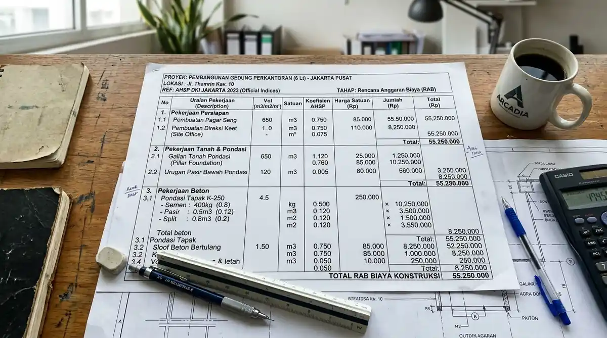
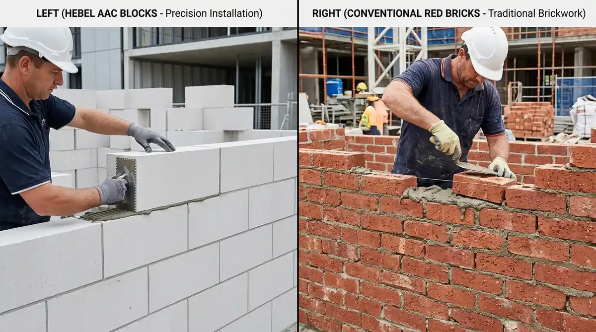

# Master SEO Content (3 Articles: Panduan Menghitung RAB AHSP, Borongan All-In vs Tenaga & Komparasi Material Dinding)
*Diterbitkan untuk stok publikasi 07 Oktober 2026*

---

# ARTIKEL 1: Cara Menghitung RAB Bangun Rumah Sendiri dengan Standar AHSP PUPR 2026

```
Meta Title: Cara Menghitung RAB Bangun Rumah Sendiri Standar AHSP 2026
Slug: /blog/cara-menghitung-rab-bangun-rumah-ahsp
Meta Description: Panduan praktis cara menghitung RAB bangun rumah sendiri menggunakan standar AHSP PUPR 2026. Rumus volume m3/m2, koefisien upah material & template BoQ anti boncos.
Focus Keyphrase: cara menghitung rab bangun rumah
Focus Keyphrase In Title: Ya
Focus Keyphrase In Meta Description: Ya
Focus Keyphrase In First Paragraph: Ya
Search Intent: Informational / Practical Tutorial
Answer Intent: Panduan Perhitungan Biaya / Rumus Volume Pekerjaan / Standarisasi AHSP PUPR
Primary Entity: Rencana Anggaran Biaya (RAB) Bangun Rumah Standar AHSP
Secondary Entities: Analisa Harga Satuan Pekerjaan (AHSP), Bill of Quantities (BoQ), Koefisien Bahan dan Upah SNI, Volume Galian dan Pembetonan, Biaya Tak Terduga (Contingency 5-10%)
Query Fan-Out:
- Bagaimana rumus menghitung volume pekerjaan pondasi, sloof, dan dinding bata?
- Apa itu koefisien pengali AHSP dalam menyusun anggaran biaya proyek rumah?
- Bagaimana cara mencegah pembengkakan biaya (cost overrun) saat membangun rumah sendiri?
Audience: Pemilik rumah perencana mandiri, calon pengembang kavling, mahasiswa teknik sipil, dan mandor pelaksana.
Suggested Schema: Article, Service, FAQPage, BreadcrumbList
Author: Tim Spesialis Kontraktor Bangunan
Last Updated: 2026-10-07
Images:
- /blog/cara-menghitung-rab-bangun-rumah-ahsp-01.webp | Alt: Cara menghitung rab bangun rumah lembar kerja excel analisa harga satuan pekerjaan ahsp
- /blog/cara-menghitung-rab-bangun-rumah-ahsp-02.webp | Alt: Pemeriksaan gambar kerja ded arsitektur untuk perhitungan volume take-off material
```

# Cara Menghitung RAB Bangun Rumah Sendiri dengan Standar AHSP PUPR 2026

**Memahami cara menghitung RAB bangun rumah sendiri menggunakan pedoman Analisa Harga Satuan Pekerjaan (AHSP) Kementerian PUPR adalah perlindungan terbaik dari jebakan kontraktor nakal dan risiko proyek mangkrak akibat kekurangan dana.**

Salah satu momok terbesar bagi siapa pun yang hendak membangun rumah impian adalah terjadinya lonjakan anggaran (*cost overrun*) di tengah proses pengerjaan. Banyak orang hanya mengandalkan "hitungan tebak-tebakan" atau patokan kasar harga per meter persegi dari tukang harian. Kenyataannya, setiap detail bentuk arsitektur, kedalaman pondasi tanah, dan spesifikasi merek material memiliki harga satuan riil yang berbeda. Dengan menyusun Rencana Anggaran Biaya (RAB) berbasis rincian volume (*take-off quantity*) dan tabel AHSP resmi, Anda memegang kendali penuh atas setiap rupiah yang dibelanjakan.

### Ringkasan Inti
* **Struktur Rumus Dasar RAB:** Total Biaya = Volume Pekerjaan (m³, m², m', unit, Ls) × Harga Satuan Pekerjaan (HSP).
* **Komponen AHSP SNI:** Terdiri dari rincian koefisien kebutuhan material bahan, koefisien indeks tenaga kerja tukang/pekerja, serta persentase overhead dan profit.
* **Tahapan Penyusunan Sistematis:** Dimulai dari pekerjaan persiapan, struktur bawah (*pondasi & sloof*), struktur atas (*kolom, balok, dak*), pasangan dinding & plesteran, atap, mekanikal-elektrikal, hingga pekerjaan finishing cat dan lantai.
* **Penyediaan Dana Kontingensi (5–10%):** Alokasi anggaran cadangan wajib untuk mengantisipasi perubahan harga pasar material atau penyesuaian teknis tak terduga di lapangan.

---

<h2 id="rumus-volume-pekerjaan">Panduan Menghitung Volume 4 Pekerjaan Utama Rumah</h2>

1. **Volume Galian Tanah Pondasi (m³):**  
   *Rumus:* `Panjang Pondasi (m) × Rata-Rata Lebar Galian (m) × Kedalaman Galian (m)`  
   *Contoh:* Pondasi sepanjang 45 meter dengan lebar galian 0,8 m dan dalam 0,8 m = `45 × 0,8 × 0,8 = 28,8 m³`.
2. **Volume Struktur Balok Sloof Beton (m³):**  
   *Rumus:* `Panjang Sloof (m) × Lebar Balok (m) × Tinggi Balok (m)`  
   *Contoh:* Sloof 15/20 sepanjang 45 meter = `45 × 0,15 × 0,20 = 1,35 m³ beton cor`.
3. **Volume Pasangan Dinding Bata Ringan (m²):**  
   *Rumus:* `(Keliling Dinding × Tinggi Dinding) - (Luas Total Pintu & Jendela)`.
4. **Volume Rangka & Penutup Plafon Gypsum (m²):**  
   *Rumus:* `Panjang Ruangan (m) × Lebar Ruangan (m) × Faktor Kemiringan/Drop Ceiling (1,05 – 1,15)`.


*Gambar 1: Contoh lembar kerja penyusunan RAB berbasis tabel AHSP terperinci.*

---

<h2 id="tabel-contoh-ahsp">Tabel Contoh Perhitungan Harga Satuan: 1 m² Pasangan Dinding Bata Ringan Hebel (Tebal 10 cm)</h2>

**Tabel rincian koefisien bahan dan upah standar AHSP untuk 1 meter persegi dinding bata ringan.**

| Uraian Kebutuhan | Satuan | Koefisien Indeks | Estimasi Harga Satuan (Rp) | Subtotal Harga (Rp) |
| :--- | :---: | :---: | :---: | :---: |
| **A. Material Bahan** | | | | |
| Bata Ringan AAC 10 cm | m³ | 0,1000 | Rp 680.000 / m³ | Rp 68.000 |
| Semen Instan Thin Bed (Perekat) | kg | 4,0000 | Rp 2.200 / kg | Rp 8.800 |
| Air Kerja | liter | 4,0000 | Rp 150 / liter | Rp 600 |
| **B. Upah Tenaga Kerja** | | | | |
| Pekerja Terampil | OH | 0,1500 | Rp 110.000 / hari | Rp 16.500 |
| Tukang Batu Berpengalaman | OH | 0,1000 | Rp 140.000 / hari | Rp 14.000 |
| Mandor / Pengawas Lapangan | OH | 0,0150 | Rp 160.000 / hari | Rp 2.400 |
| **TOTAL HARGA SATUAN** | **Per 1 m² Dinding Pasang** | | | **Rp 110.300 / m²** |

---

<h2 id="faq">Pertanyaan yang Sering Diajukan (FAQ)</h2>

### Di mana saya bisa mengunduh data indeks koefisien AHSP terbaru?
Data AHSP diterbitkan resmi secara berkala oleh Kementerian PUPR melalui Peraturan Menteri PUPR terkait Standar Pedoman Analisis Harga Satuan Pekerjaan Bidang Umum dan Cipta Karya.

### Mengapa harga borongan kontraktor resmi bisa lebih tinggi dari hitungan material murni?
Kontraktor resmi memperhitungkan biaya sewa alat berat, asuransi keselamatan kerja K3 pekerja, gaji *site engineer* pengawas, manajemen retensi garansi 1 tahun, serta kewajiban pajak resmi. Hal ini memberikan jaminan ketenangan pikiran (*peace of mind*) bagi Anda.

---

<h2 id="kesimpulan">Ingin RAB yang Akurat dan Terperinci Tanpa Pusing?</h2>

Tim estimator Kontraktor Bangunan siap membantu Anda menyusun BoQ dan RAB profesional berbasis gambar DED lengkap. Hubungi layanan konsultasi kami hari ini!

---

# ARTIKEL 2: Sistem Borongan All-In vs Borongan Tenaga: Kelebihan, Risiko & Cara Memilih

```
Meta Title: Borongan All-In vs Borongan Tenaga: Mana Paling Hemat?
Slug: /blog/borongan-all-in-vs-borongan-tenaga-bangunan
Meta Description: Pilih sistem borongan all-in atau borongan tenaga kerja saja? Ketahui perbandingan biaya, risiko material terbuang, waktu pengawasan & tips kontrak SPK aman.
Focus Keyphrase: borongan all in vs borongan tenaga
Focus Keyphrase In Title: Ya
Focus Keyphrase In Meta Description: Ya
Focus Keyphrase In First Paragraph: Ya
Search Intent: Commercial / Informational
Answer Intent: Analisis Perbandingan Sistem Kontrak Konstruksi / Panduan Memilih Jasa Bangun
Primary Entity: Sistem Kontrak Bangun Rumah (Borongan All-In vs Borongan Upah Tenaga)
Secondary Entities: Pemborong Material, Material Wastage (Sisa Terbuang), Pengawasan Harian, Perjanjian Kerja SPK, Masa Garansi Retensi
Query Fan-Out:
- Apa kekurangan memilih sistem borongan tenaga jika pemilik rumah sibuk bekerja?
- Berapa rata-rata persentase material terbuang (waste material) saat beli bahan sendiri?
- Bagaimana memastikan kualitas material pada sistem borongan all-in tidak diturunkan kontraktor?
Audience: Calon pemilik rumah yang bingung menentukan metode kontrak borongan, keluarga pekerja sibuk, dan investor properti.
Suggested Schema: Article, Service, FAQPage, BreadcrumbList
Author: Tim Spesialis Kontraktor Bangunan
Last Updated: 2026-10-07
Images:
- /blog/borongan-all-in-vs-borongan-tenaga-bangunan-01.webp | Alt: Borongan all in vs borongan tenaga proses penandatanganan spk dan pengawasan material di lapangan
- /blog/borongan-all-in-vs-borongan-tenaga-bangunan-02.webp | Alt: Tim tukang konstruksi sedang melakukan pekerjaan pemasangan dinding dan plesteran
```

# Sistem Borongan All-In vs Borongan Tenaga: Kelebihan, Risiko & Cara Memilih

**Keputusan memilih sistem borongan all-in vs borongan tenaga harus disesuaikan dengan ketersediaan waktu pengawasan, pemahaman teknis material bangunan, serta tingkat toleransi risiko keuangan Anda.**

Saat merencanakan renovasi atau membangun rumah baru, perdebatan klasik yang selalu muncul adalah: *"Lebih baik beli material sendiri lalu sewa tukang borongan upah tenaga, atau serahkan semuanya kepada kontraktor dengan sistem borongan all-in material + jasa?"* Banyak orang beranggapan membeli material sendiri akan jauh lebih murah karena tidak ada margin keuntungan kontraktor. Namun, di lapangan, faktor material terbuang (*material wastage*), salah hitung kebutuhan semen/besi, toko bangunan yang kehabisan stok sehingga tukang menganggur dibayar, sering kali membuat total biaya melesat jauh lebih tinggi dari perkiraan awal.

### Ringkasan Inti
* **Borongan Upah Tenaga Saja:** Anda bertanggung jawab 100% atas pengadaan seluruh material dari semen hingga paku terkecil; kontraktor/mandor hanya menagih ongkos kerja per meter persegi atau per item pekerjaan.
* **Borongan All-In (Turnkey):** Kontraktor menyediakan seluruh tenaga kerja ahli, alat berat, material sesuai spesifikasi merek di SPK, dan manajemen pengawasan hingga terima kunci.
* **Faktor Waktu & Tenaga:** Borongan tenaga menyita 3–5 jam waktu harian Anda untuk mondar-mandir ke toko bangunan dan mengecek sisa material di lokasi.
* **Perlindungan Hukum & Garansi:** Borongan all-in pada kontraktor berbadan hukum dilindungi kontrak SPK dengan klausul spesifikasi material terkunci (*fixed price*) dan sertifikat garansi purna jual 6–12 bulan.

---

<h2 id="tabel-komparasi-borongan">Tabel Komparasi Menyeluruh: Borongan All-In vs Borongan Tenaga</h2>

**Tabel perbandingan keuntungan, risiko, dan komitmen waktu pemilik rumah.**

| Aspek Penilaian | Sistem Borongan All-In (Bahan + Jasa) | Sistem Borongan Tenaga (Upah Kerja Saja) |
| :--- | :--- | :--- |
| **Keterlibatan Waktu Anda** | Sangat Rendah (Cukup pantau laporan mingguan) | Sangat Tinggi (Wajib pantau suplai bahan harian) |
| **Risiko Material Sisa (Waste)** | Ditanggung penuh oleh kontraktor pelaksana | Ditanggung 100% oleh pemilik rumah (Rugi bahan) |
| **Harga Beli Material** | Murah harga grosir distributor rekanan kontraktor | Harga eceran toko bangunan konvensional |
| **Kepastian Total Anggaran** | Terkunci pasti dalam dokumen kontrak SPK | Cenderung membengkak jika proyek molor |
| **Pengawasan Teknis Mutu** | Dilakukan oleh Site Engineer / Pengawas Proyek | Wajib Anda awasi sendiri kualitas adukannya |
| **Garansi Bangunan Bocor/Retak** | Garansi resmi tertulis bermaterai (6-12 bulan) | Hampir tidak ada garansi setelah upah dibayar lunas |
| **Kesesuaian Profil Pemilik** | Orang sibuk, profesional kantor, pengusaha | Memiliki waktu luang, paham dunia konstruksi |

---

<h2 id="tips-kontrak-all-in-aman">Tips Memilih Kontraktor Borongan All-In yang Jujur & Aman</h2>

* **Wajibkan Lampiran Spesifikasi Rinci di SPK:** Cantumkan merek semen (misal: Gresik/Holcim), diameter besi beton (misal: Ulir D13 Full SNI), merek cat (misal: Dulux/Jotun), dan merek keramik granit secara eksplisit.
* **Sistem Pembayaran Bertahap (Termin Prestasi):** Jangan pernah membayar lunas di depan. Pembayaran dibagi dalam 4–5 termin sesuai pencapaian progres opname fisik di lapangan (misal: DP 20%, Pondasi-Struktur 30%, Dinding-Atap 25%, Finishing 20%, Retensi 5%).


*Gambar 1: Proses penandatanganan kontrak kerja resmi SPK borongan all-in bersama kontraktor.*

---

<h2 id="faq">Pertanyaan yang Sering Diajukan (FAQ)</h2>

### Apakah saya boleh mengganti spesifikasi material di tengah proses borongan all-in?
Boleh, setiap perubahan spesifikasi merek atau material akan dihitung dalam lembar *Addendum* resmi (pekerjaan tambah/kurang) yang disepakati bersama sebelum dipasang.

### Mengapa membeli material sendiri sering kali menghasilkan banyak sisa yang terbuang?
Karena toko material eceran menjual dalam ukuran standar (misal: besi lonjoran 12 meter, tripleks lembaran). Potongan sisa besi yang salah potong (*cutting loss*) dan semen yang membatu akibat terlambat dipakai menjadi kerugian murni pemilik rumah.

---

<h2 id="kesimpulan">Pilihan Cerdas untuk Hunian Tanpa Stres</h2>

Jika Anda menghargai waktu berharga Anda dan menginginkan jaminan hasil bergaransi, sistem borongan all-in bersama Kontraktor Bangunan adalah solusi paling tepat dan aman.

---

# ARTIKEL 3: Bata Merah vs Bata Ringan Hebel vs Batako: Analisa Kekuatan, Kecepatan Pasang & Biaya

```
Meta Title: Bata Merah vs Bata Ringan vs Batako: Kuat, Cepat & Biaya
Slug: /blog/bata-merah-vs-bata-ringan-hebel-batako
Meta Description: Perbandingan bata merah press vs bata ringan Hebel (AAC) vs batako semen. Analisa kuat tekan, isolasi panas suara, kecepatan pengerjaan & perbandingan biaya/m2.
Focus Keyphrase: bata merah vs bata ringan
Focus Keyphrase In Title: Ya
Focus Keyphrase In Meta Description: Ya
Focus Keyphrase In First Paragraph: Ya
Search Intent: Informational / Material Comparison
Answer Intent: Komparasi Teknis Material Dinding / Perhitungan Total Biaya Plester Acian
Primary Entity: Perbandingan Material Dinding Rumah (Bata Merah, Bata Ringan Hebel, Batako)
Secondary Entities: Autoclaved Aerated Concrete (AAC), Kuat Tekan (N/mm²), Semen Mortar Instan, Konduktivitas Termal, Beban Struktur Gempa
Query Fan-Out:
- Mana yang lebih hemat biaya total dinding jadi antara bata merah dan bata ringan Hebel?
- Mengapa rumah dengan dinding bata ringan terasa lebih sejuk dan kedap suara?
- Apakah batako semen aman untuk dinding rumah tinggal 2 lantai?
Audience: Calon pemilik rumah, mandor bangunan, arsitek interior, dan pengembang properti.
Suggested Schema: Article, Product, FAQPage, BreadcrumbList
Author: Tim Spesialis Kontraktor Bangunan
Last Updated: 2026-10-07
Images:
- /blog/bata-merah-vs-bata-ringan-hebel-batako-01.webp | Alt: Bata merah vs bata ringan hebel perbandingan fisik dan kerapian pemasangan dinding
- /blog/bata-merah-vs-bata-ringan-hebel-batako-02.webp | Alt: Tukang sedang memasang bata ringan hebel menggunakan semen instan thin bed
```

# Bata Merah vs Bata Ringan Hebel vs Batako: Analisa Kekuatan, Kecepatan Pasang & Biaya

**Menentukan pilihan antara bata merah vs bata ringan Hebel (AAC) atau batako semen harus mempertimbangkan beban struktur pada pondasi gempa, kecepatan pemasangan per hari, serta total biaya dinding jadi hingga plesteran.**

Dinding merupakan salah satu pos anggaran terbesar dalam pembangunan rumah, memakan sekitar 15% hingga 20% dari total biaya konstruksi. Banyak pemilik rumah masih terjebak pada mitos lama bahwa bata merah konvensional selalu lebih kokoh dan lebih murah dibanding bata ringan Hebel (*Autoclaved Aerated Concrete*). Namun, jika dihitung secara komprehensif mencakup ketebalan plesteran, upah tukang per hari, dan efisiensi dimensi struktur balok beton, bata ringan modern sering kali menawarkan efisiensi biaya dan performa insulasi termal yang jauh lebih unggul.

### Ringkasan Inti
* **Bata Ringan Hebel (AAC):** Memiliki bobot 3 kali lebih ringan dibanding bata merah, memangkas beban gempa pada pondasi, serta memiliki permukaan presisi yang hanya butuh plester acian tipis (*thin bed*).
* **Bata Merah Konvensional:** Memiliki kuat tekan padat yang baik, mudah dipaku untuk gantungan beban berat tanpa *fisher* khusus, namun dimensinya tidak seragam dan membutuhkan plesteran tebal 2–3 cm.
* **Batako Semen Press:** Paling murah dari segi harga satuan dan cepat dipasang karena ukurannya besar, namun mudah menyerap air, getas, dan meneruskan panas matahari ke dalam ruangan.
* **Kecepatan Pemasangan:** 1 orang tukang mampu memasang hingga 20–25 m² bata ringan per hari, dibandingkan hanya 6–8 m² bata merah per hari.

---

<h2 id="tabel-komparasi-material-dinding">Tabel Komparasi Teknis & Biaya Dinding Jadi per 1 m²</h2>

**Tabel perbandingan spesifikasi teknis, insulasi, dan kalkulasi biaya dinding sampai acian halus.**

| Parameter Teknis | Bata Merah Press Bakar | Bata Ringan Hebel AAC (10 cm) | Batako Semen Press |
| :--- | :--- | :--- | :--- |
| **Berat Jenis Material** | 1.500 – 1.800 kg/m³ (Berat) | 550 – 650 kg/m³ (Sangat Ringan) | 1.200 – 1.600 kg/m³ (Sedang) |
| **Kuat Tekan (Compressive)** | 2,5 – 5,0 N/mm² | 4,0 – 6,0 N/mm² (Kuat & Homogen) | 1,5 – 3,0 N/mm² (Cenderung Getas) |
| **Insulasi Suhu & Suara** | Sedang (Menyimpan panas) | Sangat Baik (Rongga udara mikro) | Rendah (Ruangan cepat panas) |
| **Ketebalan Plesteran** | Tebal (20 – 30 mm pasir semen) | Sangat Tipis (3 – 5 mm semen instan) | Tebal (15 – 25 mm) |
| **Kecepatan Pasang Tukang** | 6 – 8 m² / hari / tukang | 20 – 25 m² / hari / tukang | 12 – 15 m² / hari / tukang |
| **Kebutuhan Semen & Pasir** | Sangat Banyak (Truk pasir & semen) | Sangat Sedikit (Zak semen instan) | Sedang |
| **Total Biaya Dinding Jadi/m²** | **Rp 145.000 – Rp 175.000 / m²** | **Rp 135.000 – Rp 165.000 / m²** | **Rp 110.000 – Rp 135.000 / m²** |

---

<h2 id="rekomendasi-pemilihan">Rekomendasi Pemilihan Material Berdasarkan Kebutuhan Proyek</h2>

1. **Untuk Rumah Tinggal 2–3 Lantai & Ruko:** Sangat disarankan memakai **Bata Ringan Hebel AAC**. Bobot ringannya menghemat ukuran kolom beton dan membuat rumah lebih sejuk.
2. **Untuk Dinding Pagar Luar & Gudang Sederhana:** **Batako Semen** adalah pilihan paling ekonomis untuk mengejar efisiensi anggaran dinding batas lahan.
3. **Untuk Bangunan Klasik / Industrial Terakota:** **Bata Merah Ekspos** berkualitas super memberikan estetika alami tanpa perlu plester acian.


*Gambar 1: Perbandingan kerapian pemasangan dinding bata ringan vs bata merah konvensional.*

---

<h2 id="faq">Pertanyaan yang Sering Diajukan (FAQ)</h2>

### Apakah dinding bata ringan Hebel kuat untuk memasang kitchen set gantung dan bracket TV berat?
Sangat kuat asalkan pemasangan baut menggunakan dynabolt atau *fisher* khusus bata ringan (*nylon wall plug*) tipe spiral yang mencengkeram kuat pori-pori Hebel.

### Benarkah dinding bata ringan lebih kedap suara dibanding bata merah?
Ya, struktur pori udara mikro tertutup (*closed cellular pores*) pada bata ringan AAC berfungsi sebagai peredam gelombang suara dan penahan konduksi termal alami yang efektif.

---

<h2 id="kesimpulan">Gunakan Material Terbaik untuk Bangunan Anda</h2>

Pemilihan material dinding yang tepat menciptakan bangunan yang kokoh, rapi, dan sejuk dihuni. Rencanakan struktur bangunan Anda bersama Kontraktor Bangunan sekarang juga!
