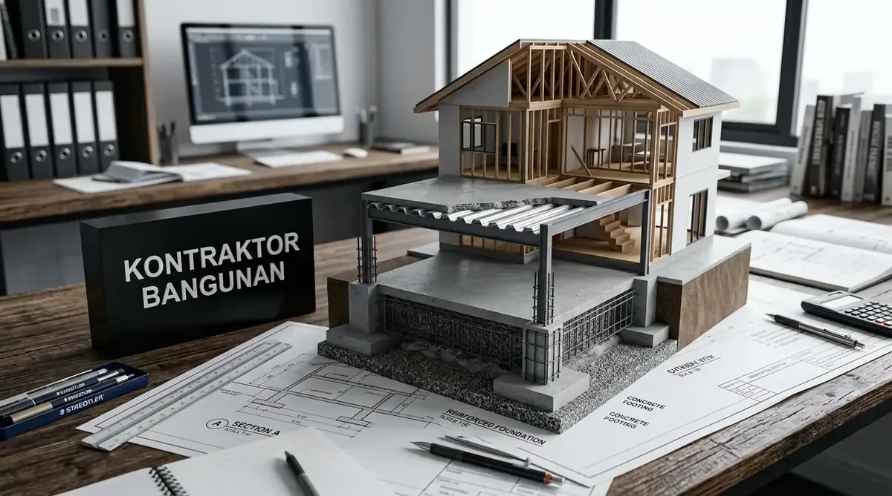
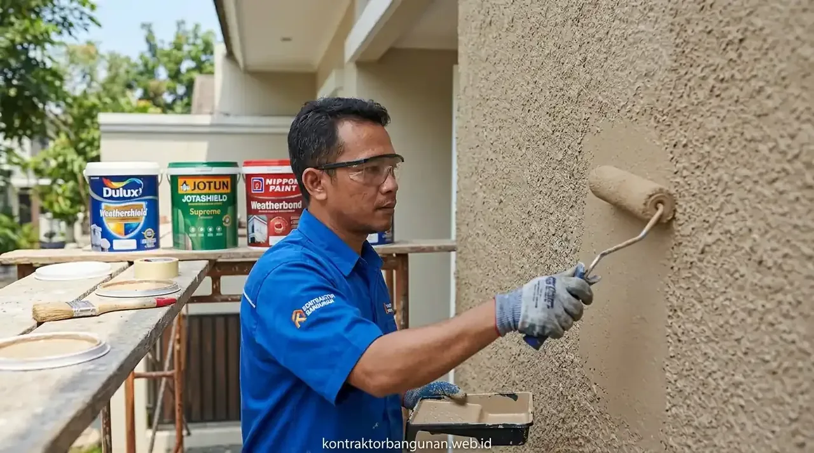
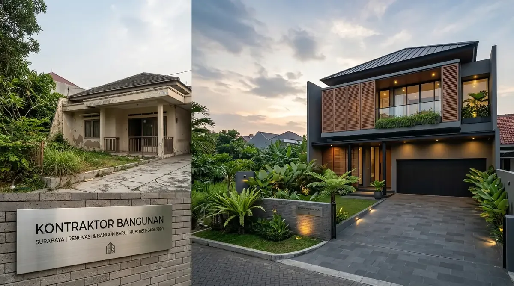

# Master SEO Content (3 Articles: Metode Suntik Pondasi Tambah Lantai, Solusi Dinding Lembap Rising Damp & Rombak Fasad Rumah Kuno)
*Diterbitkan untuk stok publikasi 07 Oktober 2026*

---

# ARTIKEL 1: Metode Suntik Pondasi & Kolom Praktis untuk Renovasi Tambah Lantai 2 Tanpa Bongkar Total

```
Meta Title: Metode Suntik Pondasi & Kolom Renovasi Tambah Lantai 2
Slug: /blog/metode-suntik-pondasi-kolom-tambah-lantai-2
Meta Description: Panduan metode suntik pondasi cakar ayam & jacketing kolom beton untuk renovasi tambah lantai 2 tanpa merobohkan lantai dasar. Aman, hemat biaya & minim debu.
Focus Keyphrase: metode suntik pondasi tambah lantai
Focus Keyphrase In Title: Ya
Focus Keyphrase In Meta Description: Ya
Focus Keyphrase In First Paragraph: Ya
Search Intent: Informational / Engineering Guide
Answer Intent: Panduan Perkuatan Struktur Bangunan / Rekayasa Jacketing Kolom & Chemical Rebar
Primary Entity: Metode Suntik Pondasi & Kolom Tambah Lantai 2
Secondary Entities: Jacketing Kolom Beton Bertulang, Chemical Anchoring Rebar (Hilti/Fischer), Pondasi Cakar Ayam Sisipan, Dak Bondek Cor Ringan, Audit Struktur Bangunan Lama
Query Fan-Out:
- Bagaimana cara menambah lantai 2 jika pondasi rumah lama awalnya hanya didesain 1 lantai?
- Berapa estimasi biaya metode suntik cakar ayam per titik kolom pada renovasi rumah?
- Apakah penghuni tetap bisa tinggal di lantai 1 saat pekerjaan suntik struktur berlangsung?
Audience: Pemilik rumah 1 lantai yang ingin memperluas ke lantai 2, arsitek renovasi, kontraktor retrofitting, dan konsultan sipil.
Suggested Schema: Article, Service, FAQPage, BreadcrumbList
Author: Tim Spesialis Kontraktor Bangunan
Last Updated: 2026-10-07
Images:
- /blog/metode-suntik-pondasi-kolom-tambah-lantai-2-01.webp | Alt: Metode suntik pondasi tambah lantai pekerjaan pembesian cakar ayam sisipan di samping dinding rumah
- /blog/metode-suntik-pondasi-kolom-tambah-lantai-2-02.webp | Alt: Proses pengeboran chemical anchor dan pembesaran selimut beton jacketing kolom
```

# Metode Suntik Pondasi & Kolom Praktis untuk Renovasi Tambah Lantai 2 Tanpa Bongkar Total

**Penerapan metode suntik pondasi tambah lantai dan teknik *column jacketing* memungkinkan penambahan lantai 2 secara aman dan hemat biaya tanpa perlu merobohkan bangunan lama lantai dasar.**

Kebutuhan ruang hunian yang meningkat seiring bertambahnya anggota keluarga sering kali terbentur oleh kenyataan bahwa struktur rumah eksisting dulunya hanya dirancang untuk 1 lantai (hanya menggunakan pondasi batu kali dangkal dan kolom praktis 11x11 cm). Merobohkan total rumah lama tentu memakan biaya sangat besar dan memaksa keluarga mengungsi berbulan-bulan. Solusi teknik sipil modern yang paling efisien adalah teknik *retrofitting* struktur dengan metode suntik pondasi cakar ayam (*underpinning*) dan pembesaran dimensi kolom (*concrete jacketing*) menggunakan perekat angkur kimia (*chemical anchoring*).

### Ringkasan Inti
* **Pondasi Cakar Ayam Sisipan:** Menggali titik-titik strategis di sudut dinding lantai 1 untuk menanam tapak cakar ayam baru (ukuran 80x80 cm s/d 100x100 cm) sedalam 1,2–1,8 meter.
* **Chemical Anchoring Rebar:** Menggunakan resin epoksi angkur khusus berkekuatan tinggi (seperti Hilti HIT-RE 500) untuk mengikat besi tulangan baru ke struktur beton lama.
* **Column & Beam Jacketing:** Memperbesar dimensi kolom eksisting dari 11x11 cm menjadi kolom struktural 15x30 cm atau 20x20 cm dengan tulangan utama D13/D16 ulir SNI.
* **Opsi Dak Bondek & Bata Ringan:** Memilih plat lantai cor bondek dan partisi dinding bata ringan di lantai 2 untuk meminimalkan beban mati (*dead load*) struktur hingga 40%.

---

<h2 id="tahapan-suntik-pondasi">4 Tahap Pelaksanaan Suntik Pondasi & Kolom yang Aman</h2>

1. **Audit Struktur & Pemetaan Titik Beban:** Insinyur sipil memeriksa ketebalan dinding dan menentukan posisi kolom utama baru yang sejajar vertikal dari lantai dasar ke lantai atas.
2. **Galian Terlokalisir & Pengecoran Tapak Cakar Ayam:** Galian dilakukan hanya pada titik kolom yang ditentukan (rata-rata 6–10 titik untuk rumah tipe 60) tanpa merusak keramik lantai utama di area lain.
3. **Pemasangan Tulangan Kolom & Jacketing:** Besi kolom baru dianyam mengelilingi kolom lama, lalu dipasang bekisting dan dicor dengan semen mortar *non-shrink grout* mutu tinggi.
4. **Pemasangan Balok Ring & Dak Lantai 2:** Balok gantung baru dihubungkan ke kolom suntikan, siap menopang balok dan plat lantai 2.


*Gambar 1: Pekerjaan perakitan pembesian pondasi cakar ayam sisipan pada sudut dinding rumah lama.*

---

<h2 id="tabel-komparasi-renovasi">Tabel Komparasi: Suntik Pondasi vs Bongkar Total Bangun Ulang</h2>

**Tabel perbandingan biaya investasi, durasi pengerjaan, dan kenyamanan keluarga.**

| Parameter Penilaian | Metode Suntik Pondasi & Jacketing | Metode Bongkar Total Bangun Ulang |
| :--- | :--- | :--- |
| **Estimasi Biaya Proyek** | Hemat 40% – 60% dari biaya bangun baru | Biaya penuh (Biaya bongkar + bangun baru) |
| **Durasi Waktu Pengerjaan** | 2,0 – 3,5 Bulan selesai siap huni | 6,0 – 9,0 Bulan kalender |
| **Kebutuhan Mengungsi** | Masih bisa tinggal di sebagian ruangan lantai 1 | Wajib sewa rumah kontrakan selama proyek |
| **Puing & Sampah Bangunan** | Sangat minim dan terlokalisir | Sangat banyak (Butuh puluhan dump truck) |
| **Kekuatan Daya Dukung Lantai 2** | Teruji aman sesuai standar beban SNI | Sangat Kokoh baru |

---

<h2 id="faq">Pertanyaan yang Sering Diajukan (FAQ)</h2>

### Berapa estimasi biaya pekerjaan suntik pondasi per 1 titik kolom?
Biaya pengerjaan suntik pondasi cakar ayam lengkap dengan galian, pembesian besi ulir SNI, bekisting, dan pengecoran berkisar antara Rp 1.750.000 hingga Rp 2.800.000 per titik.

### Apakah dinding rumah lama akan retak saat proses pengeboran?
Tidak, jika menggunakan alat bor *core drill* atau mesin rotary hammer dengan getaran terkendali serta tidak melakukan pembongkaran dinding secara hantaman palu besar (*hammering*).

---

<h2 id="kesimpulan">Solusi Cerdas Tambah Ruang Keluarga Anda</h2>

Menambah lantai 2 tidak harus membongkar seluruh rumah tercinta Anda. Konsultasikan audit struktur dan rencana perkuatan pondasi rumah Anda bersama insinyur Kontraktor Bangunan!

---

# ARTIKEL 2: Solusi Mengatasi Dinding Rumah Lembap, Cat Mengelupas & Rembesan Air Tanah (Rising Damp)

```
Meta Title: Solusi Mengatasi Dinding Rumah Lembap, Rembes & Cat Rusak
Slug: /blog/solusi-dinding-rumah-lembap-cat-mengelupas-rising-damp
Meta Description: Cara tuntas mengatasi dinding rumah lembap, cat mengelupas & rembesan air tanah (rising damp). Metode trasraam, chemical DPC injection & acian waterproofing.
Focus Keyphrase: solusi dinding rumah lembap
Focus Keyphrase In Title: Ya
Focus Keyphrase In Meta Description: Ya
Focus Keyphrase In First Paragraph: Ya
Search Intent: Informational / Problem-Solving Guide
Answer Intent: Panduan Perbaikan Dinding Rusak Lembap / Teknologi Chemical Damp Proofing
Primary Entity: Solusi Dinding Rumah Lembap & Rising Damp
Secondary Entities: Lapisan Kedap Air Trasraam (1 pc : 2 ps), Chemical DPC Injection (Silicone Damp Proofing), Acian Waterproofing Kristalisasi, Cat Dasar Anti Alkali Sealer, Jamur & Garam Efflorescence
Query Fan-Out:
- Mengapa dinding bagian bawah dekat lantai selalu basah, berjamur putih, dan catnya menggelembung?
- Apa itu teknologi injeksi DPC kimia untuk menghentikan rembesan kapiler air tanah?
- Bagaimana komposisi plesteran trasraam kedap air yang benar menurut standar SNI?
Audience: Pemilik rumah yang dindingnya rusak menahun akibat lembap, mandor renovasi, dan pengelola properti.
Suggested Schema: Article, Service, FAQPage, BreadcrumbList
Author: Tim Spesialis Kontraktor Bangunan
Last Updated: 2026-10-07
Images:
- /blog/solusi-dinding-rumah-lembap-cat-mengelupas-rising-damp-01.webp | Alt: Solusi dinding rumah lembap pengupasan plesteran rusak dan aplikasi semen kedap air trasraam
- /blog/solusi-dinding-rumah-lembap-cat-mengelupas-rising-damp-02.webp | Alt: Proses injeksi cairan chemical dpc siloxane ke dalam pori bata penahan air tanah
```

# Solusi Mengatasi Dinding Rumah Lembap, Cat Mengelupas & Rembesan Air Tanah (Rising Damp)

**Menemukan solusi dinding rumah lembap secara tuntas membutuhkan perbaikan lapisan penahan air trasraam atau injeksi cairan kimia DPC guna menghentikan naiknya air tanah akibat daya kapilaritas pori dinding.**

Banyak pemilik rumah merasa frustrasi karena sudah berkali-kali mengecat ulang dinding yang lembap dengan cat mahal berlabel *waterproof*, namun dalam hitungan bulan cat tersebut kembali menggelembung, berjamur hitam, mengeluarkan serbuk garam putih (*efflorescence*), dan akhirnya mengelupas rontok. Masalah ini bukan disebabkan oleh kualitas cat, melainkan fenomena fisika **Rising Damp**—yaitu air tanah dari bawah pondasi yang merembes naik ke atas dinding bata melalui pembuluh kapiler pori-pori semen karena hilangnya lapisan kedap air (*Damp Proof Course / Trasraam*).

### Ringkasan Inti
* **Penyebab Utama Rising Damp:** Ketiadaan atau rusaknya plesteran trasraam adukan kedap air (1 PC : 2 Pasir) setinggi 30–50 cm dari atas permukaan lantai sloof.
* **Gejala Khas Kerusakan:** Dinding basah dan cat menggelembung hanya terjadi pada ketinggian 0 sampai 1 meter dari permukaan lantai, serta muncul kerak bercak putih garam alkali.
* **Metode Perbaikan Plesteran Trasraam Ulang:** Mengupas plesteran lama yang telah lapuk hingga ke bata dasar, lalu melapisinya dengan semen mortar kedap air berkandungan aditif polimer.
* **Teknologi Chemical DPC Injection:** Mengebor lubang horizontal pada deretan bata bawah setiap jarak 10–12 cm dan menyuntikkan cairan siloxane/silicone mikro emulsi untuk membentuk barikade hidrofobik penolak air.

---

<h2 id="langkah-perbaikan-tuntas">Langkah Kerja Perbaikan Dinding Lembap Menahun</h2>

1. **Pengupasan Plesteran Rusak:** Kupas seluruh plesteran dinding yang berjamur setinggi minimal 50 cm di atas batas area yang basah. Bersihkan permukaan bata dari sisa debu dan lumut.
2. **Aplikasi Injeksi Barikade Kimia (DPC Injection):** Bor lubang berdiameter 12 mm dengan kemiringan 45 derajat pada pertemuan sloof dan bata, lalu suntikkan cairan *chemical damp proofing*.
3. **Pemasangan Plesteran Kedap Air Baru:** Gunakan adukan mortar dengan perbandingan 1 Semen : 2 Pasir Silika yang dicampur cairan *waterproofing additive* (misal: SikaLatex atau Damdex).
4. **Acian Waterproofing & Anti Alkali Primer:** Gunakan acian semen instan elastis, biarkan kering sempurna minimal 14 hari, aplikasikan cat dasar penahan garam alkali (*alkali resisting primer*), lalu akhiri dengan cat tembok *breathable*.


*Gambar 1: Proses pengupasan dan penggantian plesteran trasraam kedap air pada dinding lembap.*

---

<h2 id="tabel-komparasi-metode-dpc">Tabel Komparasi Metode Mengatasi Rising Damp</h2>

**Tabel perbandingan efektivitas, durabilitas, dan kemudahan pengerjaan.**

| Metode Solusi | Kelebihan Utama | Kelemahan / Batasan | Durabilitas Perlindungan |
| :--- | :--- | :--- | :--- |
| **Ganti Plesteran Trasraam 1:2** | Material mudah didapat & biaya ekonomis | Menghasilkan debu bobokan dinding | 8 – 12 Tahun |
| **Chemical DPC Injection Siloxane** | Cepat, tanpa bobok dinding besar, minim kotor | Butuh alat injeksi & cairan khusus | 15 – 20+ Tahun |
| **Pemasangan Pelapis PVC Wall Panel** | Fasad dinding langsung tertutup cantik & instan | Lembap di dalam bata tetap ada (Hanya kamuflase) | 5 – 8 Tahun |

---

<h2 id="faq">Pertanyaan yang Sering Diajukan (FAQ)</h2>

### Apakah cukup jika saya hanya mengerik cat lama lalu mengoleskan cat anti bocor?
Tidak akan berhasil. Cat anti bocor yang diaplikasikan pada plesteran yang masih jenuh air kapiler justru akan memerangkap uap air di dalam dinding, sehingga dalam waktu 2–3 bulan cat tersebut akan terdorong lepas dari dalam.

### Berapa lama dinding yang diperbaiki harus didiamkan sebelum dicat finishing?
Dinding plesteran baru wajib didiamkan hingga kadar air turun di bawah 14% dan tingkat pH di bawah 9 (umumnya membutuhkan waktu 14 hingga 21 hari kalender dalam ventilasi ruangan yang baik).

---

<h2 id="kesimpulan">Kembalikan Dinding Rumah Anda Menjadi Kering & Higienis</h2>

Bebaskan keluarga Anda dari spora jamur dinding yang berbahaya bagi pernapasan. Konsultasikan perbaikan dinding rembes bersama teknisi spesialis waterproofing Kontraktor Bangunan!

---

# ARTIKEL 3: Panduan Rombak Fasad Rumah Kuno Jadi Mewah Modern dengan Budget Terukur

```
Meta Title: Panduan Rombak Fasad Rumah Kuno Jadi Modern Mewah
Slug: /blog/panduan-rombak-fasad-rumah-kuno-modern
Meta Description: Panduan praktis rombak fasad rumah kuno jadi mewah modern minimalis. Trik material WPC, ACP, lighting arsitektural warm light & kanopi kantilever tanpa boros biaya.
Focus Keyphrase: panduan rombak fasad rumah kuno
Focus Keyphrase In Title: Ya
Focus Keyphrase In Meta Description: Ya
Focus Keyphrase In First Paragraph: Ya
Search Intent: Commercial / Architectural Renovation
Answer Intent: Panduan Transformasi Eksterior / Material Fasad Modern / Strategi Efisiensi Biaya
Primary Entity: Rombak Fasad Rumah Kuno Menjadi Modern
Secondary Entities: Panel Kisi Kayu WPC, Aluminium Composite Panel (ACP), Kanopi Kaca Tempered Kantilever, Lampu Wall Sconce Up-Down Light, Kusen Aluminium Powder Coating
Query Fan-Out:
- Berapa estimasi biaya renovasi ganti fasad depan rumah tanpa merombak denah dalam?
- Material apa yang paling efektif mengubah tampilan rumah kuno tahun 90-an jadi kekinian?
- Bagaimana teknik memasang kanopi carport gantung kantilever yang kokoh dan rapi?
Audience: Pemilik rumah bekas / kuno, investor flipper properti, keluarga yang ingin menyegarkan tampilan tampak depan rumah.
Suggested Schema: Article, Service, FAQPage, BreadcrumbList
Author: Tim Spesialis Kontraktor Bangunan
Last Updated: 2026-10-07
Images:
- /blog/panduan-rombak-fasad-rumah-kuno-modern-01.webp | Alt: Panduan rombak fasad rumah kuno transformasi perbandingan before after tampak depan hunian mewah
- /blog/panduan-rombak-fasad-rumah-kuno-modern-02.webp | Alt: Pemasangan kisi kisi wpc panel kayu sintetis dan lampu dinding arsitektural
```

# Panduan Rombak Fasad Rumah Kuno Jadi Mewah Modern dengan Budget Terukur

**Menerapkan panduan rombak fasad rumah kuno dengan pemilihan material aksen seperti WPC, panel ACP, dan tata pencahayaan arsitektural mampu melipatgandakan nilai jual properti hingga 40% tanpa perlu merombak denah interior.**

Tampilan depan (*façade*) adalah identitas utama dan cerminan estetika pemilik rumah. Banyak bangunan rumah tinggal era tahun 80-an hingga 2000-an yang memiliki struktur inti sangat kokoh, namun tampak depannya terlihat kusam, berat, dan ketinggalan zaman akibat pemakaian profil gipsum klasik yang berlebihan, warna cat pudar, genteng berlumut, serta kusen kayu yang lapuk termakan rayap. Merenovasi fasad depan secara terfokus merupakan langkah investasi properti paling cerdas untuk menyulap rumah tua menjadi hunian modern tropis bernuansa resor bintang lima dengan anggaran yang sangat terukur.

### Ringkasan Inti
* **Fokus pada 3 Elemen Visual Utama:** Rombak kusen jendela lama menjadi kusen aluminium kaca lebar, ganti atap teras genteng berat dengan kanopi kantilever elegan, dan tambahkan aksen dinding bertekstur.
* **Material Fasad Modern Low-Maintenance:** Gunakan panel kisi-kisi kayu sintetis (*Wood Plastic Composite / WPC*), *Aluminium Composite Panel* (ACP), atau bata roster dekoratif yang tidak memerlukan pengecatan ulang tahunan.
* **Peran Magis Architectural Lighting:** Pasang lampu dinding sorot dua arah (*up-down wall sconce*) berona hangat (*warm white 3000K*) untuk menciptakan siluet bayangan dramatis pada malam hari.
* **Peninggian Dinding Parapet Depan:** Membuat dinding pembatas atas (*parapet wall*) untuk menyembunyikan kemiringan atap seng/genteng lama sehingga rumah tampak berpenampilan kubus minimalis (*boxy modern*).

---

<h2 id="trik-material-fasad-modern">4 Trik Material Mengubah Fasad Kuno Tanpa Biaya Selangit</h2>

1. **Ganti Pintu & Jendela Utama dengan Aluminium Hitam Minimalis:** Kusen aluminium profil 3 atau 4 inch berwarna hitam doff (*black powder coating*) dengan kaca polos 6 mm langsung memberikan kesan kontemporer yang bersih dan ramping.
2. **Aksen Kisi-Kisi WPC (Wood Plastic Composite):** Memberikan kehangatan tekstur kayu alami yang mewah namun 100% tahan air, tahan panas terik matahari, dan bebas rayap seumur hidup.
3. **Kanopi Carport Kantilever Kaca Tempered / Solarflat:** Menggantikan tiang kanopi carport lama yang mengganggu manuver parkir mobil dengan kanopi gantung pipa besi hollow galvanis beratap *polycarbonate solid* bening anti pecah.
4. **Kombinasi Warna Cat Monokrom Tropis:** Padukan warna abu-abu arang (*charcoal*), putih hangat (*off-white*), dan aksen terakota atau kayu natural.


*Gambar 1: Transformasi sebelum dan sesudah renovasi fasad rumah kuno menjadi modern minimalis.*

---

<h2 id="tabel-estimasi-biaya-fasad">Tabel Estimasi Biaya Paket Renovasi Fasad Depan Rumah (Lebar 6–8 Meter)</h2>

**Tabel rincian pos pekerjaan eksterior dan perkiraan anggaran renovasi fasad.**

| Pos Pekerjaan Renovasi Fasad | Material Spesifikasi | Estimasi Biaya (Rp) |
| :--- | :--- | :--- |
| **Bongkar Ornamen Lama & Plester Ulang** | Kupas profil kuno, plester acian semen instan | Rp 4.500.000 – Rp 7.500.000 |
| **Pemasangan Aksen Dinding WPC (8 m²)** | Panel WPC Outdoor Co-Extrusion + Rangka Hollow | Rp 6.800.000 – Rp 9.600.000 |
| **Kusen Jendela & Pintu Utama Aluminium** | Aluminium Black Doff + Kaca Tempered 8 mm | Rp 12.000.000 – Rp 18.500.000 |
| **Kanopi Carport Kantilever (18 m²)** | Rangka Hollow Galvanis 50x100 + Solarflat 3mm | Rp 13.500.000 – Rp 19.800.000 |
| **Pengecatan Eksterior Weatherproof** | Cat Dulux Weathershield / Jotun Jotashield 3 Lapis | Rp 5.500.000 – Rp 8.500.000 |
| **Instalasi Lighting Up-Down LED (4 Titik)** | Lampu Dinding IP65 Waterproof + Kabel Eterna | Rp 2.200.000 – Rp 3.500.000 |
| **TOTAL ESTIMASI BIAYA** | **Renovasi Fasad Menyeluruh (Tampak Baru)** | **Rp 44.500.000 – Rp 67.400.000** |

---

<h2 id="faq">Pertanyaan yang Sering Diajukan (FAQ)</h2>

### Berapa lama durasi pengerjaan rombak fasad rumah tampak depan?
Rata-rata renovasi fasad tampak depan rumah 1 hingga 2 lantai memakan waktu sekitar 3 hingga 5 minggu kalender tanpa mengganggu kenyamanan aktivitas keluarga di dalam rumah.

### Apakah perubahan bentuk fasad membutuhkan izin PBG baru?
Jika renovasi fasad tidak mengubah luas total tapak bangunan, tidak menambah ketinggian lantai, dan tidak membongkar struktur pondasi utama, Anda tidak memerlukan izin PBG baru (cukup izin renovasi ringan lingkungan RT/RW).

---

<h2 id="kesimpulan">Sulap Rumah Kuno Anda Jadi Mahakarya Modern</h2>

Dapatkan visualisasi desain 3D render fasad depan rumah baru Anda sebelum proses konstruksi dimulai. Wujudkan impian hunian modern bersama tim arsitek Kontraktor Bangunan!
