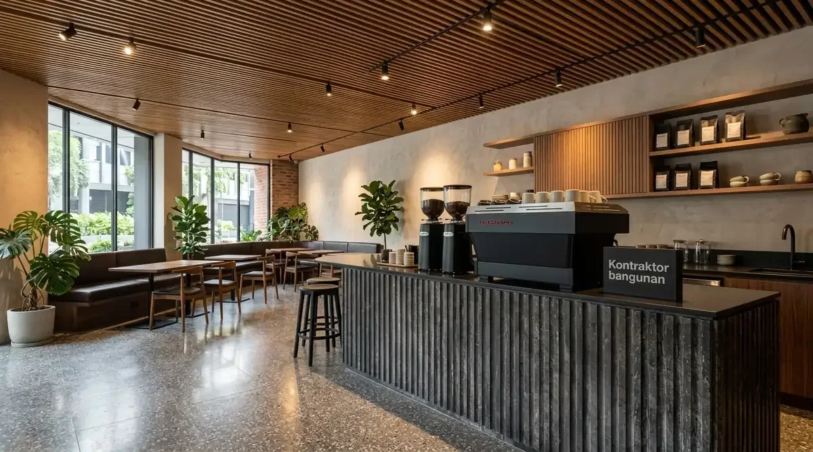
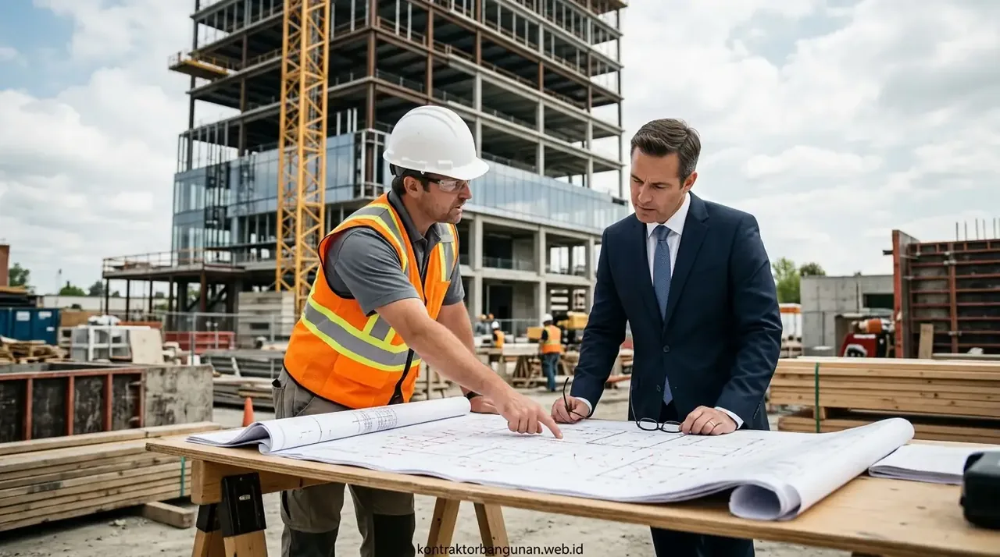

# Master SEO Content (3 Articles: Konstruksi Kafe Resto F&B, Standar Bangun Ruko Komersial & Fit Out Kantor)
*Diterbitkan untuk stok publikasi 08 Oktober 2026*

---

# ARTIKEL 1: Panduan Konstruksi Bangunan Kafe & Restoran Outdoor-Indoor: Zonasi, MEP & Akustik

```
Meta Title: Panduan Konstruksi Kafe & Restoran Outdoor Indoor: MEP & Layout
Slug: /blog/panduan-konstruksi-kafe-restoran-outdoor-indoor
Meta Description: Panduan lengkap konstruksi bangunan kafe & resto outdoor-indoor. Standar grease trap sanitasi, instalasi listrik beban tinggi, peredam akustik & alur sirkulasi F&B.
Focus Keyphrase: panduan konstruksi kafe restoran
Focus Keyphrase In Title: Ya
Focus Keyphrase In Meta Description: Ya
Focus Keyphrase In First Paragraph: Ya
Search Intent: Commercial / Business Construction
Answer Intent: Panduan Bangun Tempat Usaha Kuliner / Standar MEP & Sanitasi Dapur Komersial
Primary Entity: Konstruksi Bangunan Kafe & Restoran Komersial
Secondary Entities: Grease Trap Penjebak Lemak, Daya Listrik 3-Phase Mesin Espresso, Sirkulasi Barista Dapur, Treatment Akustik Peredam Gema, Desain Outdoor Tahan Hujan
Query Fan-Out:
- Berapa kapasitas daya listrik dan jalur pemipaan yang dibutuhkan untuk dapur kafe komersial?
- Bagaimana cara mengatasi gema suara bising di dalam ruangan kafe berkonsep industrial semen?
- Standar kemiringan lantai dan saluran drainase apa yang wajib dipenuhi dapur restoran?
Audience: Pengusaha kuliner (F&B), pemilik kafe kopi kekinian, pemilik restoran franchise, dan kontraktor interior komersial.
Suggested Schema: Article, Service, FAQPage, BreadcrumbList
Author: Tim Spesialis Kontraktor Bangunan
Last Updated: 2026-10-08
Images:
- /blog/panduan-konstruksi-kafe-restoran-outdoor-indoor-01.webp | Alt: Panduan konstruksi kafe restoran tata ruang area outdoor taman dan bar kopi modern
- /blog/panduan-konstruksi-kafe-restoran-outdoor-indoor-02.webp | Alt: Instalasi mekanikal elektrikal pipa air grease trap dan exhaust hood dapur restoran
```

# Panduan Konstruksi Bangunan Kafe & Restoran Outdoor-Indoor: Zonasi, MEP & Akustik

**Menerapkan panduan konstruksi kafe restoran yang mengintegrasikan alur operasional dapur higienis, instalasi MEP kapasitas tinggi, serta kenyamanan akustik adalah kunci keberhasilan bisnis kuliner modern yang berkelanjutan.**

Membangun kafe kopi (*coffee shop*) atau restoran masa kini menuntut perpaduan sempurna antara konsep desain visual yang estetik (*Instagrammable*) dengan keandalan fungsi utilitas di balik layar (*behind the scenes*). Kesalahan fatal dalam konstruksi kafe sering kali bukan pada pemilihan meja kursi, melainkan pada ketidakmampuan instalasi listrik menahan beban mesin kopi berdaya tinggi, saluran air dapur yang tersumbat lemak karena lupa memasang *grease trap*, atau ruangan *indoor* yang terlalu bising bergema akibat permukaan semen keras tanpa peredam akustik. Perencanaan konstruksi yang profesional menjamin kelancaran operasional harian dan kepuasan pelanggan Anda.

### Ringkasan Inti
* **Zonasi Ergonomis Rasio 60:40:** Alokasikan 60% luas bangunan untuk area tempat duduk tamu (*seating capacity*) dan 40% untuk area dapur, bar operasional, kasir, toilet, dan gudang bahan baku.
* **Instalasi Listrik 3-Phase Terpisah:** Pisahkan MCB grup tenaga mesin espresso komersial (daya 3.500–5.500 Watt), chiller/freezer dapur, sistem pendingin ruangan AC, dan sistem tata suara audio.
* **Sanitasi Saluran Limbah Lemak (Grease Trap):** Wajib memasang bak penangkap minyak dan lemak di bawah bak cuci piring (*sink*) untuk mencegah penyumbatan pipa drainase kota dan bau tak sedap.
* **Solusi Akustik Ruang Indoor:** Pemasangan panel peredam gema (*acoustic ceiling panel*) atau semprotan *cellulose acoustic spray* pada plafon ekspos untuk menjaga tingkat kebisingan di bawah 65 dB saat ruangan ramai pengunjung.

---

<h2 id="alur-utilitas-kafe">3 Sistem Utilitas (MEP) Wajib pada Kafe & Restoran</h2>

1. **Sistem Pembuangan Asap & Bau Dapur (Kitchen Exhaust & Fresh Air Ducting):** Dapur memasak membutuhkan *exhaust hood stainless steel* dengan kapasitas hisap CFM tinggi dan saluran udara segar pengganti (*make-up air*) agar asap tidak bocor ke area makan tamu.
2. **Lantai Dapur Anti Selip & Kemiringan Drainase (Floor Gully):** Pemasangan keramik lantai anti slip bertekstur kasar dengan kemiringan 2% menuju *floor drain stainless steel* berkeranjang penyaring kotoran.
3. **Kenyamanan Area Outdoor Tahan Hujan Panas:** Penggunaan kanopi *retractable awning* otomatis, lantai paving porous berpola atau dek kayu WPC, serta kipas kabut (*misting fan*) penyejuk udara.


*Gambar 1: Portofolio konstruksi kafe semi-outdoor dengan pencahayaan warm ambient.*

---

<h2 id="tabel-spesifikasi-mep-kafe">Tabel Standar Kebutuhan Utilitas Kafe Kapasitas 50–80 Pengunjung</h2>

**Tabel rincian kebutuhan teknis mekanikal, elektrikal, dan sanitasi tempat usaha kafe.**

| Pos Utilitas Konstruksi | Standar Teknis Rekomendasi | Fungsi & Keamanan |
| :--- | :--- | :--- |
| **Kapasitas Daya Listrik PLN** | Minimal 16.500 VA s/d 23.000 VA (3-Phase) | Mencegah listrik anjlok saat peak hours jam makan |
| **Kabel Distribusi Utama** | Kabel NYY / NYFGBY 4x10 mm² tembaga murni | Menahan arus panas kontinu tanpa risiko korsleting |
| **Pipa Saluran Buang Lemak** | Pipa PVC AW diameter 3–4 Inch tebal + Clean Out | Memudahkan perawatan pembersihan pipa sumbat |
| **Grease Trap Kapasitas** | Stainless Steel 304 kapasitas 60–100 Liter | Menyaring 95% limbah minyak sebelum masuk got |
| **Peredam Akustik Plafon** | Rockwool 50 kg/m³ + Perforated Gypsum Board | Mengurangi gema pantulan obrolan dan denting cangkir |
| **Kapasitas Tandon Air Cadangan**| Stainless Steel 2.000 – 3.000 Liter + Booster Pump | Menjamin ketersediaan air bersih saat pasokan PDAM mati |

---

<h2 id="faq">Pertanyaan yang Sering Diajukan (FAQ)</h2>

### Mengapa stopkontak mesin espresso harus menggunakan grounding khusus?
Mesin espresso bertekanan tinggi rentan mengalami kerusakan mikrokontroler dan membahayakan keselamatan barista jika tegangan *ground* melebihi 1 Volt. Grounding tembaga mandiri sedalam 4–6 meter wajib dipasang.

### Berapa rata-rata durasi pengerjaan bangun kafe dari nol hingga siap opening?
Untuk bangunan kafe 1–2 lantai luas 120–200 m², durasi pekerjaan konstruksi sipil hingga fit-out interior rata-rata membutuhkan waktu 2,5 hingga 4 bulan kalender.

---

<h2 id="kesimpulan">Bangun Tempat Usaha Kuliner Idaman Anda</h2>

Konstruksi kafe yang dirancang dengan matang meminimalkan biaya perbaikan di masa depan dan memaksimalkan omzet penjualan. Konsultasikan denah dan rancang bangun kafe Anda bersama Kontraktor Bangunan!

---

# ARTIKEL 2: Standar Teknis Bangun Ruko 2-3 Lantai: Struktur Beban Berat, Fasad Kaca & Parkir

```
Meta Title: Standar Teknis Bangun Ruko 2-3 Lantai: Struktur & Layout
Slug: /blog/standar-teknis-bangun-ruko-2-3-lantai
Meta Description: Standar teknis konstruksi ruko 2-3 lantai komersial. Perhitungan struktur beban hidup lantai gudang 400kg/m2, fasad kaca curtain wall & drainase parkiran.
Focus Keyphrase: standar teknis bangun ruko
Focus Keyphrase In Title: Ya
Focus Keyphrase In Meta Description: Ya
Focus Keyphrase In First Paragraph: Ya
Search Intent: Commercial / Engineering Guide
Answer Intent: Standarisasi Struktur Ruko Komersial / Perhitungan Live Load & Tata Ruang
Primary Entity: Standar Konstruksi Bangunan Rumah Toko (Ruko) 2-3 Lantai
Secondary Entities: Live Load Lantai Gudang (400 kg/m²), Fasad Kaca Curtain Wall Aluminium, Pintu Harmonika / Folding Gate Baja, Area Parkir Paving Heavy Duty K-300, Tangga Darurat & Akses Servis
Query Fan-Out:
- Berapa beban hidup (live load) yang wajib dihitung insinyur untuk plat lantai 2 dan 3 ruko usaha?
- Bagaimana spesifikasi rangka dan kaca untuk fasad curtain wall ruko agar tahan angin kencang?
- Berapa meter luas area mundur garis sempadan bangunan (GSB) untuk parkir ruko di pinggir jalan raya?
Audience: Pengembang ruko komersial, pengusaha retail/perkantoran, investor ruko sewa, dan konsultan arsitektur.
Suggested Schema: Article, Product, FAQPage, BreadcrumbList
Author: Tim Spesialis Kontraktor Bangunan
Last Updated: 2026-10-08
Images:
- /blog/standar-teknis-bangun-ruko-2-3-lantai-01.webp | Alt: Standar teknis bangun ruko fasad kaca curtain wall modern dan area parkir paving luas
- /blog/standar-teknis-bangun-ruko-2-3-lantai-02.webp | Alt: Pengecoran plat lantai beton bertulang bondek beban berat proyek ruko 3 lantai
```

# Standar Teknis Bangun Ruko 2-3 Lantai: Struktur Beban Berat, Fasad Kaca & Parkir

**Menerapkan standar teknis bangun ruko dengan perhitungan beban hidup lantai gudang hingga 400 kg/m² dan fasad modern memaksimalkan fleksibilitas fungsi usaha serta menaikkan nilai sewa properti komersial.**

Rumah Toko (Ruko) merupakan instrumen investasi properti yang sangat populer karena memiliki fungsi ganda: lantai dasar untuk aktivitas usaha komersial (toko, showroom, klinik, kantor) dan lantai atas untuk gudang stok barang maupun tempat tinggal keluarga. Namun, kesalahan fatal kerap terjadi ketika ruko dirancang hanya menggunakan perhitungan struktur rumah tinggal biasa (*beban hidup 200 kg/m²*). Ketika lantai 2 difungsikan sebagai gudang penumpukan kardus barang berat atau ruang server, lantai beton dapat melendut, timbul retak lentur pada balok, dan membahayakan keselamatan penghuni.

### Ringkasan Inti
* **Kalkulasi Beban Hidup Standar SNI 1727:** Plat lantai ruko komersial wajib dirancang mampu menahan beban minimal 250 kg/m² untuk perkantoran dan 400–500 kg/m² untuk area gudang penyimpanan logistik.
* **Fasad Kaca Curtain Wall / Kaca Frameless:** Menggunakan kaca tempered 10–12 mm dengan rangka *mullion & transom* aluminium tebal 1,5–2,0 mm yang mampu menahan beban terpaan angin badai (*wind load*).
* **Area Parkir Paving Blok Heavy Duty:** Paving blok mutu minimal K-300 tebal 8 cm di atas lapisan sirtu dan makadam padat agar tidak bergelombang saat dilindas mobil dan truk logistik.
* **Kepatuhan Garis Sempadan Bangunan (GSB):** Menyediakan jarak bebas dari as jalan raya minimal 8–12 meter untuk manuver parkir kendaraan roda empat yang legal dan nyaman.

---

<h2 id="elemen-struktural-ruko">3 Pilar Konstruksi Ruko Tahan Beban Berat</h2>

1. **Pondasi Tiang Pancang / Strauss Pile Ganda:** Mengantisipasi beban aksial kolom ruko 3 lantai dengan kombinasi *pile cap* masif dan balok sloof pengikat silang (*cross tie beam*).
2. **Plat Lantai Bondek Cor Monolit Tebal 12–15 cm:** Menggunakan tulangan wiremesh M8–M10 dua lapis (*double layer*) dengan mutu beton Ready Mix minimal fc' 25 MPa (K-300).
3. **Sistem Pintu Keamanan Toko:** Mengombinasikan pintu kaca otomatis geser di sisi dalam dengan pintu *folding gate* baja atau *rolling door perforated* otomatis bermotor di sisi luar.


*Gambar 1: Portofolio konstruksi kompleks ruko komersial 3 lantai modern di kawasan bisnis.*

---

<h2 id="tabel-komparasi-standar-ruko">Tabel Komparasi: Ruko Standar Hunian vs Ruko Komersial Heavy Duty</h2>

**Tabel perbandingan spesifikasi struktur, kapasitas beban, dan daya tahan bangunan.**

| Parameter Konstruksi | Ruko Standar (Spesifikasi Rumah) | Ruko Komersial Heavy Duty (Standar SNI) |
| :--- | :--- | :--- |
| **Kapasitas Beban Hidup Lantai 2-3** | 150 – 200 kg/m² (Hanya untuk kamar) | 400 – 500 kg/m² (Kuat untuk tumpukan barang gudang) |
| **Tebal Plat Lantai Cor Beton** | 10 cm (Wiremesh M6 single layer) | 12 – 15 cm (Wiremesh M8/M10 double layer) |
| **Mutu Beton Struktur** | K-225 (fc' 18,7 MPa) manual molen | K-300 (fc' 25,0 MPa) Ready Mix bersertifikat |
| **Dimensi Kolom Utama** | 20x20 cm (Besi polos 10/12 mm) | 30x30 cm s/d 35x35 cm (Besi ulir D16/D19 SNI) |
| **Paving Halaman Parkir** | Paving K-200 tebal 6 cm (Mudah pecah) | Paving K-350 tebal 8 cm (Kuat beban truk muatan) |

---

<h2 id="faq">Pertanyaan yang Sering Diajukan (FAQ)</h2>

### Apakah ruko 3 lantai wajib memiliki tangga darurat kebakaran terpisah?
Berdasarkan Permen PUPR tentang bangunan gedung komersial bertingkat, ruko yang difungsikan untuk kantor bersama atau ruang publik dengan kapasitas lebih dari 50 orang disarankan memiliki akses jalur evakuasi darurat menuju area terbuka.

### Bagaimana mencegah suara bising antar ruko yang saling berdampingan?
Dinding pemisah antar unit ruko wajib dibuat dinding ganda (*double wall*) bata merah atau bata ringan 10 cm dengan celah udara isolasi 3–5 cm yang diisi *rockwool* kedap suara.

---

<h2 id="kesimpulan">Bangun Ruko Berkualitas Tinggi untuk Bisnis Sukses</h2>

Keamanan struktur adalah nilai jual tertinggi bagi pembeli dan penyewa ruko komersial. Rancang konstruksi ruko Anda bersama kontraktor berpengalaman Kontraktor Bangunan!

---

# ARTIKEL 3: Panduan Fit-Out Interior Kantor Komersial: Tata Ruang Ergonomis, Akustik & HVAC

```
Meta Title: Panduan Fit-Out Interior Kantor: Ergonomi, Akustik & HVAC
Slug: /blog/panduan-fit-out-interior-kantor-komersial
Meta Description: Panduan fit-out interior kantor komersial modern. Standar tata ruang ergonomis, partisi kedap suara meeting room, raised floor server & sistem AC VRV hemat energi.
Focus Keyphrase: panduan fit out interior kantor
Focus Keyphrase In Title: Ya
Focus Keyphrase In Meta Description: Ya
Focus Keyphrase In First Paragraph: Ya
Search Intent: Commercial / B2B Corporate
Answer Intent: Panduan Renovasi Interior Kantor / Standar K3 Ergonomi & Akustik Ruang Kerja
Primary Entity: Fit-Out Interior Kantor Komersial
Secondary Entities: Partisi Gypsum Rockwool Soundproof, Raised Access Floor Server, Sistem HVAC AC Central VRV/VRF, Standar Pencahayaan 350-500 Lux, Meja Kerja Ergonomis Sit-to-Stand
Query Fan-Out:
- Berapa estimasi biaya fit-out interior kantor per meter persegi di gedung komersial?
- Bagaimana merancang ruang meeting yang kedap suara tanpa kebocoran obrolan rahasia?
- Apa keuntungan memasang raised floor untuk jalur kabel data server kantor?
Audience: Pimpinan perusahaan, manajer HR & GA (General Affairs), pengelola gedung perkantoran, dan arsitek interior komersial.
Suggested Schema: Article, Service, FAQPage, BreadcrumbList
Author: Tim Spesialis Kontraktor Bangunan
Last Updated: 2026-10-08
Images:
- /blog/panduan-fit-out-interior-kantor-komersial-01.webp | Alt: Panduan fit out interior kantor tata ruang open space workstation modern dan ruang meeting kaca
- /blog/panduan-fit-out-interior-kantor-komersial-02.webp | Alt: Pemasangan partisi gypsum peredam suara rockwool dan ducting ac central kantor
```

# Panduan Fit-Out Interior Kantor Komersial: Tata Ruang Ergonomis, Akustik & HVAC

**Mengikuti panduan fit out interior kantor yang tepat menciptakan lingkungan kerja produktif, menekan tingkat stres karyawan, serta mencerminkan profesionalisme brand perusahaan di mata klien.**

Ruang kantor modern saat ini telah berevolusi dari sekadar bilik kubikel yang kaku menjadi ruang kolaboratif yang fleksibel (*agile workspace*). Proyek *fit-out* kantor—mulai dari lantai kosong (*bare shell*) hingga siap huni—memerlukan integrasi menyeluruh antara estetika arsitektur interior, standar ergonomi pencahayaan, privasi akustik ruang rapat, serta sistem tata udara (HVAC) yang efisien. Kegagalan merancang insulasi suara pada ruang *meeting* atau tata letak kabel yang berantakan di lantai dapat mengganggu produktivitas kerja tim dan merusak citra profesional perusahaan.

### Ringkasan Inti
* **Konsep Tata Ruang Terbuka (Open Plan vs Focus Zone):** Kombinasi area kerja kolaboratif tanpa sekat dengan bilik fokus (*phone booth / focus pods*) untuk konsentrasi kerja mendalam.
* **Kekedapan Akustik Ruang Rapat (STC 45–50):** Pemasangan partisi gipsum ganda yang diisi *rockwool sound insulation* padat dan pintu berpelindung *acoustic drop seal* di bawah kusen.
* **Raised Access Floor untuk Jalur Data & Elektrikal:** Lantai panggung modular berketinggian 15–20 cm untuk menyembunyikan ribuan meter kabel LAN data server dan kelistrikan di bawah lantai kerja.
* **Standarisasi Pencahayaan LED (350–500 Lux):** Penerangan merata dengan temperatur warna *cool white 4000K* yang terbukti mengurangi kelelahan mata pekerja layar komputer sesuai standar Kemenkes.

---

<h2 id="komponen-kunci-fitout">4 Komponen Teknis Wajib Proyek Fit-Out Kantor</h2>

1. **Sistem Tata Udara AC Central (VRV / VRF Inverter):** Memungkinkan pengaturan suhu yang presisi di setiap zona ruangan secara mandiri tanpa pemborosan daya listrik kompresor.
2. **Sistem Proteksi Kebakaran Gedung (Sprinkler & Smoke Detector):** Penataan ulang titik pipa *sprinkler* otomatis dan sensor asap di plafon yang disesuaikan dengan posisi partisi dinding baru.
3. **Dinding Partisi Kaca Frameless Tempered (10–12 mm):** Memberikan kesan modern transparan yang elegan dengan aplikasi stiker sandblast bermotif logo perusahaan untuk privasi visual.
4. **Furnitur Ergonomis Berstandar BIFMA:** Kursi kerja dengan *lumbar support* adjustable dan meja kerja ketinggian optimal untuk mencegah cedera tulang belakang karyawan.


*Gambar 1: Portofolio pekerjaan fit-out interior kantor open workspace modern dan meeting room.*

---

<h2 id="tabel-estimasi-fitout-kantor">Tabel Estimasi Paket Biaya Fit-Out Kantor per Meter Persegi</h2>

**Tabel rincian estimasi biaya pekerjaan fit-out kantor berdasarkan level spesifikasi.**

| Kategori Spesifikasi Fit-Out | Cakupan Pekerjaan & Material Utama | Estimasi Biaya / m² |
| :--- | :--- | :--- |
| **Standard Fit-Out (Ekonomis)** | Partisi gypsum standar, lantai karpet tile nilon, lampu panel LED, cat tembok premium | Rp 2.500.000 – Rp 3.800.000 / m² |
| **Corporate Deluxe (Menengah)** | Partisi kaca tempered + acoustic rockwool, karpet tebal, ceiling drop, AC ducting split | Rp 4.000.000 – Rp 6.200.000 / m² |
| **Executive High-End (Mewah)** | Raised floor server, AC central VRV, wall acoustic fabric panel, smart office automation | Rp 6.500.000 – Rp 9.800.000 / m² |

---

<h2 id="faq">Pertanyaan yang Sering Diajukan (FAQ)</h2>

### Berapa lama durasi rata-rata pelaksanaan fit-out kantor luas 200–500 m²?
Durasi pekerjaan fit-out kantor berkisar antara 6 hingga 10 minggu kalender, mencakup tahap pembongkaran awal, instalasi MEP, pemasangan partisi dan plafon, hingga perakitan furnitur *custom built-in*.

### Bagaimana prosedur izin kerja fit-out di dalam gedung perkantoran bertingkat tinggi?
Kontraktor wajib menyerahkan gambar kerja DED arsitektur MEP ke pihak Building Management gedung (*fit-out permit*), menyetorkan uang jaminan (*fit-out deposit*), dan mematuhi jam kerja bising (*noisy work*) yang biasanya dibatasi pada malam hari atau akhir pekan.

---

<h2 id="kesimpulan">Transformasikan Ruang Kerja Perusahaan Anda</h2>

Ciptakan suasana kantor yang memotivasi karyawan dan mengesankan para mitra bisnis Anda. Konsultasikan konsep fit-out dan tata ruang kantor Anda bersama Kontraktor Bangunan sekarang juga!
