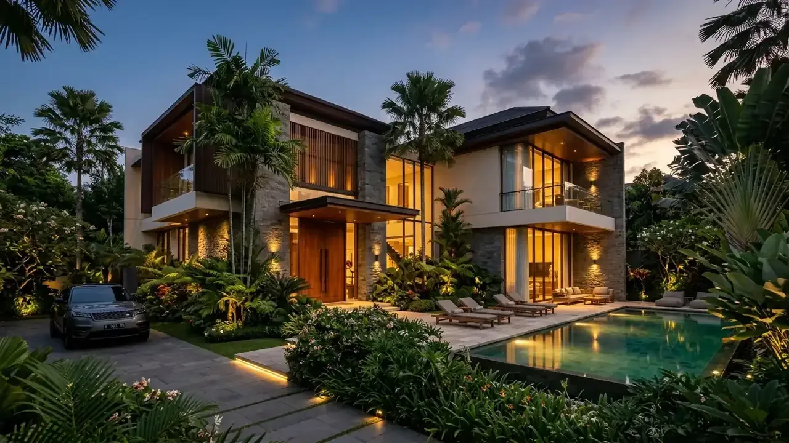
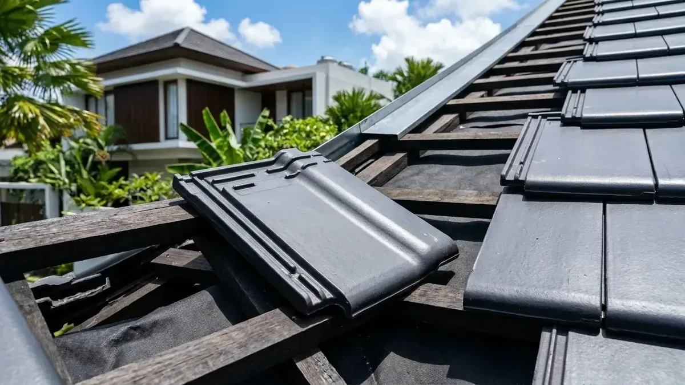
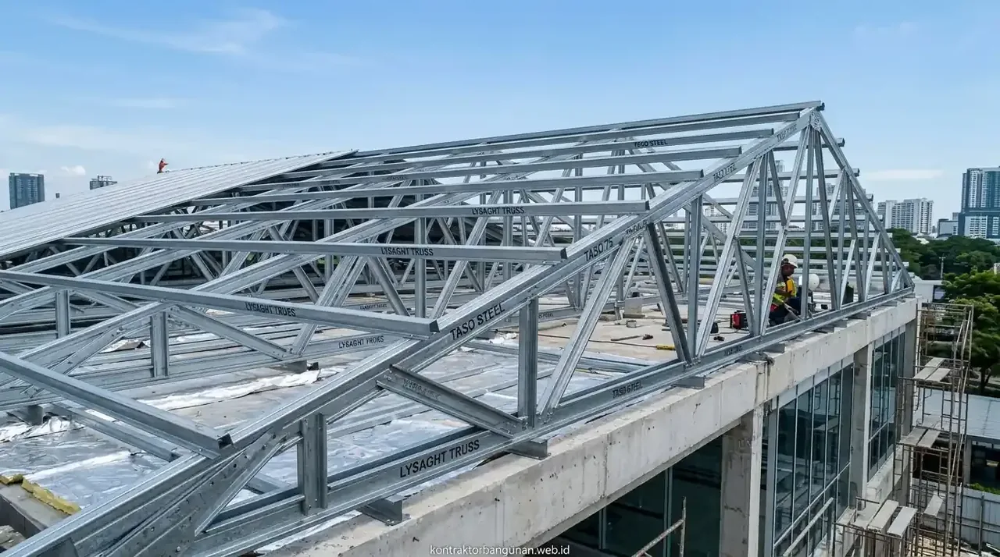

# Master SEO Content (3 Articles: Lantai Industri Floor Hardener vs Epoxy, Atap Pabrik Insulasi & Struktur Portal Frame)
*Diterbitkan untuk stok publikasi 09 Oktober 2026*

---

# ARTIKEL 1: Lantai Gudang Floor Hardener vs Epoxy Lantai: Ketahanan Beban Forklift & Biaya

```
Meta Title: Lantai Gudang Floor Hardener vs Epoxy Lantai: Kuat & Biaya
Slug: /blog/lantai-gudang-floor-hardener-vs-epoxy
Meta Description: Perbandingan lantai gudang floor hardener vs epoxy lantai industri. Analisa ketahanan beban forklift berat, ketahanan kimia asam, daya gesek & estimasi biaya/m2.
Focus Keyphrase: lantai gudang floor hardener
Focus Keyphrase In Title: Ya
Focus Keyphrase In Meta Description: Ya
Focus Keyphrase In First Paragraph: Ya
Search Intent: Commercial / Technical Comparison
Answer Intent: Komparasi Pelapis Lantai Industri / Spesifikasi Beban Forklift & Daya Abrasi
Primary Entity: Lantai Gudang & Pabrik Industri (Floor Hardener vs Epoxy)
Secondary Entities: Non-Metallic Floor Hardener (Sika Chapdur/Fosroc), Epoxy Self-Leveling (Ketebalan 1000-2000 Micron), Abrasi Roda Forklift, Expansion Joint Sealant, Finishing Trowel Beton
Query Fan-Out:
- Berapa ketahanan beban per m2 lantai beton dengan aplikasi floor hardener mineral?
- Kapan lantai pabrik wajib memakai epoxy self-leveling dibanding floor hardener semen?
- Bagaimana mencegah keretakan dan popping pada lantai gudang logistik?
Audience: Manajer operasional gudang, pemilik fasilitas logistik, manajer pabrik industri, dan kontraktor lantai sipil.
Suggested Schema: Article, Product, FAQPage, BreadcrumbList
Author: Tim Spesialis Kontraktor Bangunan
Last Updated: 2026-10-09
Images:
- /blog/lantai-gudang-floor-hardener-vs-epoxy-01.webp | Alt: Lantai gudang floor hardener proses finishing trowel mesin pada lantai beton gudang baru
- /blog/lantai-gudang-floor-hardener-vs-epoxy-02.webp | Alt: Pengaplikasian lapisan epoxy self leveling glossy warna hijau pada lantai pabrik farmasi
```

# Lantai Gudang Floor Hardener vs Epoxy Lantai: Ketahanan Beban Forklift & Biaya

**Memilih spesifikasi lantai gudang floor hardener atau pelapis cat epoxy industri harus disesuaikan dengan jenis lalu lintas armada forklift, paparan tumpahan bahan kimia, serta standar kebersihan higienis fasilitas pergudangan Anda.**

Lantai beton (*slab on grade*) merupakan elemen paling krusial pada fasilitas pergudangan dan pabrik manufaktur. Lantai ini menerima beban dinamis terberat secara terus-menerus: mulai dari lalu-lalang forklift roda baja bermuatan berton-ton, gesekan palet kayu, hingga getaran mesin produksi. Beton polos biasa tanpa perlakuan pelindung akan cepat mengalami keausan abrasi, menghasilkan serbuk debu semen (*dusting*) yang mengotori produk, serta timbul gompal pada sambungan lantai. Dua solusi proteksi permukaan lantai terpopuler adalah sistem **Floor Hardener** bubuk semen mineral dan sistem **Epoxy Resin** *self-leveling*.

### Ringkasan Inti
* **Floor Hardener Semen (Dry Shake):** Serbuk silika/korundum keras yang ditaburkan langsung saat pengecoran beton basah dan dihaluskan mesin *trowel*; menyatu secara monolit dengan plat beton dasar.
* **Epoxy Lantai Self-Leveling:** Lapisan polimer resin cair dengan ketebalan 1.000 hingga 3.000 mikron yang menghasilkan permukaan super mulus, mengkilap (*glossy*), tanpa pori (*dustproof & antimicrobial*).
* **Ketahanan Beban Mekanis Forklift:** Floor hardener sangat unggul terhadap benturan benda jatuh dan gesekan roda forklift berat berkapasitas di atas 3–5 Ton.
* **Standar Higienis & Ketahanan Kimia:** Epoxy wajib digunakan untuk industri makanan-minuman (F&B), farmasi, kosmetik, dan laboratorium kimia karena tahan cairan asam dan mudah disterilisasi.

---

<h2 id="tabel-komparasi-lantai-industri">Tabel Komparasi Menyeluruh: Floor Hardener vs Epoxy Lantai</h2>

**Tabel perbandingan performa abrasi, ketahanan kimia, dan kalkulasi biaya aplikasi per m².**

| Parameter Teknis | Floor Hardener Non-Metallic (Dry Shake) | Epoxy Lantai Self-Leveling (2.000 µm) |
| :--- | :--- | :--- |
| **Metode Aplikasi** | Ditabur saat cor beton basah (Monolit) | Dilabur di atas beton kering umur min 28 hari |
| **Ketahanan Beban Abrasi Forklift** | Sangat Tinggi (Beban forklift 3 – 10 Ton) | Sedang–Tinggi (Forklift roda karet halus) |
| **Ketahanan Tumpahan Bahan Kimia** | Rendah (Pori beton masih bisa menyerap asam/oli) | Sangat Tinggi (Tahan tumpahan kimia, asam, alkali) |
| **Standar Ruang Bersih (Cleanroom)** | Tidak memenuhi standar cGMP farmasi | Memenuhi standar cGMP & HACCP Internasional |
| **Permukaan Akhir (Finishing)** | Halus doff / semi kilap natural beton | Mulus mengkilap (*high gloss*), aneka warna cerah |
| **Kemudahan Perbaikan (Patching)** | Sulit ditambal tanpa bekas | Sangat mudah dilapisi ulang per petak |
| **Estimasi Biaya Pasang per m²** | **Rp 25.000 – Rp 45.000 / m²** (Di luar cor) | **Rp 120.000 – Rp 250.000 / m²** |

---

<h2 id="tips-pengerjaan-lantai-awet">3 Kunci Mutlak Lantai Gudang Bebas Retak</h2>

1. **Mutu Beton Ready Mix Minimal K-300 / K-350:** Menggunakan beton berspesifikasi kuat lentur (*flexural strength*) tinggi dengan tulangan wiremesh M8–M10 dua lapis dan plastik cor (*vapor barrier*) tebal di bawah plat.
2. **Dosis Tabur Floor Hardener yang Benar:** Gunakan dosis minimal 3 kg/m² untuk gudang beban ringan, 5 kg/m² untuk gudang lalu lintas sedang, dan 7 kg/m² untuk area manuver forklift berat.
3. **Pemotongan Siar Pemuaian (Saw Cut Expansion Joint):** Memotong celah dilatasi beton selebar 4–5 mm dengan kedalaman 1/3 tebal plat setiap modul 4x4 atau 5x5 meter dan mengisinya dengan *polyurethane joint sealant*.


*Gambar 1: Proses pemadatan serbuk floor hardener menggunakan mesin power trowel beton.*

---

<h2 id="faq">Pertanyaan yang Sering Diajukan (FAQ)</h2>

### Apakah lantai beton lama yang sudah berdebu bisa diaplikasikan floor hardener?
Floor hardener bubuk (*dry shake*) hanya bisa diaplikasikan pada saat pengecoran beton baru yang masih basah. Untuk lantai beton lama yang berdebu, solusinya adalah aplikasi cairan *liquid lithium silicate chemical hardener / densifier* atau pelapisan cat epoxy.

### Mengapa cat epoxy lantai sering kali melepuh atau terkelupas setelah beberapa bulan?
Penyebab utamanya adalah kadar air (kelembapan) beton yang masih tinggi (di atas 5%) saat pengecatan, tidak adanya plastik *vapor barrier* penahan air tanah di bawah plat, atau ketiadaan proses *grinding* permukaan beton sebelum pelapisan primer.

---

<h2 id="kesimpulan">Wujudkan Lantai Fasilitas Logistik yang Kokoh</h2>

Kekuatan lantai adalah fondasi kelancaran operasional gudang Anda. Konsultasikan pekerjaan lantai industri berstandar tinggi bersama tim spesialis Kontraktor Bangunan!

---

# ARTIKEL 2: Pilihan Atap Pabrik & Gudang: Spandek Zincalume vs UPVC Alderon & Insulasi Panas

```
Meta Title: Atap Pabrik & Gudang: Spandek vs UPVC Alderon & Insulasi Panas
Slug: /blog/pilihan-atap-pabrik-gudang-spandek-vs-alderon
Meta Description: Perbandingan atap pabrik dan gudang: atap spandek zincalume vs UPVC Alderon rongga ganda. Analisa ketahanan korosi karat, peredam panas suara & insulasi foil.
Focus Keyphrase: atap pabrik dan gudang
Focus Keyphrase In Title: Ya
Focus Keyphrase In Meta Description: Ya
Focus Keyphrase In First Paragraph: Ya
Search Intent: Informational / Material Selection
Answer Intent: Komparasi Material Atap Industri / Efisiensi Termal & Ketahanan Karat
Primary Entity: Pilihan Material Penutup Atap Pabrik dan Gudang
Secondary Entities: Spandek Zincalume (Galvalum AZ150), UPVC Alderon Rongga Ganda (Twinwall), Insulasi Panas Aluminium Bubble Foil & Glasswool, Korosi Asam & Garam Laut, Insulasi Suara Hujan
Query Fan-Out:
- Mana atap yang tidak berisik saat hujan lebat antara spandek dan UPVC Alderon?
- Berapa penurunan suhu ruangan gudang dengan pemasangan insulasi aluminium foil bubble?
- Mengapa atap spandek biasa cepat berkarat di kawasan industri pengolahan pupuk / kimia?
Audience: Pengelola pabrik, kontraktor gudang baja, insinyur utilitas industri, dan pemilik bangunan komersial.
Suggested Schema: Article, Product, FAQPage, BreadcrumbList
Author: Tim Spesialis Kontraktor Bangunan
Last Updated: 2026-10-09
Images:
- /blog/pilihan-atap-pabrik-gudang-spandek-vs-alderon-01.webp | Alt: Pilihan atap pabrik dan gudang pemasangan atap upvc alderon rongga ganda dan insulasi peredam
- /blog/pilihan-atap-pabrik-gudang-spandek-vs-alderon-02.webp | Alt: Pemasangan insulasi aluminium bubble foil dan wiremesh penahan panas di bawah atap spandek
```

# Pilihan Atap Pabrik & Gudang: Spandek Zincalume vs UPVC Alderon & Insulasi Panas

**Menentukan pilihan material atap pabrik dan gudang antara spandek zincalume berlapis insulasi atau atap UPVC Alderon rongga ganda sangat mempengaruhi kenyamanan suhu kerja pekerja, keawetan mesin, dan ketahanan terhadap korosi uap kimia.**

Atap bangunan industri memiliki luas bidang yang sangat masif dan berada pada posisi horizontal teratas yang menyerap hingga 70% total radiasi panas matahari harian. Di dalam fasilitas pabrik atau gudang logistik, temperatur ruangan yang terlalu panas bukan hanya menurunkan produktivitas dan stamina para buruh kerja, tetapi juga berisiko merusak barang simpanan yang sensitif terhadap suhu panas (seperti produk pangan, plastik, kimia, farmasi, dan elektronik). Memilih antara atap lembaran baja seng aluminium (Zincalume/Spandek) atau lembaran plastik polimer *Unplasticized Polyvinyl Chloride* (UPVC) membutuhkan kalkulasi teknis yang presisi.

### Ringkasan Inti
* **Atap Spandek Zincalume (AZ100–AZ150):** Sangat ekonomis, ringan, memiliki bentang lembaran panjang utuh tanpa sambungan (hingga 12–15 meter), namun sangat panas dan berisik saat hujan jika tanpa lapisan insulasi.
* **Atap UPVC Alderon Rongga Ganda (Twinwall):** Memiliki struktur dinding berongga penahan udara yang meredam panas matahari hingga 5–7°C dan meredam kebisingan suara air hujan hingga 28 dB secara alami tanpa perlu insulasi tambahan.
* **Ketahanan Korosi Kimia & Pesisir:** UPVC Alderon 100% tahan terhadap uap asam sulfat pabrik, asap emisi industri pengolahan, dan udara laut bergaram tinggi yang memicu karat kilat pada seng biasa.
* **Sistem Insulasi Termal Tambahan:** Pemasangan lapisan *Aluminium Bubble Foil* (tebal 4–8 mm) atau *Glasswool / Rockwool blanket* dengan kawat *wiremesh* di bawah atap spandek mampu menurunkan suhu ruangan sebesar 4–6°C.

---

<h2 id="tabel-komparasi-atap-industri">Tabel Komparasi Teknis: Spandek Zincalume vs UPVC Alderon</h2>

**Tabel perbandingan spesifikasi termal, durabilitas karat, dan aspek biaya investasi.**

| Parameter Evaluasi | Atap Spandek Zincalume (Tebal 0,40 mm) | Atap UPVC Alderon Twinwall (Tebal 10 mm) |
| :--- | :--- | :--- |
| **Material Dasar** | Baja Lapis Aluminium-Seng (55% Al, 43.5% Zn) | Polimer UPVC Anti UV Berkualitas Tinggi |
| **Insulasi Suhu Panas** | Sangat Panas (Wajib tambah insulasi foil) | Sangat Sejuk (Rongga udara meredam konduksi panas) |
| **Insulasi Kebisingan Hujan** | Sangat Bising (75 – 85 dB) | Kedap Suara Hujan (Peredaman hingga 28 dB) |
| **Ketahanan Karat / Asam Kimia** | Rentan karat pada tepi potongan & uap asam | 100% Anti Karat, Anti Asam, Tahan Garam |
| **Jarak Gording Penopang (Purlin)**| 1,2 – 1,5 Meter | 1,0 – 1,2 Meter |
| **Garansi Pabrik Anti Bocor** | 5 – 10 Tahun (Karat terkikis) | 10 – 15 Tahun Penuh Garansi Pabrik |
| **Estimasi Biaya Material/m²** | **Rp 75.000 – Rp 115.000 / m²** (Polos) | **Rp 195.000 – Rp 260.000 / m²** |

---

<h2 id="rekomendasi-aplikasi-atap">Rekomendasi Pemilihan Atap Berdasarkan Karakteristik Pabrik</h2>

* **Gunakan UPVC Alderon Twinwall Jika:** Fasilitas Anda adalah pabrik pengolahan pupuk/kimia, pabrik peternakan unggas/ikan (uap amonia tinggi), pergudangan di tepi pantai bergaram tinggi, atau fasilitas yang tidak mengizinkan ada partikel serabut peredam rontok (*clean manufacturing*).
* **Gunakan Spandek Zincalume + Insulasi Bubble Foil Jika:** Fasilitas Anda adalah gudang logistik umum, bengkel otomotif, depo kargo, atau fasilitas beranggaran terbatas yang memiliki bentang atap sangat luas ratusan meter.


*Gambar 1: Pemasangan atap UPVC Alderon rongga ganda pada gedung fasilitas produksi.*

---

<h2 id="faq">Pertanyaan yang Sering Diajukan (FAQ)</h2>

### Mengapa sekrup atap (roofing screw) sering menjadi titik awal kebocoran?
Sekrup atap konvensional yang karet sealnya getas terkena panas matahari akan membiarkan air hujan merembes masuk melalui lubang bor. Gunakan sekrup dengan ring karet EPDM anti-UV berkualitas tinggi (*self-drilling screw with weather-seal cap*).

### Apakah atap UPVC Alderon mudah terbakar jika terjadi kebakaran pabrik?
Tidak, bahan UPVC memiliki karakteristik *self-extinguishing* (memadamkan api sendiri saat sumber api menjauh) dan tidak merambatkan kobaran api (*Class 1 Fire Rated*).

---

<h2 id="kesimpulan">Investasi Perlindungan Fasilitas Industri Anda</h2>

Atap yang berkualitas menjaga aset mesin dan kenyamanan kerja tim operasional Anda selama puluhan tahun. Rencanakan konstruksi atap pabrik dan gudang Anda bersama Kontraktor Bangunan!

---

# ARTIKEL 3: Desain Struktur Baja Bentang Lebar Portal Frame untuk Gudang Tanpa Kolom Tengah

```
Meta Title: Struktur Baja Portal Frame Gudang Bentang Lebar Tanpa Kolom
Slug: /blog/desain-struktur-baja-bentang-lebar-portal-frame
Meta Description: Panduan desain struktur baja bentang lebar portal frame untuk gudang tanpa kolom tengah. Analisa rafter IWF, base plate angkur, ikatan angin & bracing gempa.
Focus Keyphrase: struktur baja bentang lebar
Focus Keyphrase In Title: Ya
Focus Keyphrase In Meta Description: Ya
Focus Keyphrase In First Paragraph: Ya
Search Intent: Informational / Structural Design
Answer Intent: Panduan Rekayasa Struktur Baja Portal Frame / Dimensi Rafter & Bracing
Primary Entity: Desain Struktur Baja Bentang Lebar Portal Frame
Secondary Entities: Profil Baja IWF (Wide Flange), Balok Rafter & Kolom Gable, Wind Bracing (Ikatan Angin Silang), Base Plate & Anchor Bolt Grade 8.8, Sambungan Momen Baut HTB A325
Query Fan-Out:
- Berapa ukuran profil baja IWF yang dibutuhkan untuk bentang bebas kolom 24 meter hingga 30 meter?
- Bagaimana merancang sambungan sudut lutut (haunch) pada portal frame agar kokoh menahan angin?
- Mengapa ikatan angin (sagrod & cross bracing) wajib dipasang pada rangka atap gudang?
Audience: Konsultan struktur sipil, arsitek industri, fabrikator baja, dan pemilik proyek pergudangan.
Suggested Schema: Article, Product, FAQPage, BreadcrumbList
Author: Tim Spesialis Kontraktor Bangunan
Last Updated: 2026-10-09
Images:
- /blog/desain-struktur-baja-bentang-lebar-portal-frame-01.webp | Alt: Desain struktur baja bentang lebar portal frame perakitan rafter iwf bentang 24 meter
- /blog/desain-struktur-baja-bentang-lebar-portal-frame-02.webp | Alt: Pemasangan ikatan angin wind bracing dan sambungan base plate angkur pondasi
```

# Desain Struktur Baja Bentang Lebar Portal Frame untuk Gudang Tanpa Kolom Tengah

**Menerapkan desain struktur baja bentang lebar portal frame memungkinkan terciptanya ruang lantai gudang yang 100% bebas kolom tengah (open span) hingga bentang 24–40 meter guna memaksimalkan manuver logistik dan kapasitas rak penyimpanan tinggi (*high-density racking*).**

Efisiensi tata letak ruang (*spatial efficiency*) adalah tujuan utama dalam perancangan fasilitas pergudangan modern. Keberadaan tiang kolom di tengah area operasional gudang sering kali menghalangi jalur lintasan truk *kontainer*, mempersempit gang sirkulasi forklift (*aisle width*), dan memangkas hingga 25% kapasitas volume penyimpanan rak *pallet*. Sistem rangka kaku baja **Portal Frame** dengan profil IWF (*Wide Flange*) menjadi standar industri rekayasa sipil terbaik di dunia untuk menghadirkan bangunan beratap pelana dengan bentang bebas kolom yang luas, kokoh terhadap beban gempa, serta memiliki kecepatan perakitan tinggi di lapangan.

### Ringkasan Inti
* **Konsep Portal Frame:** Sistem rangka kaku 2 dimensi yang terdiri dari kolom vertikal dan balok miring (*rafter*) yang dihubungkan secara kaku (*rigid moment connection*) pada bagian sudut pertemuan (*knee / haunch*).
* **Sambungan Sudut Haunch (Lutut Balok):** Perkuatan plat baja segitiga pada pertemuan balok dan kolom untuk menahan momen lentur negatif maksimum akibat beban mati atap dan terpaan angin badai.
* **Sistem Ikatan Angin (Wind Bracing & Sagrod):** Rangkaian kabel baja silang atau besi beton yang menstabilkan struktur portal dari gaya puntir lateral dan dorongan angin horizontal (*wind suction*).
* **Base Plate & Anchor Bolt Grade 8.8:** Plat landasan baja masif tebal 16–25 mm dengan deretan baut angkur baja tarik tinggi yang tertanam kokoh ke dalam pondasi *pedestal* beton bertulang.

---

<h2 id="dimensi-profil-portal-frame">Pedoman Dimensi Profil Baja IWF Berdasarkan Panjang Bentang</h2>

1. **Bentang 15 – 18 Meter:** Menggunakan Kolom IWF 250x125 atau IWF 300x150, dengan Rafter atap IWF 200x100 s/d IWF 250x125 (Berat rata-rata 25–30 kg/m² luas atap).
2. **Bentang 20 – 24 Meter:** Menggunakan Kolom IWF 350x175 atau IWF 400x200, dengan Rafter IWF 300x150 + perkuatan *haunch* sepanjang 2,5 meter di sudut (Berat rata-rata 35–42 kg/m²).
3. **Bentang 25 – 36 Meter:** Menggunakan Kolom IWF 450x200 s/d IWF 500x200, dengan sistem *tapered rafter* (balok berprofil variabel) atau kombinasi rangka batang pipa baja (*truss space frame*).


*Gambar 1: Perakitan rangka portal frame baja IWF bentang bebas kolom 24 meter.*

---

<h2 id="tabel-komponen-portal-frame">Tabel Komponen Kunci Struktur Baja Portal Frame Gudang</h2>

**Tabel rincian elemen struktural dan fungsi mekanik dalam menahan beban.**

| Komponen Struktur | Material Profil Standar | Fungsi Utama |
| :--- | :--- | :--- |
| **Kolom Utama (Gable Column)** | Baja IWF SS400 / BJ37 SNI | Menyalurkan beban aksial vertikal dan momen lateral ke pondasi |
| **Balok Rafter Atap** | Baja IWF dengan Haunch Pengaku | Menopang beban gording, penutup atap, dan beban angin hisap |
| **Balok Gording (Purlin)** | Profil C-Channel (CNP) / Z-Section | Dudukan langsung sekrup lembaran penutup atap |
| **Ikatan Angin (Roof Bracing)** | Besi Round Bar D16/D19 + Turnbuckle | Mentransfer gaya angin horizontal dari bidang atap ke tanah |
| **Pengaku Batang (Fly Bracing)** | Besi Siku L 50x50x5 mm | Mencegah terjadinya tekuk torsi lateral (*lateral torsional buckling*) pada rafter |
| **Baut Penyambung (Fastener)** | Baut Mutu Tinggi HTB A325 Grade 8.8 | Mengunci sambungan momen antar segmen balok baja di ketinggian |

---

<h2 id="faq">Pertanyaan yang Sering Diajukan (FAQ)</h2>

### Apakah struktur baja portal frame aman terhadap goncangan gempa bumi besar di Indonesia?
Sangat aman. Struktur baja portal frame memiliki elastisitas dan faktor daktilitas (*ductility factor*) tinggi yang mampu menyerap energi kinetik gempa melalui deformasi elastis tanpa mengalami patah getas secara tiba-tiba.

### Mengapa harus menggunakan baut High Tensile Bolt (HTB A325) bukan baut hitam biasa?
Baut HTB A325 memiliki kuat tarik hingga 830 MPa dan dikencangkan dengan kunci torsi (*torque wrench*) terkalibrasi untuk menghasilkan gaya jepit friksi geser yang kuat pada sambungan momen struktural.

---

<h2 id="kesimpulan">Rancang Gudang Logistik Modern Tanpa Hambatan</h2>

Struktur baja bentang lebar yang kokoh dan presisi menjamin kelancaran operasional gudang serta melindungi investasi aset berharga Anda. Wujudkan desain konstruksi baja pergudangan Anda bersama insinyur Kontraktor Bangunan!
