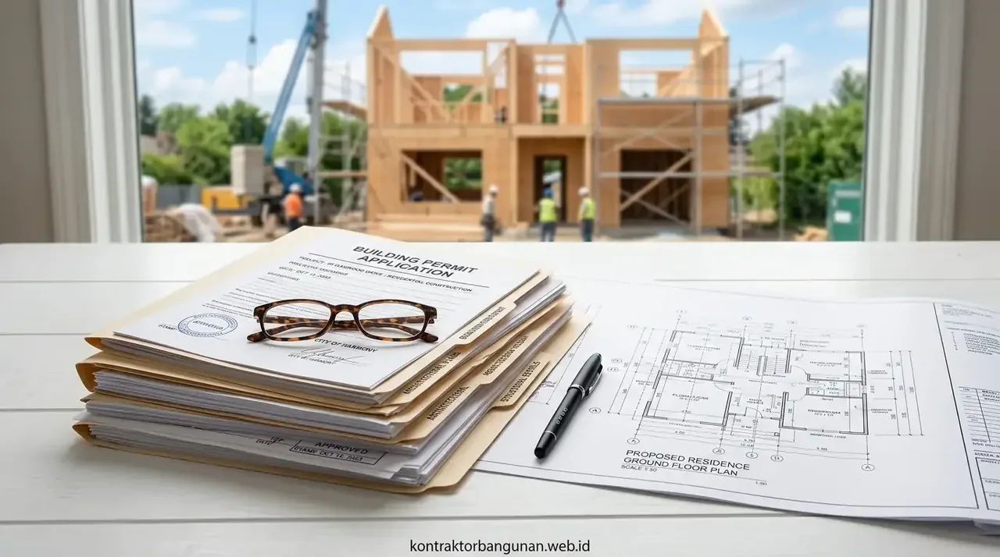
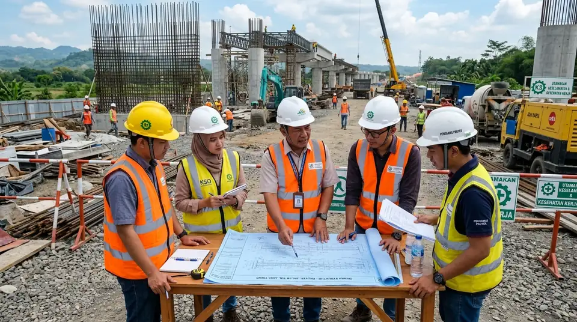

# Master SEO Content (3 Articles: Panduan Alur Izin PBG di SIMBG PUPR, Cara Mengurus SLF Gedung & Standar K3 Konstruksi)
*Diterbitkan untuk stok publikasi 10 Oktober 2026*

---

# ARTIKEL 1: Panduan Lengkap Syarat & Alur Pengurusan Izin PBG Rumah & Gedung di SIMBG PUPR

```
Meta Title: Panduan Syarat & Alur Izin PBG SIMBG PUPR 2026 Terlengkap
Slug: /blog/panduan-lengkap-syarat-alur-izin-pbg-simbg-pupr
Meta Description: Panduan lengkap syarat dan alur pengurusan izin PBG (pengganti IMB) via portal SIMBG PUPR 2026. Berkas arsitek STRA, perhitungan struktur & rumus retribusi resmi.
Focus Keyphrase: alur pengurusan izin pbg simbg
Focus Keyphrase In Title: Ya
Focus Keyphrase In Meta Description: Ya
Focus Keyphrase In First Paragraph: Ya
Search Intent: Informational / Legal Guide
Answer Intent: Panduan Legalitas Bangunan / Alur Pendaftaran SIMBG Online / Berkas Teknis PUPR
Primary Entity: Pengurusan Izin Persetujuan Bangunan Gedung (PBG) via SIMBG PUPR
Secondary Entities: Pengganti IMB (PP No 16/2021), Surat Tanda Registrasi Arsitek (STRA), Sertifikat Keahlian Kerja (SKK/SKA Struktur), Sidang Tim Profesi Ahli (TPA/TPT), Rumus Retribusi Daerah
Query Fan-Out:
- Apa saja dokumen teknis yang wajib diunggah pemohon pada portal simbg.pupr.go.id?
- Berapa lama waktu proses penerbitan surat PBG dari pendaftaran hingga terbit?
- Bagaimana rumus menghitung biaya retribusi resmi PBG di dinas perizinan terpadu (DPMPTSP)?
Audience: Pemilik rumah tinggal, pengembang perumahan, pemilik ruko & gedung, arsitek perencana, dan konsultan legalitas properti.
Suggested Schema: Article, Service, FAQPage, BreadcrumbList
Author: Tim Spesialis Kontraktor Bangunan
Last Updated: 2026-10-10
Images:
- /blog/panduan-lengkap-syarat-alur-izin-pbg-simbg-pupr-01.webp | Alt: Alur pengurusan izin pbg simbg portal resmi kementerian pupr dan dokumen gambar kerja ded
- /blog/panduan-lengkap-syarat-alur-izin-pbg-simbg-pupr-02.webp | Alt: Tim arsitek dan insinyur struktur sedang menyusun berkas teknis kalkulasi beban pbg
```

# Panduan Lengkap Syarat & Alur Pengurusan Izin PBG Rumah & Gedung di SIMBG PUPR

**Memahami alur pengurusan izin PBG SIMBG secara komprehensif memastikan proyek pembangunan Anda berjalan legal, bebas dari risiko segel satpol PP, dan memenuhi standar keselamatan tata bangunan nasional.**

Sejak diterbitkannya Peraturan Pemerintah (PP) No. 16 Tahun 2021 sebagai aturan turunan Undang-Undang Cipta Kerja, istilah Izin Mendirikan Bangunan (IMB) telah resmi dihapus dan digantikan oleh **Persetujuan Bangunan Gedung (PBG)**. Perbedaan fundamentalnya adalah PBG tidak lagi sekadar izin administratif, melainkan instrumen kepatuhan standar teknis bangunan gedung yang wajib didaftarkan secara daring (*online*) melalui portal terpusat **Sistem Informasi Manajemen Bangunan Gedung (SIMBG)** di bawah naungan Kementerian PUPR dan Dinas Penanaman Modal Pelayanan Terpadu Satu Pintu (DPMPTSP) kota/kabupaten.

### Ringkasan Inti
* **Peralihan dari IMB ke PBG:** PBG menitikberatkan pada fungsi keselamatan struktur tahan gempa, proteksi bahaya kebakaran, serta kesehatan tata cahaya dan udara gedung.
* **Wajib Gambar Teknis Berlisensi:** Seluruh berkas gambar arsitektur, struktur, dan MEP wajib ditandatangani oleh tenaga ahli bersertifikat (Arsitek ber-STRA dan Insinyur Sipil ber-SKA/SKK).
* **Sidang Konsultasi Teknis (TPT/TPA):** Berkas yang diunggah akan diuji kelayakannya dalam rapat koordinasi teknis bersama Tim Penilai Teknis (TPT) dinas PUPR setempat.
* **Transparansi Retribusi Resmi Daerah:** Biaya retribusi PBG dihitung otomatis berdasarkan rumus indeks lokal (luas lantai × indeks fungsi × indeks lokasi) yang disetorkan langsung ke Kas Daerah (Kasda) melalui kode *Billing SIMBG*.

---

<h2 id="alur-tahapan-simbg">5 Langkah Alur Pendaftaran PBG Melalui Portal SIMBG</h2>

1. **Pembuatan Akun Pemohon:** Buka laman `simbg.pupr.go.id`, daftar akun menggunakan NIK KTP atau NIB Perusahaan, lalu pilih menu *"Permohonan PBG/SLF Baru"*.
2. **Pengisian Data Tanah & Bangunan:** Masukkan data sertifikat kepemilikan tanah (SHM/HGB), KRK (Keterangan Rencana Kota/ITR), serta data fungsi bangunan.
3. **Unggah Dokumen Teknis Lengkap:** Mengunggah file PDF gambar kerja arsitektur DED, laporan perhitungan struktur baja/beton, penyelidikan tanah (sondir), serta gambar MEP.
4. **Sidang Uji Kelayakan & Perbaikan (Revisi):** Menghadiri sidang verifikasi online/offline bersama tim ahli dinas PUPR untuk penyesuaian detail teknis.
5. **Penerbitan SKRD & Dokumen PBG Final:** Membayar retribusi daerah via bank daerah/pos, setelah itu dokumen PBG dan lampiran rencana teknis bertandatangan elektronik (TTE) dapat diunduh langsung.


*Gambar 1: Alur pendaftaran izin PBG online melalui portal SIMBG Kementerian PUPR.*

---

<h2 id="tabel-daftar-berkas-pbg">Tabel Daftar Berkas Persyaratan Pengurusan PBG Rumah & Gedung</h2>

**Tabel rincian dokumen administrasi dan dokumen rencana teknis yang wajib disiapkan.**

| Kategori Dokumen | Jenis Berkas yang Wajib Disiapkan | Keterangan & Legalitas |
| :--- | :--- | :--- |
| **A. Dokumen Administrasi** | KTP / NPWP Pemilik Bangunan & NIB Usaha | Identitas legal pemohon |
| | Sertifikat Hak Atas Tanah (SHM / SHGB) | Bukti kepemilikan lahan sah |
| | Surat Keterangan Rencana Kota (KRK / ITR) | Peta zonasi tata ruang dari dinas tata kota |
| **B. Dokumen Teknis Arsitektur** | Gambar Denah, Tampak, Potongan & Site Plan | Bertandatangan Arsitek berlisensi STRA resmi |
| | Spesifikasi Teknis Material Finishing | Rincian bahan dinding, atap, dan sanitair |
| **C. Dokumen Teknis Struktur** | Gambar Detail Pondasi, Sloof, Kolom, Balok, Dak | Ditandatangani Insinyur Struktur Sipil ber-SKA |
| | Laporan Hasil Uji Uji Tanah (Sondir DCPT) | Menentukan daya dukung lapisan tanah keras |
| | Laporan Perhitungan Struktur Software (SAP2000/ETABS)| Analisa beban gempa SNI 1726 terbaru |
| **D. Dokumen Teknis MEP** | Gambar Instalasi Listrik, Pipa Air Bersih/Kotor | Skema jalur pipa, septic tank & titik lampu |
| | Rencana Proteksi Kebakaran & Penangkal Petir | Khusus ruko, gedung kantor, dan fasilitas publik |

---

<h2 id="faq">Pertanyaan yang Sering Diajukan (FAQ)</h2>

### Berapa lama estimasi waktu penerbitan PBG dari pendaftaran awal?
Berdasarkan SOP Kementerian PUPR, jika seluruh dokumen teknis telah lengkap dan valid tanpa banyak revisi gambar, PBG dapat diterbitkan dalam waktu 14 hingga 28 hari kerja.

### Apakah rumah yang sudah terlanjur dibangun tanpa izin masih bisa mengurus PBG?
Bisa, permohonan diajukan melalui skema **PBG Bangunan Eksisting** yang disinergikan langsung dengan penerbitan Sertifikat Laik Fungsi (SLF) setelah dilakukan audit keandalan struktur bangunan oleh tenaga ahli.

---

<h2 id="kesimpulan">Urus Izin Bangunan Anda Tanpa Ribet</h2>

Menyiapkan dokumen teknis ber-STRA dan SKA membutuhkan keahlian profesional. Percayakan jasa gambar kerja dan pendampingan pengurusan izin PBG Anda kepada Kontraktor Bangunan!

---

# ARTIKEL 2: Cara Mengurus Sertifikat Laik Fungsi (SLF) Bangunan Gedung: Syarat Teknis & Audit Berkala

```
Meta Title: Cara Mengurus Sertifikat Laik Fungsi (SLF) Gedung: Syarat & Alur
Slug: /blog/cara-mengurus-sertifikat-laik-fungsi-slf-gedung
Meta Description: Panduan lengkap cara mengurus Sertifikat Laik Fungsi (SLF) bangunan gedung. Syarat audit keandalan struktur, proteksi kebakaran, kelayakan elektrikal & perpanjangan.
Focus Keyphrase: cara mengurus sertifikat laik fungsi slf
Focus Keyphrase In Title: Ya
Focus Keyphrase In Meta Description: Ya
Focus Keyphrase In First Paragraph: Ya
Search Intent: Informational / Legal Compliance
Answer Intent: Panduan Penerbitan SLF Gedung Komersial / Syarat Uji Kelayakan Bangunan
Primary Entity: Sertifikat Laik Fungsi (SLF) Bangunan Gedung
Secondary Entities: Pengkaji Teknis Bangunan (Audit Kelayakan), Uji Sistem Hidran & Sprinkler, Uji Kelaikan Instalasi Listrik (SLO), Aksesibilitas Ramah Difabel, Masa Berlaku SLF (5 Tahun)
Query Fan-Out:
- Kapan sebuah bangunan gedung komersial wajib memiliki dokumen SLF?
- Apa sanksi hukum jika gedung operasional kantor / pabrik tidak mengantongi izin SLF?
- Berapa tahun masa berlaku sertifikat laik fungsi dan bagaimana alur perpanjangannya?
Audience: Pengelola gedung, pemilik hotel/apartemen, pengusaha pabrik industri, konsultan pengkaji teknis, dan direktur operasional perusahaan.
Suggested Schema: Article, Service, FAQPage, BreadcrumbList
Author: Tim Spesialis Kontraktor Bangunan
Last Updated: 2026-10-10
Images:
- /blog/cara-mengurus-sertifikat-laik-fungsi-slf-gedung-01.webp | Alt: Cara mengurus sertifikat laik fungsi slf inspeksi teknis sistem proteksi kebakaran gedung
- /blog/cara-mengurus-sertifikat-laik-fungsi-slf-gedung-02.webp | Alt: Audit keandalan struktur balok kolom beton dan uji kelayakan genset lift gedung
```

# Cara Mengurus Sertifikat Laik Fungsi (SLF) Bangunan Gedung: Syarat Teknis & Audit Berkala

**Memahami cara mengurus sertifikat laik fungsi SLF gedung memastikan seluruh sistem keselamatan penghuni teruji secara sah sebelum bangunan dioperasikan untuk aktivitas komersial maupun fasilitas publik.**

Banyak pemilik properti mengira bahwa setelah mengantongi izin PBG dan menyelesaikan pekerjaan fisik konstruksi, bangunan dapat langsung dioperasikan secara bebas. Kenyataannya, regulasi tata ruang dan bangunan di Indonesia mewajibkan setiap bangunan gedung memiliki **Sertifikat Laik Fungsi (SLF)** sebelum dimanfaatkan. SLF adalah bukti surat resmi dari pemerintah daerah yang menyatakan bahwa bangunan tersebut telah memenuhi persyaratan kelaikan teknis fungsi bangunan—mencakup keselamatan struktur terhadap gempa, keandalan sistem pemadam api, kelayakan instalasi listrik genset, serta kenyamanan sirkulasi udara dan aksesibilitas ramah disabilitas.

### Ringkasan Inti
* **Kewajiban Mutlak Operasional:** Gedung komersial, ruko bertingkat, hotel, mall, rumah sakit, dan pabrik wajib mengantongi SLF sebagai syarat utama penerbitan izin operasional usaha di OSS (Online Single Submission).
* **Peran Lembaga Pengkaji Teknis:** Pemeriksaan fisik lapangan dilakukan oleh tim Pengkaji Teknis (*Technical Auditor*) independen bersertifikat yang ditunjuk pemilik gedung.
* **4 Parameter Uji Keandalan:** Meliputi aspek Keselamatan (*Safety*), Kesehatan (*Health*), Kenyamanan (*Comfort*), dan Kemudahan (*Accessibility*).
* **Masa Berlaku SLF:** Berlaku selama 5 (lima) tahun untuk bangunan gedung umum/komersial dan 20 (dua puluh) tahun untuk rumah tinggal tunggal, sebelum wajib diaudit ulang untuk perpanjangan.

---

<h2 id="parameter-audit-slf">4 Aspek Pemeriksaan Kelaikan Bangunan Gedung (SLF)</h2>

1. **Aspek Keselamatan (Safety):** Uji kekuatan lentur struktur beton/baja tanpa retak struktural, uji coba fungsi sistem proteksi kebakaran (*hydrant pump, sprinkler, smoke detector, APAR*), penangkal petir, serta kejelasan jalur evakuasi pintu darurat.
2. **Aspek Kesehatan (Health):** Kecukupan ventilasi pertukaran udara alami/mekanis, sistem pencahayaan ruang kerja, sanitasi air bersih, pengolahan air limbah (*Sewage Treatment Plant / STP*), dan pengelolaan sampah.
3. **Aspek Kenyamanan (Comfort):** Tingkat kebisingan ruang dan getaran mesin, temperatur suhu ruangan AC, serta kenyamanan pandangan visual.
4. **Aspek Kemudahan (Accessibility):** Ketersediaan fasilitas ramah difabel seperti ramp tangga kursi roda bergradien landai, toilet khusus disabilitas, serta rambu petunjuk arah evakuasi yang jelas.


*Gambar 1: Pemeriksaan kelaikan tekanan pompa hydrant dan sistem pemadam api untuk syarat SLF gedung.*

---

<h2 id="tabel-alur-penerbitan-slf">Tabel Tahapan Alur Pengurusan Sertifikat Laik Fungsi (SLF)</h2>

**Tabel urutan langkah kerja pengurusan sertifikat laik fungsi bangunan komersial.**

| Urutan Tahap | Pelaksana Kegiatan | Output Dokumen yang Dihasilkan |
| :---: | :--- | :--- |
| **Tahap 1** | Pemilik Gedung / Pemohon | Pengumpulan berkas As-Built Drawing DED, PBG awal, dan sertifikat tanah |
| **Tahap 2** | Tim Pengkaji Teknis Bersertifikat | Inspeksi visual, NDT test beton (hammer test), uji beban, audit MEP |
| **Tahap 3** | Konsultan Pengkaji Teknis | Penyusunan Buku Laporan Hasil Kajian Teknis Keandalan Bangunan Gedung |
| **Tahap 4** | Dinas PUPR & Tim Penilai Teknis | Sidang pleno evaluasi hasil audit teknis via platform SIMBG PUPR |
| **Tahap 5** | Kepala DPMPTSP Kota / Kabupaten | Penerbitan Sertifikat Laik Fungsi (SLF) resmi ber-barcode TTE |

---

<h2 id="faq">Pertanyaan yang Sering Diajukan (FAQ)</h2>

### Apa risiko hukum jika gedung beroperasi tanpa memiliki SLF?
Pemerintah daerah berwenang memberikan surat peringatan, mengenakan denda administratif, mencabut izin usaha operasional, hingga melakukan penutupan dan penyegelan sementara bangunan.

### Apakah biaya penerbitan dokumen SLF dikenakan retribusi daerah?
Penerbitan dokumen SLF oleh dinas perizinan pemerintah daerah pada dasarnya **Rp 0 (Gratis)** tanpa retribusi. Biaya yang timbul hanyalah biaya jasa audit dan pengujian lapangan oleh konsultan pengkaji teknis independen.

---

<h2 id="kesimpulan">Pastikan Legalitas & Keamanan Gedung Usaha Anda</h2>

Bangunan yang mengantongi SLF memberikan rasa aman bagi para penyewa dan pengunjung serta menaikkan nilai valuasi properti Anda. Konsultasikan proses audit dan pengurusan SLF gedung Anda bersama tim ahli Kontraktor Bangunan!

---

# ARTIKEL 3: Penerapan K3 Konstruksi Bangunan Gedung: Standar APD, Scaffolding Aman & Zero Accident

```
Meta Title: Penerapan K3 Konstruksi Bangunan: Standar APD & Scaffolding
Slug: /blog/penerapan-k3-konstruksi-bangunan-gedung
Meta Description: Panduan penerapan K3 konstruksi bangunan gedung berstandar Permen PUPR. Standarisasi APD wajib, pemasangan scaffolding aman ketinggian & target zero accident.
Focus Keyphrase: penerapan k3 konstruksi bangunan
Focus Keyphrase In Title: Ya
Focus Keyphrase In Meta Description: Ya
Focus Keyphrase In First Paragraph: Ya
Search Intent: Informational / Safety & Compliance
Answer Intent: Standar Manajemen Keselamatan Konstruksi (SMKK) / Panduan K3 Proyek Bangunan
Primary Entity: Penerapan K3 (Keselamatan dan Kesehatan Kerja) Konstruksi Bangunan
Secondary Entities: Sistem Manajemen Keselamatan Konstruksi (SMKK Permen PUPR 10/2021), Alat Pelindung Diri (APD Standar SNI), Scaffolding Pipa Tubular & Safety Net, Full Body Harness Ketinggian, Safety Induction Pagi (Toolbox Meeting)
Query Fan-Out:
- Apa saja perlengkapan APD wajib bagi pekerja proyek konstruksi bangunan bertingkat?
- Bagaimana standar pemasangan scaffolding perancah pipa agar tidak roboh saat pengecoran?
- Bagaimana alur pelaksanaan safety induction dan identifikasi bahaya (HIRADC) di lokasi proyek?
Audience: Safety Officer (Petugas K3 Konstruksi), Site Manager, mandor proyek, kontraktor sipil, dan mahasiswa teknik sipil.
Suggested Schema: Article, Service, FAQPage, BreadcrumbList
Author: Tim Spesialis Kontraktor Bangunan
Last Updated: 2026-10-10
Images:
- /blog/penerapan-k3-konstruksi-bangunan-gedung-01.webp | Alt: Penerapan k3 konstruksi bangunan pelaksanaan toolbox meeting safety induction pekerja di lapangan
- /blog/penerapan-k3-konstruksi-bangunan-gedung-02.webp | Alt: Pemasangan safety net jaring pengaman dan pekerja memakai full body harness di scaffolding
```

# Penerapan K3 Konstruksi Bangunan Gedung: Standar APD, Scaffolding Aman & Zero Accident

**Disiplin dalam penerapan K3 konstruksi bangunan gedung sesuai regulasi Sistem Manajemen Keselamatan Konstruksi (SMKK) Kementerian PUPR melindungi nyawa pekerja, mencegah kerugian material akibat insiden kerja, dan menjaga reputasi proyek tepat waktu (*Zero Accident*).**

Industri konstruksi merupakan salah satu sektor industri dengan risiko kecelakaan kerja tertinggi (*high-risk industry*). Mulai dari bahaya terjatuh dari ketinggian (*fall from height*), tertimpa material runtuh, sengatan aliran listrik tegangan tinggi, hingga ambruknya perancah *scaffolding* saat proses pengecoran beton berlangsung. Penerapan prinsip Keselamatan dan Kesehatan Kerja (K3) bukan sekadar formalitas mengenakan helm proyek, melainkan sebuah sistem manajemen terpadu yang mencakup analisa risiko bahaya, pelatihan harian, kelayakan peralatan kerja, dan mitigasi tanggap darurat di lapangan.

### Ringkasan Inti
* **Regulasi Acuan Permen PUPR No. 10/2021:** Mewajibkan setiap penyedia jasa konstruksi menerapkan SMKK dalam seluruh tahapan perencanaan, pengadaan, hingga pelaksanaan fisik proyek.
* **Standarisasi Alat Pelindung Diri (APD):** Setiap orang yang memasuki area proyek wajib mengenakan helm keselamatan (*safety helmet* bersertifikat SNI/ANSI), rompi reflektif berkilau (*high-visibility vest*), dan sepatu pelindung berujung baja (*steel toe safety shoes*).
* **Bekerja di Ketinggian (Work at Height):** Pekerjaan di atas ketinggian 1,8 meter wajib menggunakan tali pengaman tubuh penuh (*full body harness with double lanyard & shock absorber*) yang dicantolkan ke pipa *lifeline* kokoh.
* **Rutinitas Toolbox Meeting (TBM):** Pengarahan keselamatan singkat selama 10–15 menit setiap pagi sebelum pekerjaan dimulai untuk mengingatkan potensi bahaya spesifik hari itu.

---

<h2 id="hierarki-pengendalian-bahaya">Standar Pemasangan Scaffolding (Perancah) Aman Bebas Ambruk</h2>

1. **Pondasi Pijakan Landasan (Sole Plate & Base Plate):** Kaki pipa *scaffolding* tidak boleh bertumpu langsung di atas tanah lembek; wajib menggunakan papan kayu tebal (*sole board*) dan plat baja *base plate* perata beban.
2. **Pemasangan Pengaku Silang (Cross Bracing & Tie-Back):** Seluruh rangka perancah diikat dengan batang silang dan diikatkan (*anchored*) ke kolom/dinding beton gedung minimal setiap interval ketinggian 4 meter.
3. **Lantai Kerja Penuh (Full Catwalk & Toe Board):** Lantai kerja wajib ditutup rapat dengan papan plat baja atau multipleks tebal anti selip, dilengkapi papan pembatas tepi (*toe board* tinggi 15 cm) agar perkakas kerja tidak menggelinding jatuh menimpa pekerja di bawah.
4. **Sistem Label Kelayakan (Scaff-Tag System):** Pemasangan kartu tanda status inspeksi: Tag Hijau (Aman Digunakan), Tag Kuning (Ada Catatan Khusus), dan Tag Merah (Dilarang Digunakan / Sedang Dirakit).


*Gambar 1: Pelaksanaan toolbox meeting keselamatan kerja K3 sebelum memulai aktivitas proyek.*

---

<h2 id="tabel-apd-wajib">Tabel Standar APD Wajib Pekerja Konstruksi Bangunan Gedung</h2>

**Tabel spesifikasi perlengkapan pelindung diri berdasarkan area risiko kerja.**

| Jenis APD Wajib | Standar Spesifikasi Mutu | Fungsi Perlindungan Utama |
| :--- | :--- | :--- |
| **Safety Helmet (Helm Proyek)** | SNI ISO 3873 / ANSI Z89.1 Tipe 1 Kelas E | Melindungi kepala dari benturan benda jatuh dan tegangan listrik |
| **Safety Shoes (Sepatu Baja)** | SNI 7079 / Toe Cap Baja Kuat Tekan 200 Joule | Melindungi telapak kaki dari tusukan paku dan himpitan beban berat |
| **Full Body Harness** | EN 361 / ANSI Z359.1 Double Hook Carabiner | Menahan tubuh pekerja saat terpeleset jatuh dari ketinggian scaffolding |
| **Kacamata Safety (Eye Goggles)** | ANSI Z87.1 Lensa Polikarbonat Anti Pecah | Mencegah percikan gram las besi, serbuk semen, dan debu gurinda |
| **Sarung Tangan (Safety Gloves)** | Heavy Duty Leather / Nitrile Coated Grip | Melindungi tangan dari sayatan plat tajam dan cairan semen basah |
| **Safety Net & Jaring Debu (Mesh)** | Poliamida Kekuatan Tarik Tinggi 350 kg/m | Menangkap serpihan material puing agar tidak jatuh ke jalan umum |

---

<h2 id="faq">Pertanyaan yang Sering Diajukan (FAQ)</h2>

### Apa peran utama seorang Petugas K3 Konstruksi (HSE Officer) di proyek?
Petugas K3 bertugas mengidentifikasi potensi bahaya (*Job Safety Analysis*), memastikan seluruh pekerja mematuhi SOP keselamatan dan memakai APD lengkap, menginspeksi alat berat secara berkala, serta melakukan penanganan pertolongan pertama jika terjadi insiden.

### Mengapa jaring pengaman (safety net) wajib dipasang di sekeliling gedung bertingkat?
Jaring pengaman berfungsi ganda: sebagai penahan lapis kedua jika ada pekerja yang terjatuh dari perancah serta mencegah jatuhnya puing batu/peralatan kerja ke area pemukiman warga sekitar proyek.

---

<h2 id="kesimpulan">Membangun dengan Komitmen Keselamatan Tertinggi</h2>

Proyek yang sukses bukan hanya selesai tepat waktu dan sesuai anggaran, melainkan berhasil diselesaikan tanpa ada satupun korban kecelakaan kerja. Wujudkan pembangunan proyek berstandar K3 profesional bersama Kontraktor Bangunan!
