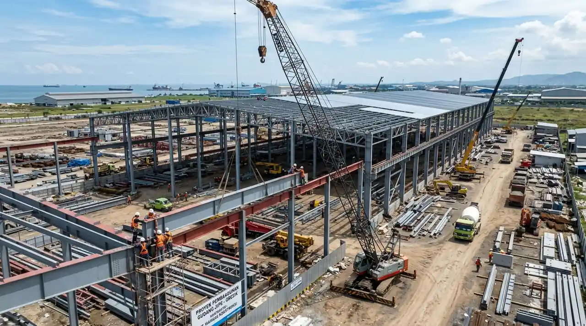
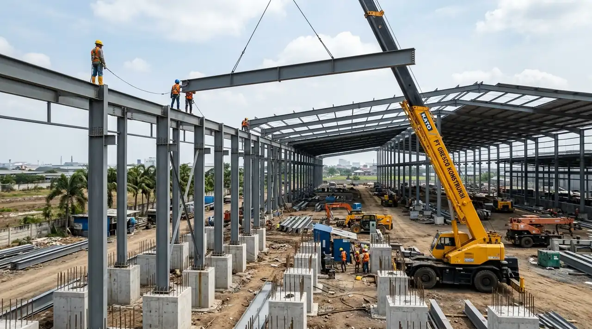
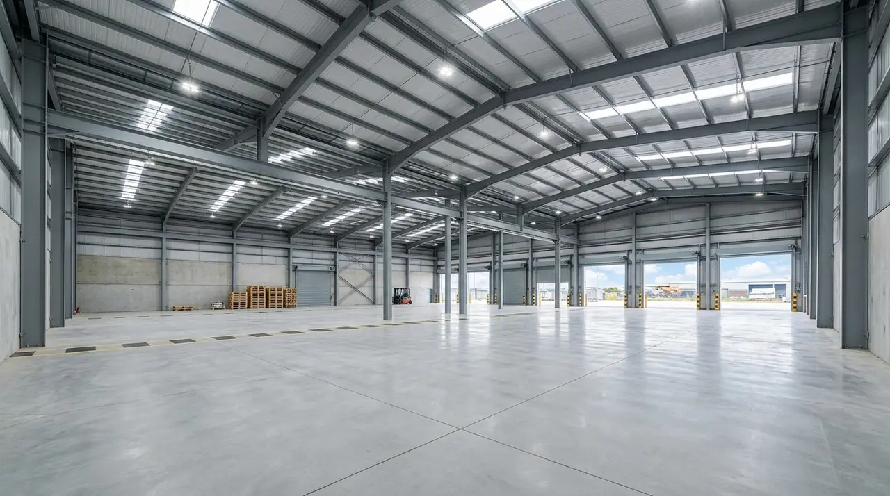
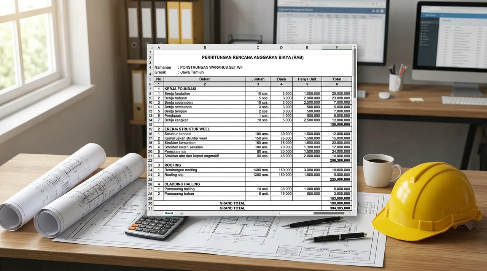
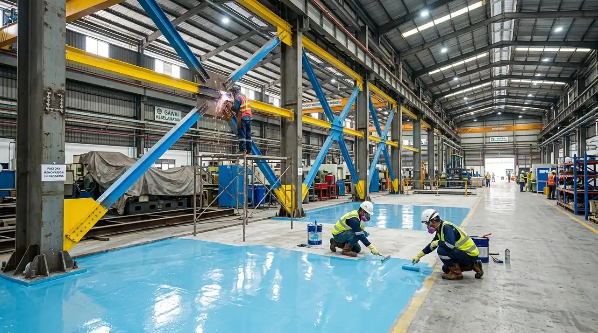
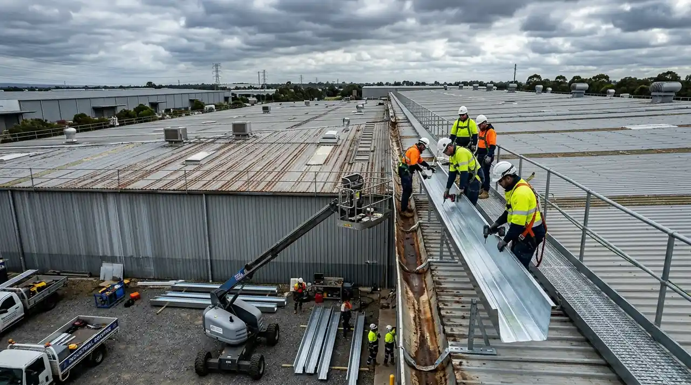

# Master SEO Content (3 Articles Konstruksi Gudang & Bangunan Industri Gresik)
*Diterbitkan otomatis untuk publikasi 28 September 2026*

---

# ARTIKEL 1: Jasa Kontraktor Gudang & Pabrik di Gresik (Kawasan Industri JIIPE & Manyar)

```
Meta Title: Kontraktor Gudang & Pabrik Gresik JIIPE Manyar Baja WF
Slug: /blog/kontraktor-gudang-pabrik-gresik
Meta Description: Cari kontraktor gudang & pabrik di Gresik (JIIPE, Manyar, Driyorejo)? Rangka baja WF SNI, lantai heavy duty K-350 & izin PBG/SLF. Dapatkan RAB Gratis!
Focus Keyphrase: kontraktor gudang gresik
Search Intent: Commercial / B2B Transactional
Answer Intent: Rekomendasi / Spesifikasi Teknis / Rekayasa Bangunan Industri
Primary Entity: Jasa Kontraktor Gudang dan Pabrik Gresik
Secondary Entities: Kontraktor Kawasan Industri JIIPE Manyar, Konstruksi Baja WF Gresik, Gudang Logistik Pelabuhan Gresik, Jasa Bangun Pabrik Driyorejo
Query Fan-Out:
- Berapa estimasi biaya bangun gudang logistik per meter di kawasan JIIPE Manyar Gresik?
- Bagaimana cara mengurus PBG industri dan Sertifikat Laik Fungsi (SLF) di Pemkab Gresik?
- Apa standar mutu beton dan perkuatan tanah pesisir pantai untuk lantai gudang di Gresik?
Audience: Pimpinan perusahaan manufaktur, manajer rantai pasok (supply chain), investor pergudangan pelabuhan, dan pemilik usaha industri di koridor Gresik (JIIPE, Manyar, Kebomas, Driyorejo, Wringinanom).
Suggested Schema: Article, Product, FAQPage, BreadcrumbList
Author: Tim Spesialis Kontraktor Bangunan
Last Updated: 2026-09-28
Images:
- /blog/kontraktor-gudang-pabrik-gresik-01.webp | Alt: Kontraktor gudang gresik pembangunan fasilitas pabrik dan pergudangan industri baja bentang lebar di Manyar JIIPE
- /blog/kontraktor-gudang-pabrik-gresik-02.webp | Alt: Ereksi struktur baja profil WF dan kolom pedestal beton bertulang gudang logistik Gresik
```

# Jasa Kontraktor Gudang & Pabrik di Gresik (Kawasan Industri JIIPE & Manyar)

**Jasa kontraktor gudang dan pabrik di Gresik menyediakan solusi rancang bangun fasilitas industri, logistik pelabuhan JIIPE, dan workshop manufaktur berstruktur baja WF kokoh dengan jaminan PBG serta SLF resmi.**

Kabupaten Gresik memegang peranan krusial sebagai simpul manufaktur, kimia, pengolahan mineral, dan logistik maritim terpadu di Jawa Timur. Keberadaan *Java Integrated Industrial and Port Estate* (JIIPE) Manyar, Kawasan Industri Gresik (KIG), hingga koridor industri Driyorejo serta Wringinanom menuntut kapabilitas rekayasa konstruksi yang tangguh. Membangun pabrik ataupun gudang penyimpanan skala besar di area pesisir Gresik menghadapi tantangan geoteknik khusus, seperti daya dukung tanah lempung lunak (*soft marine clay*) dan risiko korosi air laut yang tinggi.

### Ringkasan Inti
* **Rekayasa Struktur Tahan Korosi Pesisir:** Memakai baja profil WF bersertifikasi SNI dengan sistem pelapisan *epoxy zinc-rich primer* dan *polyurethane topcoat* tahan uap garam laut Manyar.
* **Pondasi Dalam Berdaya Dukung Tinggi:** Pemilihan pondasi tiang pancang spun pile atau bored pile yang mencapai tanah keras (*bearing stratum*) guna mencegah deformasi lantai.
* **Plat Lantai Beban Ekstrem (Heavy-Duty):** Beton cor K-350 hingga K-400 dengan perkuatan *wiremesh double layer* M10 serta taburan *metallic floor hardener* anti-abrasi forklift.
* **Perizinan Terpadu SIMBG Gresik:** Pengurusan lengkap DED Arsitektur-Struktur-MEP, dokumen AMDAL/UKL-UPL, Persetujuan Bangunan Gedung (PBG), hingga penerbitan SLF.

---

<h2 id="tantangan-konstruksi-gresik">Karakteristik & Tantangan Teknis Bangunan Industri di Gresik</h2>

**Pembangunan gudang dan pabrik di kawasan Gresik menuntut penanganan daya dukung tanah rawa pesisir dan pencegahan korosi atmosfer maritim agresif.**

Berdasarkan data penyelidikan geoteknik di koridor Manyar dan pesisir utara Gresik, lapisan tanah atas umumnya didominasi sedimen aluvial dan lempung lanauan dengan nilai *Standard Penetration Test* (N-SPT) di bawah 5 hingga kedalaman 12-18 meter. Kondisi ini membuat pondasi dangkal tidak memadai untuk menopang beban tumpukan barang logistik maupun mesin getar industri berat.

Keunggulan penerapan standar Kontraktor Bangunan:
1. **Analisa Geoteknik Presisi (CPT & Bor Log Dalam):** Penentuan kedalaman tiang pancang hingga lapisan batuan dasar lempung kaku (*stiff clay/shale*) agar penurunan diferensial (*differential settlement*) mendekati nol.
2. **Desain Struktur Bentang Lebar (*Clear Span*):** Pemanfaatan sistem portal frame baja WF bentang 24 hingga 48 meter tanpa kolom tengah, memaksimalkan efisiensi manuver forklift dan *racking system*.
3. **Proteksi Katodik & Coating Maritim C4/C5:** Memberikan perlindungan ekstra terhadap komponen struktural baja dari kelembapan tinggi serta zat kimiawi industri.


*Gambar 1: Rancang bangun konstruksi gudang bentang lebar dengan rangka baja WF standar SNI di kawasan industri Gresik.*

---

<h2 id="spesifikasi-struktur-gudang-gresik">Tahapan Eksekusi Rancang Bangun Gudang Modern di Gresik</h2>

**Alur pembangunan terstruktur mencakup penyelidikan tanah lapangan, fabrikasi rangka baja presisi di workshop, ereksi lapangan dengan alat berat berlisensi SIO, serta pengecoran lantai laser screed.**

Berikut alur sistematis pembangunan proyek industri di Gresik:

### 1. Soil Investigation & Soil Improvement
Meliputi uji sondir kapasitas 2,5 ton/20 ton, *deep boring*, serta stabilisasi tanah dasar (*preloading* atau *vibro-replacement*) jika diperlukan pada lahan bekas tambak atau rawa.

### 2. Pekerjaan Substructure (Pondasi & Pedestal)
Pemancangan *precast spun pile* diameter 300-500 mm menggunakan sistem *Hydraulic Static Pile Driver* (HSPD) guna meminimalisasi kebisingan dan retak lingkungan tetangga, dilanjutkan pembesian *pile cap* masif.

### 3. Fabrikasi & Ereksi Rangka Baja WF
Fabrikasi balok rafter, kolom WF, ikatan angin (*cross bracing*), dan trekstang dilakukan dengan pengelasan terkontrol *Submerged Arc Welding* (SAW). Pemasangan di lapangan dipandu mobile crane 35-50 ton dengan baut torsi mutu tinggi Grade 8.8 (A325).

### 4. Lantai Super Flat & Hardener
Pengecoran plat beton tebal 18-25 cm mutu K-350/K-400 menggunakan *laser screed* untuk kerataan lantai maksimal, diakhiri pemotongan sambungan susut (*saw-cut joint sealant*) untuk mencegah retak liar.


*Gambar 2: Proses ereksi kolom portal frame baja WF dan penulangan plat lantai heavy duty di lokasi proyek.*

---

<h2 id="tabel-komparasi-gudang-gresik">Tabel Komparasi Spesifikasi Gudang Industri di Area Gresik</h2>

**Tabel ini memberikan acuan komparasi teknis tipe bangunan gudang logistik dan pabrik manufaktur di Gresik.**

| Parameter Evaluasi | Gudang Logistik Umum (Manyar) | Pabrik Manufaktur Berat (JIIPE) | Gudang Transit Workshop (Driyorejo) |
| :--- | :--- | :--- | :--- |
| **Profil Rangka Baja** | Baja WF 250 - WF 400 | Baja WF 400 - WF 700 + Konsol Crane | Rangka Baja WF 200 - WF 350 |
| **Beban Plat Lantai** | 3.000 – 5.000 kg/m² | 5.000 – 10.000 kg/m² (Dinamis) | 2.000 – 3.000 kg/m² |
| **Mutu Beton Lantai** | K-300 / K-350 tebal 15-18 cm | K-350 / K-400 tebal 20-25 cm | K-250 / K-300 tebal 12-15 cm |
| **Tipe Penutup Atap** | Spandek Zincalume 0.45 mm + Foil | Insulasi Rockwool / PU Foam Sandwich | Spandek Galvalum 0.40 mm |
| **Estimasi Biaya / m²** | Rp 2.600.000 – Rp 3.400.000 | Rp 3.500.000 – Rp 5.200.000 | Rp 2.300.000 – Rp 3.000.000 |

---

<h2 id="faq">Pertanyaan yang Sering Diajukan (FAQ)</h2>

### Apakah Kontraktor Bangunan melayani perizinan PBG dan SLF di Pemkab Gresik?
Ya, kami menyediakan layanan terintegrasi rancang-bangun (*design and build*) mulai dari penyusunan berkas teknis arsitektur, kalkulasi struktur SAP2000 bertanda tangan SKA/STRA, koordinasi sidang TPA/TPT di Dinas CKTR Gresik, hingga terbit PBG dan sertifikat SLF.

### Berapa lama durasi rata-rata pembangunan gudang seluas 2.000 m² di Gresik?
Untuk gudang rangka baja seluas 2.000 m², estimasi pengerjaan membutuhkan waktu sekitar 4 hingga 6 bulan kalender, tergantung pada kompleksitas pekerjaan pondasi dalam dan pematangan lahan awal.

### Apakah rangka baja yang digunakan sudah memiliki sertifikasi uji tarik SNI?
Seluruh material baja profil WF dan H-Beam yang kami gunakan berasal dari produsen resmi bersertifikasi Standar Nasional Indonesia (SNI), seperti Gunung Garuda, Krakatau Steel, atau KS POSCO, lengkap dengan *Mill Certificate* resmi.

---

<h2 id="kesimpulan">Kesimpulan Praktis</h2>

Membangun gudang dan pabrik di kawasan strategis Gresik memerlukan perencanaan matang yang mengintegrasikan aspek geoteknik tanah pesisir, pemilihan material struktur tahan korosi, dan kecepatan legalitas izin PBG. Bersama Kontraktor Bangunan, proyek Anda dikerjakan oleh tim berpengalaman dengan standar mutu terbaik, bebas keterlambatan, dan bergaransi resmi.

---

# ARTIKEL 2: Estimasi Biaya Bangun Gudang Rangka Baja di Gresik & Analisa RAB 2026

```
Meta Title: Biaya Bangun Gudang Rangka Baja Gresik 2026 & Analisa RAB
Slug: /blog/biaya-bangun-gudang-gresik
Meta Description: Cek rincian estimasi biaya bangun gudang rangka baja di Gresik per meter persegi 2026. Analisa RAB pondasi pancang, plat beton K-350, baja WF & atap zincalume.
Focus Keyphrase: biaya bangun gudang gresik
Search Intent: Commercial / Informational
Answer Intent: Estimasi Harga / Rincian Komponen Biaya / Perhitungan RAB
Primary Entity: Estimasi Biaya Bangun Gudang di Gresik
Secondary Entities: RAB Gudang Rangka Baja Gresik, Harga Konstruksi Baja WF per Kg Jawa Timur, Biaya Pondasi Spun Pile Gresik, Biaya Bangun Pabrik per m2
Query Fan-Out:
- Berapa rincian biaya per meter persegi bangun gudang baja di wilayah Gresik tahun 2026?
- Apa saja item pekerjaan terbesar dalam penyusunan RAB gudang di kawasan Manyar dan Driyorejo?
- Bagaimana cara menghitung kebutuhan tonase baja WF dan volume cor beton lantai gudang?
Audience: Investor properti industri, manajer operasional pergudangan, kontraktor lokal, dan pemilik bisnis yang merencanakan ekspansi fasilitas di Gresik.
Suggested Schema: Article, Product, FAQPage, BreadcrumbList
Author: Tim Spesialis Kontraktor Bangunan
Last Updated: 2026-09-28
Images:
- /blog/biaya-bangun-gudang-gresik-01.webp | Alt: Biaya bangun gudang gresik konstruksi rangka baja bentang lebar presisi dan lantai cor beton industri
- /blog/biaya-bangun-gudang-gresik-02.webp | Alt: Lembar perhitungan rencana anggaran biaya rab konstruksi gudang baja wf di Gresik Jawa Timur
```

# Estimasi Biaya Bangun Gudang Rangka Baja di Gresik & Analisa RAB 2026

**Estimasi biaya bangun gudang rangka baja di Gresik pada tahun 2026 berkisar antara Rp 2.500.000 hingga Rp 4.200.000 per meter persegi, dipengaruhi oleh jenis tanah pondasi, bentang struktur baja WF, dan spesifikasi lantai beban berat.**

Perhitungan Rencana Anggaran Biaya (RAB) gudang di Gresik memiliki variabel unik karena letak geografisnya yang memadukan kawasan pesisir (Manyar, Ujungpangkah) dan dataran padat (Driyorejo, Menganti). Biaya pondasi dan pematangan tanah (*earthwork*) dapat menyumbang porsi 20% hingga 30% dari total nilai proyek jika berada di atas tanah bekas tambak yang memerlukan penanganan khusus.

### Ringkasan Inti
* **Rentang Biaya Rata-Rata:** Biaya konstruksi berkisar Rp 2.500.000 – Rp 3.200.000/m² untuk gudang standar, dan Rp 3.300.000 – Rp 4.200.000/m² untuk gudang logistik modern beban berat.
* **Komponen Biaya Terbesar:** Struktur baja WF & penutup atap (35-45%), pekerjaan pondasi tiang pancang (18-25%), dan plat lantai beton bertulang (20-25%).
* **Harga Baja Terpasang:** Biaya fabrikasi dan ereksi baja WF bersertifikasi SNI berkisar antara Rp 26.000 hingga Rp 33.000 per kilogram (termasuk cat primer dan erection).
* **Efisiensi Anggaran Melalui Engineering:** Optimalisasi berat tonase profil baja menggunakan software rekayasa struktur dapat menghemat biaya material hingga 15%.

---

<h2 id="breakdown-biaya-gudang-gresik">Rincian Komponen Pekerjaan Utama dalam RAB Gudang Gresik</h2>

**Struktur pembiayaan gudang dibagi ke dalam 5 pos pokok: pekerjaan persiapan & tanah, pondasi substructure, rangka baja superstructure, arsitektur lantai & dinding, serta mekanikal-elektrikal.**

Berikut jabaran detail persentase alokasi biaya:

### 1. Pekerjaan Tanah & Pondasi (20% – 25%)
Mencakup pembersihan lahan, pemadatan tanah sirtu lapis demi lapis, pengadaan dan pemancangan tiang beton *mini pile* 25x25 atau *spun pile* dia. 30-40 cm, galian *pile cap*, dan balok *tie beam*.

### 2. Struktur Rangka Baja Utama (35% – 40%)
Pengadaan material baja WF/H-Beam (SS400/SM490), pelat simpul *gusset plate*, baut angkur *high strength*, gording CNP/Zincalume, ikatan angin, sagrod, serta pengecatan anti-karat zinkromate/epoxy primer.

### 3. Penutup Atap & Dinding (12% – 16%)
Pemasangan seng spandek zincalume tebal 0.40 - 0.45 mm, insulasi peredam panas *aluminium bubble foil* atau *glasswool*, talang air plat galvalum, dan dinding bata ringan/spandek perimeter.

### 4. Pekerjaan Lantai Beton & Floor Hardener (18% – 22%)
Pengecoran plat beton lantai tebal 15-20 cm mutu K-300 hingga K-350 dengan tulangan *wiremesh* M8/M10, perataan permukaan dengan *trowel finish*, dan tabur bubuk *floor hardener* Sika/Fosroc 5 kg/m².

### 5. Pekerjaan MEP & Drainase (8% – 12%)
Pemasangan panel distribusi utama, penerangan lampu High Bay LED industri, instalasi penangkal petir radius tembaga, pipa pembuangan air hujan, dan saluran drainase keliling bangunan.


*Gambar 1: Pekerjaan struktur lantai dan portal baja gudang industri dengan spesifikasi teknis terukur di Gresik.*

---

<h2 id="simulasi-rab-gudang-1000m2">Simulasi Perhitungan RAB Gudang Ukuran 1.000 m² di Manyar Gresik</h2>

**Simulasi biaya pembangunan gudang dimensi 25 x 40 meter (luas 1.000 m²) dengan tinggi kolom 8 meter di wilayah Gresik.**

Berikut estimasi biaya indikatif standar profesional Kontraktor Bangunan:

| No | Uraian Pekerjaan | Volume | Satuan | Harga Satuan (Rp) | Total Biaya (Rp) |
| :---: | :--- | :---: | :---: | :---: | :---: |
| 1 | Pekerjaan Persiapan, Pembersihan & Uji Sondir | 1 | Ls | 35.000.000 | 35.000.000 |
| 2 | Pemancangan Spun Pile Dia. 30 cm & Pile Cap | 120 | Titik/m | 185.000.000 | 380.000.000 |
| 3 | Struktur Rangka Baja WF & Rafter (Terpasang) | 36.000 | Kg | 28.500 | 1.026.000.000 |
| 4 | Penutup Atap Zincalume 0.45mm + Insulasi Foil | 1.250 | m² | 215.000 | 268.750.000 |
| 5 | Lantai Beton K-350 tbl 18 cm + Wiremesh M10 + Hardener | 1.000 | m² | 580.000 | 580.000.000 |
| 6 | Dinding Keliling Bata Ringan t=3m + Spandek | 650 | m² | 290.000 | 188.500.000 |
| 7 | Pintu Rolling Shutter Elektrik & Pintu Darurat | 2 | Unit | 45.000.000 | 90.000.000 |
| 8 | Instalasi Listrik High Bay LED & Grounding | 1 | Ls | 110.000.000 | 110.000.000 |
| 9 | Saluran Drainase Kawasan & Paving Luar | 1 | Ls | 145.000.000 | 145.000.000 |
| **Total** | **Estimasi Total Anggaran Konstruksi (Exclude PPN)** | | | | **Rp 2.823.250.000** |

*Catatan: Rata-rata biaya per meter persegi diperoleh sekitar **Rp 2.823.000 / m²**, sangat efisien untuk spesifikasi gudang logistik standar heavy-duty di Gresik.*


*Gambar 2: Analisa Harga Satuan Pekerjaan (AHSP) transparan dan detail volume BoQ menjamin efisiensi proyek.*

---

<h2 id="faktor-penghemat-biaya">Strategi Menekan Biaya Bangun Gudang Tanpa Mengorbankan Kualitas</h2>

1. **Gunakan Profil Baja Honeycomb / Castellated Beam:** Untuk bentang di atas 30 meter, baja kastela mengurangi berat sendiri balok hingga 20% dibandingkan profil WF utuh.
2. **Kombinasi Dinding Bata & Spandek:** Batasi pasangan dinding bata setinggi 3 meter dari lantai untuk proteksi keamanan, dan gunakan spandek zincalume untuk dinding bagian atas.
3. **Pilih Vendor Kontraktor Terintegrasi:** Kontraktor yang memiliki workshop fabrikasi baja sendiri dan armada alat berat mandiri dapat memotong margin perantara hingga 10-15%.

---

<h2 id="faq">Pertanyaan yang Sering Diajukan (FAQ)</h2>

### Apakah harga per meter persegi di atas sudah termasuk izin PBG?
Estimasi biaya fisik konstruksi di atas belum termasuk biaya retribusi daerah dan konsultan perizinan PBG/SLF. Kami menyediakan paket terpisah untuk legalitas lengkap dengan tarif transparan.

### Bagaimana sistem pembayaran pengerjaan gudang bersama Kontraktor Bangunan?
Sistem pembayaran berbasis prestasi kerja lapangan (termin per kemajuan persentase opname fisik) yang disepakati resmi dalam Surat Perjanjian Kerja (SPK), dilengkapi retensi garansi 5%.

### Berapa garansi kebocoran atap dan kekokohan struktur rangka baja?
Kami memberikan garansi pemeliharaan kebocoran atap selama 6 bulan dan garansi integritas struktur rangka baja hingga 10 tahun.

---

<h2 id="kesimpulan">Kesimpulan Praktis</h2>

Penyusunan RAB gudang yang akurat adalah pondasi finansial bagi keberhasilan ekspansi bisnis Anda di Gresik. Hubungi tim estimator profesional Kontraktor Bangunan untuk mendapatkan survei lokasi awal dan draf perhitungan RAB detail tanpa dipungut biaya.

---

# ARTIKEL 3: Jasa Renovasi Bangunan Industri, Gudang & Kantor Pabrik di Gresik

```
Meta Title: Jasa Renovasi Pabrik, Gudang & Kantor Industri Gresik
Slug: /blog/jasa-renovasi-bangunan-industri-gresik
Meta Description: Jasa renovasi pabrik, gudang & gedung kantor di Gresik (Manyar, Kebomas, Driyorejo). Perkuatan struktur baja, lantai epoxy, perbaikan atap bocor bergaransi SPK.
Focus Keyphrase: renovasi pabrik gresik
Search Intent: Commercial / B2B Service
Answer Intent: Solusi Perbaikan / Retrofitting Struktur / Peningkatan Kapasitas
Primary Entity: Jasa Renovasi Bangunan Industri di Gresik
Secondary Entities: Perbaikan Lantai Gudang Gresik, Jasa Renovasi Kantor Pabrik Manyar, Retrofitting Baja WF Industri, Penanganan Atap Bocor Pabrik
Query Fan-Out:
- Berapa biaya perbaikan lantai beton retak dan amblas di gudang industri Gresik?
- Bagaimana teknik renovasi perkuatan struktur baja untuk menambah kapasitas crane pabrik?
- Apa solusi mengatasi kebocoran talang jurai air dan tampias hujan pada gudang bentang lebar di Manyar?
Audience: Manajer pemeliharaan (maintenance manager), manajer operasional pabrik, pemilik aset pergudangan tua, dan pengelola kawasan industri di Gresik.
Suggested Schema: Article, Product, FAQPage, BreadcrumbList
Author: Tim Spesialis Kontraktor Bangunan
Last Updated: 2026-09-28
Images:
- /blog/jasa-renovasi-bangunan-industri-gresik-01.webp | Alt: Renovasi pabrik gresik perkuatan struktur baja portal frame dan perbaikan lantai beton epoxy
- /blog/jasa-renovasi-bangunan-industri-gresik-02.webp | Alt: Penanganan kebocoran atap gudang dan penggantian talang air galvanis kapasitas besar
```

# Jasa Renovasi Bangunan Industri, Gudang & Kantor Pabrik di Gresik

**Jasa renovasi bangunan industri di Gresik menangani perkuatan struktur portal baja, perbaikan lantai beton amblas, penggantian atap bocor, dan peremajaan interior kantor manajemen pabrik tanpa menghentikan aktivitas operasional produksi.**

Banyak fasilitas manufaktur dan pergudangan di Gresik yang didirikan lebih dari satu dekade lalu kini mengalami degradasi struktural. Paparan lingkungan pesisir yang korosif, beban dinamis forklift yang melampaui kapasitas awal, serta intensitas hujan tinggi sering memicu kebocoran talang air, keretakan lantai, hingga kelelahan sambungan baja (*fatigue*). Melakukan renovasi industri membutuhkan keahlian rekayasa khusus agar pekerjaan konstruksi berjalan aman di tengah operasional pabrik yang tetap berlangsung (*live operations*).

### Ringkasan Inti
* **Metode Kerja Tanpa Gangguan (Zero Downtime):** Pelaksanaan renovasi dengan zonasi pengaman terisolasi, jadwal kerja malam/akhir pekan, dan kepatuhan sistem izin kerja aman (*Permit to Work*).
* **Retrofitting & Penguatan Struktur:** Pemasangan pelat penguat (*stiffener*), penambahan ikatan silang, serta perkuatan kolom pedestal beton bertulang untuk instalasi crane baru.
* **Perbaikan Lantai Beban Berat:** Injeksi semen grouting di bawah plat beton amblas (*slab jacking*), perbaikan spalling dengan mortar epoxy, dan pelapisan Polyurethane (PU) Screed.
* **Overhaul Sistem Atap & Talang:** Penggantian talang air internal berkapasitas besar anti-luap dan aplikasi insulasi atap penurun suhu ruangan kerja pabrik.

---

<h2 id="layanan-renovasi-industri">Layanan Utama Renovasi Industri di Gresik</h2>

**Cakupan renovasi komprehensif mencakup area produksi, area pergudangan logistik, hingga gedung perkantoran dan fasilitas pendukung karyawan.**

1. **Perbaikan & Re-Coating Lantai Industri:** Mengatasi lantai berdebu (*dusting*), keretakan delaminasi, dan penggantian lapisan epoxy tahan kimia untuk ruang produksi bersertifikasi ISO/HACCP.
2. **Penggantian Atap & Talang Air (Reroofing):** Pemasangan atap baru tanpa membongkar rangka lama, penggantian sekrup *self-drilling* ber-seal EPDM tahan korosi, serta pelebaran lebar talang jurai.
3. **Perluasan Gudang (Warehouse Extension):** Penambahan bentang kanopi bongkar muat (*loading dock*), pembangunan mezzanine baja untuk ruang penyimpanan suku cadang, dan partisi dinding tahan api (*fire-rated wall*).
4. **Renovasi Kantor Pabrik & Fasad:** Modernisasi interior ruang kontrol manajemen, partisi akustik kaca, sistem HVAC sentral, dan peremajaan fasad luar berbahan Aluminium Composite Panel (ACP).


*Gambar 1: Pekerjaan retrofitting baja dan pemulihan permukaan lantai beton industri di kawasan Gresik.*

---

<h2 id="tabel-komparasi-renovasi">Tabel Komparasi Solusi Renovasi Struktur Gudang di Gresik</h2>

**Tabel komparasi metode perbaikan lantai dan struktur atap gudang di area industri Gresik.**

| Kondisi Kerusakan | Metode Konvensional | Solusi Rekayasa Kontraktor Bangunan | Keuntungan Hasil |
| :--- | :--- | :--- | :--- |
| **Lantai Amblas / Kopong Bawah Plat** | Bongkar total beton & cor ulang (Operasional mati 30 hari) | Injeksi Polyurethane Foam / Cement Grout Bertekanan | Selesai dalam 3 hari, tanpa bongkar beton, kapasitas pulih |
| **Atap Berkarat & Bocor Luas** | Tambal sealant silikon berkala (Tahan 3-6 bulan) | Re-roofing spandek anti-korosi maritim + ganti talang stainless 304 | Tahan cuaca ekstrem > 10 tahun, bebas kebocoran |
| **Penambahan Beban Crane 5 Ton** | Tambah kolom baru di tengah lantai (Mempersempit jalur) | Retrofitting balok bracket portal baja WF & penambahan tie rod | Ruang bebas manuver tetap 100%, struktur aman teruji SAP2000 |
| **Lantai Licin & Terkelupas Kimia** | Cat minyak biasa (Cepat rontok) | Aplikasi Heavy Duty Polyurethane Screed 4-6 mm | Tahan abrasi forklift, anti-slip, tahan cairan kimiawi |


*Gambar 2: Perbaikan sistem atap, talang air stainless, dan dinding cladding pada bangunan fasilitas gudang.*

---

<h2 id="prosedur-k3-renovasi">Standar K3 & Keselamatan Kerja Renovasi Lingkungan Aktif</h2>

Kami mematuhi regulasi ketat keselamatan kerja di lingkungan pabrik aktif:
* Pemasangan jaring pengaman jatuh (*safety net*) dan barikade debu terisolasi plastik tebal.
* Penyediaan sertifikat operator alat berat, rigger, dan teknisi bekerja pada ketinggian (*Working at Height*).
* Inspeksi kelistrikan harian dengan Ground Fault Circuit Interrupter (GFCI) untuk mencegah bahaya arus pendek di area industri.

---

<h2 id="faq">Pertanyaan yang Sering Diajukan (FAQ)</h2>

### Apakah proses renovasi pabrik mengharuskan lini produksi dihentikan?
Tidak harus. Kami terbiasa mengelola renovasi dengan sistem pentahapan (*phased work*) dan jadwal lembur malam/libur operasional, sehingga lini produksi klien tetap dapat berjalan normal.

### Bagaimana cara menentukan apakah struktur baja lama masih kuat untuk direnovasi?
Tim kami melakukan audit struktur awal meliputi pengujian ketebalan baja (*ultrasonic thickness gauge*), pengujian kekerasan beton (*hammer test*), serta pemodelan ulang kapasitas struktur dengan software teknik.

### Berapa lama garansi yang diberikan untuk pekerjaan renovasi atap dan lantai?
Pekerjaan penggantian atap dan waterproofing talang dilindungi garansi bebas bocor hingga 12 bulan, sementara pekerjaan perbaikan lantai dilindungi garansi hingga 1 tahun.

---

<h2 id="kesimpulan">Kesimpulan Praktis</h2>

Renovasi fasilitas industri dan gudang secara berkala menjaga nilai aset properti dan mencegah kerugian akibat kerusakan material logistik. Percayakan proyek renovasi bangunan industri Anda di Gresik kepada tim ahli Kontraktor Bangunan untuk solusi cepat, presisi, dan aman.
