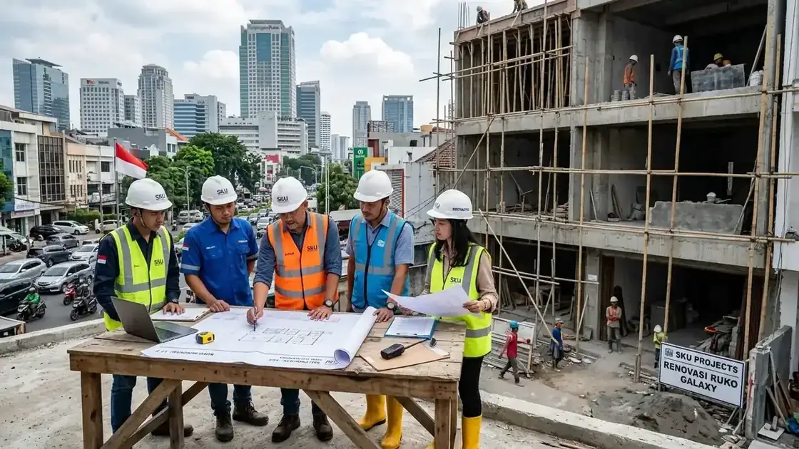
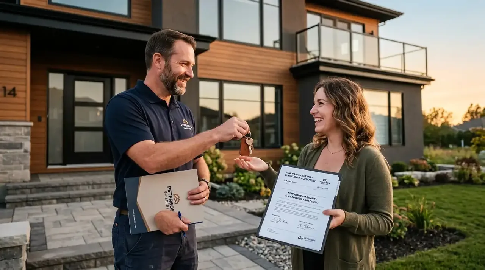
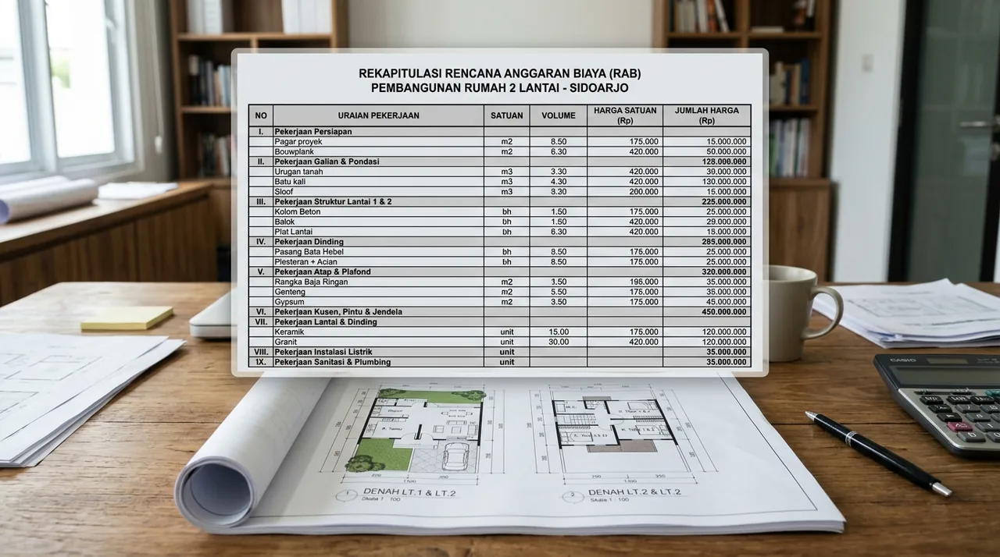
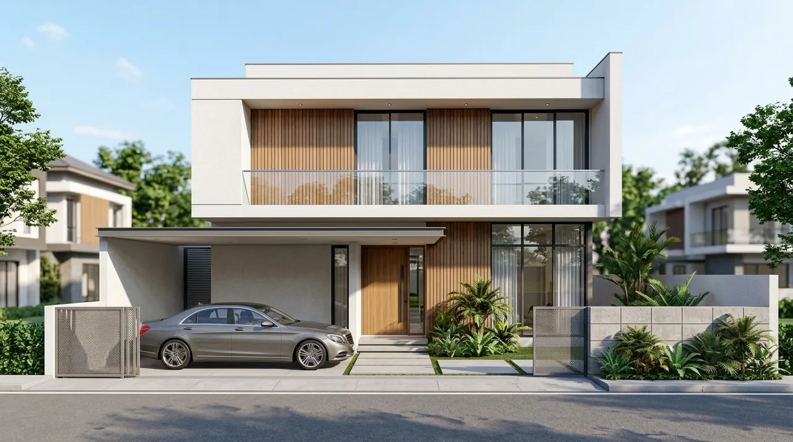
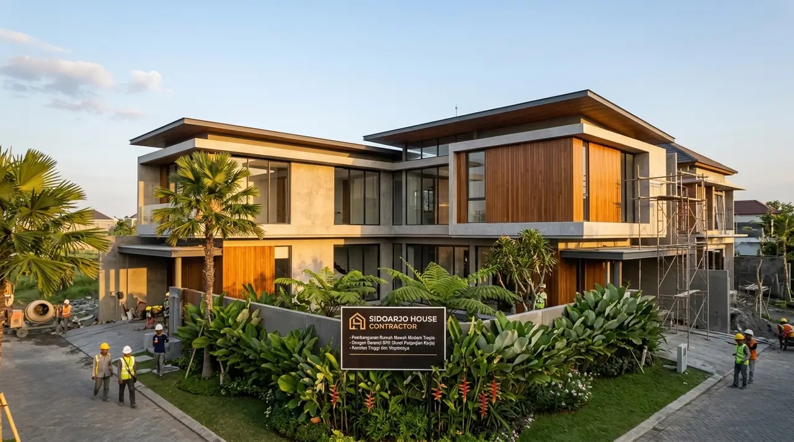
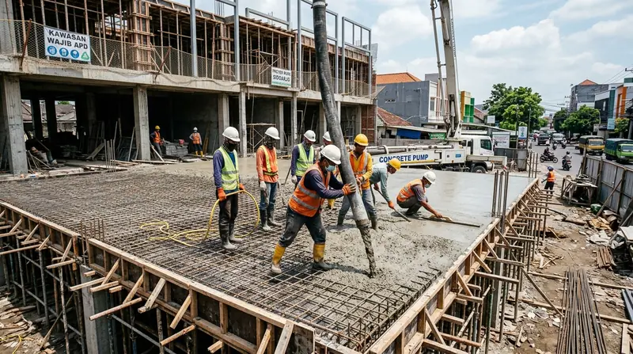

# Master SEO Content (3 Articles Konstruksi Rumah & Ruko Komersial Sidoarjo)
*Diterbitkan otomatis untuk publikasi 29 September 2026*

---

# ARTIKEL 1: Jasa Kontraktor Rumah Mewah & Minimalis di Sidoarjo Bergaransi

```
Meta Title: Kontraktor Rumah Sidoarjo Mewah & Minimalis Bergaransi SPK
Slug: /blog/kontraktor-rumah-sidoarjo-terpercaya
Meta Description: Jasa kontraktor rumah di Sidoarjo (Waru, Gedangan, Buduran, Candi). Bangun rumah baru 1-2 lantai sistem borongan turnkey, free arsitek & garansi struktur 1 tahun.
Focus Keyphrase: kontraktor rumah sidoarjo
Search Intent: Commercial / Transactional
Answer Intent: Rekomendasi Jasa / Portofolio / Solusi Bangun Rumah Turnkey
Primary Entity: Jasa Kontraktor Rumah di Sidoarjo
Secondary Entities: Bangun Rumah Mewah Sidoarjo, Jasa Arsitek Rumah Sidoarjo, Kontraktor Rumah Waru Gedangan, Borongan Rumah Turnkey Sidoarjo
Query Fan-Out:
- Berapa biaya bangun rumah per meter bersama kontraktor di Sidoarjo tahun 2026?
- Bagaimana penanganan pondasi rumah pada kondisi tanah sawah atau lempung di Sidoarjo?
- Apa keuntungan menggunakan sistem kontrak borongan turnkey dibandingkan mandiri di Sidoarjo?
Audience: Pemilik tanah kavling, keluarga muda, profesional, dan pengusaha yang ingin membangun hunian impian 1-2 lantai di kawasan Sidoarjo (Waru, Gedangan, Buduran, Candi, Sukodono, Taman).
Suggested Schema: Article, Product, FAQPage, BreadcrumbList
Author: Tim Spesialis Kontraktor Bangunan
Last Updated: 2026-09-29
Images:
- /blog/kontraktor-rumah-sidoarjo-terpercaya-01.webp | Alt: Kontraktor rumah sidoarjo pembangunan rumah mewah 2 lantai gaya modern tropis bergaransi spk
- /blog/kontraktor-rumah-sidoarjo-terpercaya-02.webp | Alt: Pengerjaan pembesian pondasi cakar ayam dan struktur balok cor beton rumah tinggal di Sidoarjo
```

# Jasa Kontraktor Rumah Mewah & Minimalis di Sidoarjo Bergaransi

**Jasa kontraktor rumah di Sidoarjo melayani pembangunan hunian modern, klasik, dan minimalis tropis secara turnkey dengan pondasi anti-ambles, pembesian SNI, dan transparansi RAB tanpa biaya siluman.**

Sidoarjo merupakan salah satu pusat hunian satelit paling dinamis di kawasan metropolitan Gerbangkertosusila. Pertumbuhan kawasan residensial di Waru, Gedangan, Sedati, Buduran, hingga Candi menuntut kehadiran kontraktor terpercaya yang memahami betul karakteristik geologi tanah Sidoarjo. Sebagian besar wilayah Sidoarjo merupakan dataran endapan aluvial bekas persawahan atau tambak dengan muka air tanah tinggi, sehingga pondasi rumah membutuhkan rekayasa cakar ayam bertulang atau tiang strauss pile yang dirancang dengan cermat untuk mencegah penurunan bangunan.

### Ringkasan Inti
* **Pondasi Kokoh Anti-Retak Rambut:** Menggunakan kombinasi pondasi batu belah, cerucuk kayu/bambu galam jika diperlukan, dan tiang strauss pile diameter 25-30 cm hingga lapisan tanah padat.
* **Sistem Borongan Turnkey Lengkap:** Paket pengerjaan menyeluruh mencakup desain arsitektur 3D eksterior-interior, gambar DED siap izin PBG, pengadaan material SNI, hingga instalasi sanitari & kelistrikan.
* **Transparansi RAB & Spesifikasi Terbuka:** Tidak ada biaya tak terduga (*hidden cost*); setiap merk semen, besi beton, keramik granit, dan cat dicantumkan detail di SPK.
* **Jaminan Masa Retensi & Garansi:** Sertifikat garansi kebocoran atap dan instalasi pipa selama 3-6 bulan, serta garansi struktur beton hingga 12 bulan.

---

<h2 id="mengapa-kontraktor-sidoarjo">Pentingnya Memilih Kontraktor Berpengalaman di Area Sidoarjo</h2>

**Pembangunan rumah di Sidoarjo menuntut keahlian menangani tanah ekspansif yang mudah kembang-susut serta elevasi peil banjir lingkungan.**

Kerap kali pemilik rumah mengeluhkan lantai keramik meledak (*popping*), dinding retak tembus, atau dinding berjamur akibat naiknya uap air tanah (*rising damp*). Bersama Kontraktor Bangunan, setiap potensi kegagalan struktur diantisipasi sejak awal:

1. **Pengukuran Peil Banjir Presisi:** Menentukan elevasi lantai dasar rumah minimal 60 – 100 cm di atas as jalan perumahan Sidoarjo untuk mengantisipasi luapan genangan air hujan musiman.
2. **Waterproofing Integral & Membran:** Aplikasi aditif waterproofing pada sloof gantung dan plat beton kamar mandi lantai 2 untuk mencegah rembesan air ke plafon bawah.
3. **Pembesian Besi Ulir SNI Full:** Menggunakan tulangan besi ulir (deformed bar) standar SNI dengan selimut beton minimum 2,5 cm untuk perlindungan korosi jangka panjang.


*Gambar 1: Desain dan konstruksi hunian minimalis modern 2 lantai berkualitas prima di perumahan Sidoarjo.*

---

<h2 id="alur-kerja-bangun-rumah">Tahapan Transparan Bangun Rumah Bersama Kontraktor Bangunan</h2>

**Proses kerja kami dibangun di atas transparansi komunikasi, ketepatan jadwal Kurva S, dan kemudahan bagi klien.**

* **Langkah 1 - Konsultasi & Survei Lokasi Gratis:** Tim arsitek dan estimator kami mengunjungi kavling Anda di Sidoarjo untuk mengukur dimensi lahan, kontur, serta orientasi arah mata angin.
* **Langkah 2 - Konsep Desain 3D & RAB Terperinci:** Penyusunan denah tata ruang fungsional, render visual fotorealistik 3D, dan Bill of Quantities (BoQ) terperinci per satuan m².
* **Langkah 3 - Penandatanganan SPK Notarial / Resmi:** Kesepakatan jadwal mulai-selesai, tahapan termin pembayaran bertahap, dan spesifikasi material tertulis.
* **Langkah 4 - Pelaksanaan Konstruksi & Laporan Progres Mingguan:** Pengawasan ketat mandor bersertifikat, dokumentasi foto/video mingguan untuk klien, dan kontrol mutu bahan.
* **Langkah 5 - Serah Terima Kunci & Masa Pemeliharaan:** Checklist bersama seluruh fungsi pintu, jendela, kelistrikan, dan sanitari sebelum serah terima kunci fisik.


*Gambar 2: Pekerjaan pembesian balok sloof dan kolom struktur beton bertulang rumah 2 lantai di Sidoarjo.*

---

<h2 id="tabel-komparasi-paket-rumah">Pilihan Paket Pembangunan Rumah Tinggal di Sidoarjo</h2>

**Tabel paket spesifikasi bangunan rumah di Kontraktor Bangunan disesuaikan dengan anggaran dan preferensi estetika klien.**

| Spesifikasi / Fitur | Paket Standar Minimalis | Paket Premium Modern | Paket Mewah / Klasik Tropis |
| :--- | :--- | :--- | :--- |
| **Estimasi Biaya / m²** | Rp 3.500.000 – Rp 4.200.000 | Rp 4.300.000 – Rp 5.500.000 | Rp 5.600.000 – Rp 7.500.000+ |
| **Pondasi** | Batu Belah + Footplate Cakar Ayam | Cakar Ayam + Strauss Pile Dia. 25 | Strauss Pile Dalam + Pile Cap Masif |
| **Struktur Beton** | Mutu K-225 Manual Mix Terstandar | Ready Mix K-250 / K-300 Slump 12 | Ready Mix K-300 + Aditif Kedap Air |
| **Dinding & Partisi** | Bata Ringan Citicon / Grand Elephant | Bata Ringan tebal 10 cm + Plester Aci | Bata Merah Bakar Super / Bata Ringan |
| **Lantai Utama** | Granit Tile 60x60 motif Polos | Granit Tile 80x80 Glazed Polished | Marmer Alam / Granit Slab 100x100 |
| **Kusen & Jendela** | Aluminium Dural 3 inch Powder Coating | Aluminium 4 inch Alexindo / YKK | Kayu Jati Perhutani / Aluminium YKK |
| **Garansi Struktur** | 6 Bulan | 12 Bulan (1 Tahun Penuh) | 24 Bulan (2 Tahun Penuh) |

---

<h2 id="faq">Pertanyaan yang Sering Diajukan (FAQ)</h2>

### Apakah saya bisa request desain arsitektur sesuai keinginan pribadi?
Tentu saja. Desain rumah dibuat 100% kustom (*custom-tailored*) sesuai kebutuhan ruang keluarga, gaya arsitektur yang disukai (Scandinavian, Japandi, Modern Tropis, atau Klasik), serta disesuaikan dengan bujet Anda.

### Bagaimana jika ada perubahan material di tengah proses pembangunan?
Setiap perubahan material atau layout dituangkan resmi dalam berita acara *Addendum / Change Order*, sehingga selisih biaya (tambah atau kurang) selalu transparan dan disetujui bersama terlebih dahulu.

### Apakah Kontraktor Bangunan membantu pengurusan izin PBG di Sidoarjo?
Ya, tim drafter dan perizinan kami siap mendampingi pengunggahan berkas teknis ke portal SIMBG Pemkab Sidoarjo hingga surat Persetujuan Bangunan Gedung (PBG) terbit resmi.

---

<h2 id="kesimpulan">Kesimpulan Praktis</h2>

Membangun rumah di Sidoarjo adalah investasi seumur hidup yang memerlukan jaminan mutu dan ketenangan pikiran. Jangan pertaruhkan anggaran Anda pada tukang harian tanpa ikatan kontrak resmi. Konsultasikan rencana hunian impian Anda sekarang bersama Kontraktor Bangunan untuk survei lokasi dan estimasi RAB gratis!

---

# ARTIKEL 2: Rincian Biaya Bangun Rumah 2 Lantai di Sidoarjo Terbaru 2026

```
Meta Title: Biaya Bangun Rumah 2 Lantai di Sidoarjo 2026 & Simulasi RAB
Slug: /blog/biaya-bangun-rumah-2-lantai-sidoarjo
Meta Description: Cek estimasi biaya bangun rumah 2 lantai di Sidoarjo per m2 tahun 2026. Rincian struktur cakar ayam/strauss, dak beton cor, bata ringan & simulasi RAB tipe 100-200.
Focus Keyphrase: biaya bangun rumah 2 lantai sidoarjo
Search Intent: Commercial / Informational
Answer Intent: Estimasi Harga / Rincian Pekerjaan / Simulasi RAB Lengkap
Primary Entity: Estimasi Biaya Bangun Rumah 2 Lantai Sidoarjo
Secondary Entities: Simulasi RAB Rumah Sidoarjo, Biaya Dak Cor Lantai 2 Sidoarjo, Harga Borongan Rumah per Meter Sidoarjo, Estimasi Bangun Rumah Tipe 120
Query Fan-Out:
- Berapa kisaran biaya borongan per meter bangun rumah tingkat 2 di Sidoarjo tahun 2026?
- Apa saja faktor yang menyebabkan biaya bangun rumah 2 lantai lebih tinggi dibanding 1 lantai?
- Berapa simulasi total anggaran membangun rumah 2 lantai ukuran tipe 120 atau tipe 150 di Sidoarjo?
Audience: Calon pemilik rumah tinggal yang sedang menyusun anggaran finansial pembangunan rumah bertingkat di Sidoarjo dan sekitarnya.
Suggested Schema: Article, Product, FAQPage, BreadcrumbList
Author: Tim Spesialis Kontraktor Bangunan
Last Updated: 2026-09-29
Images:
- /blog/biaya-bangun-rumah-2-lantai-sidoarjo-01.webp | Alt: Biaya bangun rumah 2 lantai sidoarjo fasad modern minimalis dengan balkon kaca dan carport mobil
- /blog/biaya-bangun-rumah-2-lantai-sidoarjo-02.webp | Alt: Rincian estimasi biaya dan tabel analisa rencana anggaran biaya rab rumah 2 lantai di Sidoarjo
```

# Rincian Biaya Bangun Rumah 2 Lantai di Sidoarjo Terbaru 2026

**Rata-rata biaya bangun rumah 2 lantai di Sidoarjo pada tahun 2026 berkisar antara Rp 3.800.000 hingga Rp 5.500.000 per meter persegi, tergantung pada spesifikasi dak lantai beton, kedalaman pondasi strauss, dan material finishing arsitektur.**

Membangun rumah 2 lantai di lahan terbatas menjadi pilihan populer di Sidoarjo guna memaksimalkan ruang hidup keluarga. Namun, membangun ke atas membutuhkan alokasi biaya struktural yang lebih besar dibandingkan rumah 1 lantai. Pondasi harus diperdalam untuk memikul beban bertingkat, balok pembagi (*ring balk*) dan kolom harus diperbesar dimensinya, serta pekerjaan pengecoran dak lantai 2 membutuhkan ketelitian tinggi agar tidak terjadi lendutan (*deflection*) maupun rembesan air.

### Ringkasan Inti
* **Standar Biaya Konstruksi 2026:** Kategori ekonomis-standar Rp 3.800.000 – Rp 4.300.000/m², kategori menengah-premium Rp 4.400.000 – Rp 5.200.000/m², dan kategori mewah mulai Rp 5.500.000/m².
* **Porsi Biaya Struktur:** Pos pekerjaan struktur beton bertulang (pondasi strauss, footplate, kolom, balok, dan dak plat lantai) menyerap 40% hingga 50% dari total keseluruhan anggaran.
* **Metode Dak Beton:** Pengecoran dak menggunakan Ready Mix mutu K-250 dengan ketebalan plat 12 cm dan wiremesh M8 dua lapis rata-rata membutuhkan biaya Rp 750.000 – Rp 950.000/m².
* **Solusi Efisiensi:** Memilih denah dengan kolom struktur yang segaris (*grid teratur*) dapat menghemat volume beton dan besi hingga 12%.

---

<h2 id="faktor-biaya-2-lantai">Mengapa Biaya Bangun Rumah 2 Lantai Berbeda dengan 1 Lantai?</h2>

**Pertambahan lantai menggandakan kebutuhan beban dukung tanah dan memerlukan komponen tangga, dak beton, serta peralatan perancah (scaffolding).**

Elemen-elemen pembentuk kenaikan biaya pada rumah 2 lantai:
1. **Pondasi Kombinasi Dalam (Strauss Pile):** Tanah Sidoarjo menuntut pondasi tiang bor manual (strauss) sedalam 4-6 meter di setiap titik kolom utama untuk mentransfer beban ke tanah keras.
2. **Plat Dak Lantai 2:** Membutuhkan bekisting multipleks tebal, perancah besi pipa scaffolding, penulangan ganda, dan cairan aditif anti-bocor (*waterproofing integral*).
3. **Pekerjaan Tangga Beton Bertulang:** Pembuatan struktur tangga cor lengkap dengan railing besi hollow/kaca tempered dan pegangan kayu solid.
4. **Instalasi Pipa Sanitari Bertingkat:** Pemasangan pipa air bersih bertekanan (*booster pump*), pipa air kotor vertikal pipa PVC AW, dan talang pembuangan hujan tertutup.


*Gambar 1: Visualisasi rumah 2 lantai elegan modern dengan alokasi anggaran efisien di kawasan Sidoarjo.*

---

<h2 id="simulasi-rab-tipe-120">Simulasi Rincian RAB Rumah 2 Lantai Luas Bangunan 120 m² di Sidoarjo</h2>

**Berikut simulasi estimasi anggaran untuk rumah 2 lantai dengan luas total 120 m² (luas lantai 1: 65 m², lantai 2: 55 m²) kelas Menengah-Premium.**

| No | Uraian Pekerjaan | Persentase | Total Biaya (Rp) |
| :---: | :--- | :---: | :---: |
| 1 | **Pekerjaan Persiapan:** Pembersihan kavling, bouwplank presisi, air kerja & listrik | 2.5% | Rp 13.500.000 |
| 2 | **Pondasi & Tanah:** Galian, buang tanah, strauss pile 16 titik dia. 30 cm, cakar ayam, sloof gantung 20x35 | 14.0% | Rp 75.600.000 |
| 3 | **Struktur Beton Lantai 1 & 2:** Kolom utama K-250, balok lantai, dak cor t=12cm, tangga beton bertulang | 30.5% | Rp 164.700.000 |
| 4 | **Pekerjaan Dinding & Plafon:** Pasangan bata ringan Citicon, plester aci semen instan, plafon gypsum rangka hollow galvalum | 15.0% | Rp 81.000.000 |
| 5 | **Atap & Rangka:** Rangka baja ringan galvalum tebal 0.75 mm SNI, genteng beton flat/keramik berglazur | 9.0% | Rp 48.600.000 |
| 6 | **Finishing Lantai & Dinding:** Granit tile 60x60 glazed polished, keramik dinding kamar mandi & dapur | 12.0% | Rp 64.800.000 |
| 7 | **Kusen, Pintu & Jendela:** Kusen aluminium hitam powder coating 4 inch, pintu utama panel kayu solid | 6.5% | Rp 35.100.000 |
| 8 | **Instalasi MEP & Sanitari:** Kabel Supreme/Eterna, armature lampu LED Philips, kloset duduk TOTO/American Standard | 7.0% | Rp 37.800.000 |
| 9 | **Pengecatan & Pembersihan Akhir:** Cat interior anti noda & cat eksterior tahan cuaca tropis (Dulux/Jotun) | 3.5% | Rp 18.900.000 |
| **TOTAL** | **Estimasi Total Nilai Kontrak (Borongan Turnkey All-In)** | **100%** | **Rp 540.000.000** |

*Rata-rata biaya diperoleh adalah **Rp 4.500.000 / m²**, siap huni tanpa repot mengurus material secara mandiri.*


*Gambar 2: Transparansi data Rencana Anggaran Biaya (RAB) menghindarkan pembengkakan biaya di kemudian hari.*

---

<h2 id="tips-hemat-bangun-2-lantai">Panduan Praktis Menghemat Anggaran Bangun Rumah Tingkat di Sidoarjo</h2>

* **Bentuk Denah Geometris Simetris:** Hindari lekukan dinding yang terlalu rumit atau sudut non-siku karena akan memperbanyak pemotongan material keramik dan menambah waktu kerja tukang.
* **Manfaatkan Pencahayaan Alami (Void & Skylight):** Menempatkan void di atas tangga mengurangi kebutuhan lampu di siang hari serta memperlancar sirkulasi udara sejuk.
* **Pilih Kontraktor dengan Desain Arsitek Terintegrasi:** Kontraktor Bangunan memberikan layanan desain arsitek dan DED gratis bagi Anda yang mengambil paket pembangunan borongan turnkey penuh.

---

<h2 id="faq">Pertanyaan yang Sering Diajukan (FAQ)</h2>

### Apakah biaya Rp 4,5 juta per meter sudah termasuk instalasi listrik dan air?
Ya, paket borongan turnkey kami sudah mencakup titik instalasi saklar, stop kontak, instalasi pipa air bersih dari tandon, serta instalasi septic tank biofil modern ramah lingkungan.

### Berapa lama waktu yang dibutuhkan untuk membangun rumah 2 lantai tipe 120 di Sidoarjo?
Waktu pengerjaan standar berkisar antara 4 hingga 5 bulan kalender, tergantung cuaca dan kelancaran akses jalan material ke kavling Anda.

### Apakah saya boleh menyediakan beberapa material tertentu sendiri (misal lampu gantung atau sanitari)?
Bisa. Item pekerjaan tersebut dapat dikeluarkan dari BoQ (*deduction*) sehingga Anda hanya membayar ongkos pasangnya saja.

---

<h2 id="kesimpulan">Kesimpulan Praktis</h2>

Mengetahui estimasi biaya bangun rumah 2 lantai sejak awal memberikan Anda kepastian finansial untuk mewujudkan hunian yang kokoh, nyaman, dan bernilai jual tinggi. Dapatkan estimasi RAB resmi dan konsultasi gratis langsung dari kontraktor ahli kami hari ini.

---

# ARTIKEL 3: Jasa Bangun Ruko & Renovasi Tempat Usaha Komersial di Sidoarjo

```
Meta Title: Jasa Bangun Ruko & Tempat Usaha Sidoarjo Desain Modern
Slug: /blog/jasa-bangun-ruko-sidoarjo
Meta Description: Kontraktor bangun ruko 2-3 lantai di Sidoarjo (koridor Waru, Aloha, Lingkar Timur). Struktur beton bertulang kokoh, fasad ACP/kaca & kepengurusan PBG SIMBG.
Focus Keyphrase: jasa bangun ruko sidoarjo
Search Intent: Commercial / B2B Transactional
Answer Intent: Rekomendasi Jasa / Panduan Ruko Komersial / Spesifikasi Usaha
Primary Entity: Jasa Bangun Ruko di Sidoarjo
Secondary Entities: Kontraktor Ruko Waru Sidoarjo, Bangun Tempat Usaha Kafe Sidoarjo, Biaya Bangun Ruko 2 Lantai Sidoarjo, Renovasi Ruko Komersial Lingkar Timur
Query Fan-Out:
- Berapa biaya bangun ruko 2 lantai atau 3 lantai per meter di koridor bisnis Sidoarjo?
- Bagaimana rancang bangun ruko yang memiliki fleksibilitas untuk disewakan atau kantor?
- Apa saja syarat perizinan PBG usaha dan tata ruang garis sempadan bangunan (GSB) ruko di Sidoarjo?
Audience: Pengembang properti komersial, pelaku usaha ritel, pemilik klinik, kafe, kantor cabang, dan investor properti ruko di Sidoarjo.
Suggested Schema: Article, Product, FAQPage, BreadcrumbList
Author: Tim Spesialis Kontraktor Bangunan
Last Updated: 2026-09-29
Images:
- /blog/jasa-bangun-ruko-sidoarjo-01.webp | Alt: Jasa bangun ruko sidoarjo deretan ruko modern 3 lantai dengan fasad acp kaca dan area parkir luas
- /blog/jasa-bangun-ruko-sidoarjo-02.webp | Alt: Proses konstruksi struktur beton bertulang dak cor lantai ruko komersial di Sidoarjo
```

# Jasa Bangun Ruko & Renovasi Tempat Usaha Komersial di Sidoarjo

**Jasa bangun ruko di Sidoarjo membantu pelaku usaha dan investor membangun ruko 2 hingga 3 lantai dengan layout modular fleksibel, struktur lantai berdaya dukung tinggi, dan estetika fasad komersial modern penarik pengunjung.**

Aktivitas perniagaan di Kabupaten Sidoarjo berkembang sangat pesat di sepanjang jalur arteri protokol seperti Waru, Aloha, Gedangan, Jalan Raya Buduran, hingga Jalan Lingkar Timur dan Porong. Membangun Rumah Toko (Ruko) atau tempat usaha komersial memerlukan pendekatan arsitektur yang berorientasi pada nilai komersial (*commercial viability*), kemudahan akses parkir pengunjung, kepatuhan Garis Sempadan Bangunan (GSB), serta ketahanan struktur lantai terhadap beban inventaris barang dagangan yang padat.

### Ringkasan Inti
* **Layout Terbuka (*Open Plan*):** Desain interior lantai dasar tanpa banyak sekat kolom (*clear area*) untuk memaksimalkan display produk ritel, showroom, ataupun kafe.
* **Fasad Komersial Eye-Catching:** Kombinasi material *curtain wall glass*, Aluminium Composite Panel (ACP) Seven / Alucobond, dan *louvre* penutup outdoor AC yang elegan.
* **Kekuatan Lantai Komersial:** Perhitungan struktur beban hidup (*live load*) lantai 1 dan 2 minimal 300 – 400 kg/m², mampu menampung etalase berat dan mobilitas pengunjung.
* **Kepatuhan Izin PBG Usaha:** Asistensi pemenuhan ketentuan AMDAL Lalu Lintas (Andalalin), proteksi hidran kebakaran, dan legalitas SIMBG Pemkab Sidoarjo.

---

<h2 id="keunggulan-bangun-ruko">Kriteria Ruko Komersial Sukses di Koridor Bisnis Sidoarjo</h2>

**Ruko yang sukses bukan hanya kokoh secara sipil, tetapi memiliki daya tarik visual yang meningkatkan nilai sewa dan trafik pelanggan bisnis.**

Aspek krusial dalam perencanaan ruko bersama Kontraktor Bangunan:
1. **Area Parkir (*Drop-off & Paving*):** Alokasi ruang parkir mobil dan motor yang memadai di depan ruko dengan paving block tebal 8 cm mutu K-300 yang tidak mudah amblas.
2. **Pintu Keamanan Rolling Door Otomatis:** Pemasangan *rolling door one sheet* atau *heavy duty rolling shutter* bermotor elektrik untuk keamanan maksimal aset toko.
3. **Sistem Mekanikal & Kelistrikan Komersial:** Penyediaan daya listrik PLN 3 phase (di atas 6.600 VA), jalur pipa pembuangan limbah grease trap untuk usaha kuliner/kafe, dan instalasi genset cadangan.


*Gambar 1: Rancang bangun kompleks ruko komersial modern 3 lantai di koridor bisnis Sidoarjo.*

---

<h2 id="tabel-komparasi-ruko">Tabel Komparasi Bangun Ruko 2 Lantai vs 3 Lantai di Sidoarjo</h2>

**Panduan estimasi biaya dan peruntukan bisnis ruko komersial di kawasan Sidoarjo.**

| Parameter Evaluasi | Ruko 2 Lantai Standar (Dimensi 4.5 x 14 m) | Ruko 3 Lantai Premium (Dimensi 5 x 16 m) |
| :--- | :--- | :--- |
| **Total Luas Bangunan** | ± 120 – 130 m² | ± 220 – 240 m² |
| **Estimasi Biaya / m²** | Rp 3.600.000 – Rp 4.300.000 | Rp 4.200.000 – Rp 5.200.000 |
| **Total Estimasi Proyek** | Rp 450.000.000 – Rp 550.000.000 | Rp 950.000.000 – Rp 1.250.000.000 |
| **Peruntukan Ideal** | Minimarket, Apotek, Kantor Notaris, Salon | Kantor Bank/Fintech, Restoran, Klinik Medis, Coworking |
| **Struktur Pondasi** | Strauss Pile Dia. 25 + Cakar Ayam | Strauss Pile Dia. 35 Dalam + Balok Tie Beam K-300 |
| **Material Fasad** | Cat Weathercoat + Kaca Kusen Aluminium | Aluminium Composite Panel (ACP) + Curtain Wall |
| **Estimasi Durasi Kerja** | 3.5 – 4.5 Bulan | 5 – 6.5 Bulan |


*Gambar 2: Tahap pengecoran dak lantai bertingkat pada proyek pembangunan deretan unit ruko komersial.*

---

<h2 id="layanan-renovasi-ruko">Layanan Renovasi & Alih Fungsi Ruko Lama</h2>

Bagi pemilik ruko tua di kawasan Krian atau Sidoarjo Kota, kami melayani:
* **Peremajaan Fasad (Re-Facelift):** Membongkar dinding depan usang dan menggantinya dengan fasad modern ACP dan kaca frameless.
* **Penambahan Lantai Mezzanine:** Memanfaatkan plafon tinggi (*double volume*) dengan menambahkan lantai mezzanine berstruktur baja ringan atau WF untuk menambah kapasitas meja kantor.
* **Waterproofing Dak Talang:** Mengatasi kebocoran dak atap beton ruko yang sering menjadi sumber utama rembesan air ke dinding toko.

---

<h2 id="faq">Pertanyaan yang Sering Diajukan (FAQ)</h2>

### Apakah Kontraktor Bangunan bisa membangun ruko secara bertahap (struktur dulu)?
Bisa. Kami melayani skema pengerjaan struktur utama (*bare finish*) terlebih dahulu hingga atap tertutup, dan finishing arsitektur dapat dilanjutkan kemudian sesuai kesiapan anggaran Anda.

### Bagaimana kepengurusan izin GSB dan PBG ruko di pinggir jalan provinsi Sidoarjo?
Kami membantu perhitungan sempadan jalan sesuai Perda Tata Ruang Sidoarjo dan mendampingi pengajuan izin teknis hingga persetujuan PBG SIMBG resmi diterbitkan.

### Apakah ada diskon khusus untuk pembangunan deretan ruko majemuk (ruko gandeng 3-5 pintu)?
Ya! Pembangunan ruko gandeng memberikan efisiensi dinding bersama (*party wall*) dan volume pondasi massal, sehingga kami memberikan penawaran harga khusus yang jauh lebih hemat per unitnya.

---

<h2 id="kesimpulan">Kesimpulan Praktis</h2>

Membangun ruko dengan kualitas konstruksi unggul dan tampilan fasad profesional adalah magnet penarik pelanggan bagi bisnis yang beroperasi di dalamnya. Jadikan proyek komersial Anda di Sidoarjo sukses bersama Kontraktor Bangunan. Hubungi kami untuk jadwal survei dan penawaran RAB terbaik hari ini!
