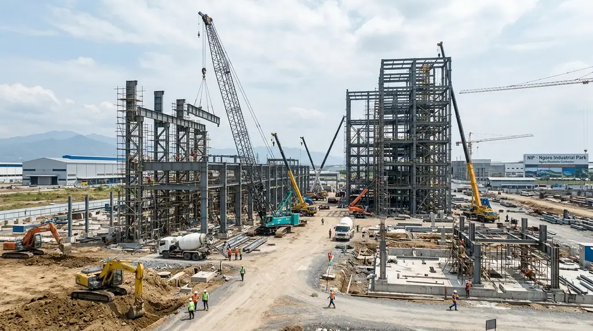
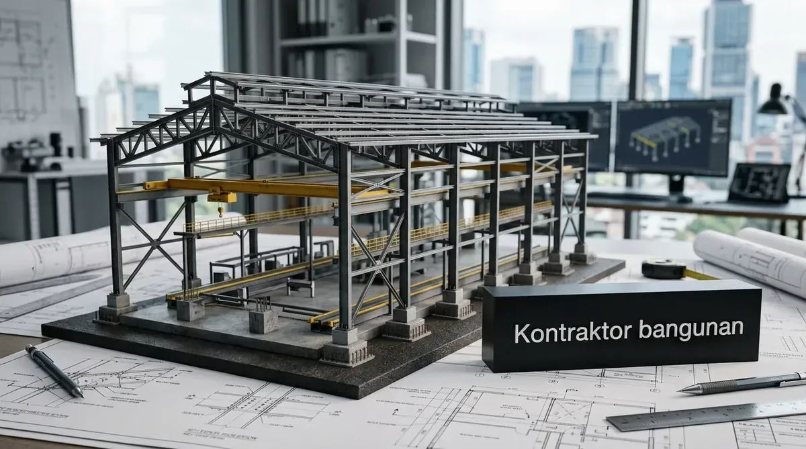
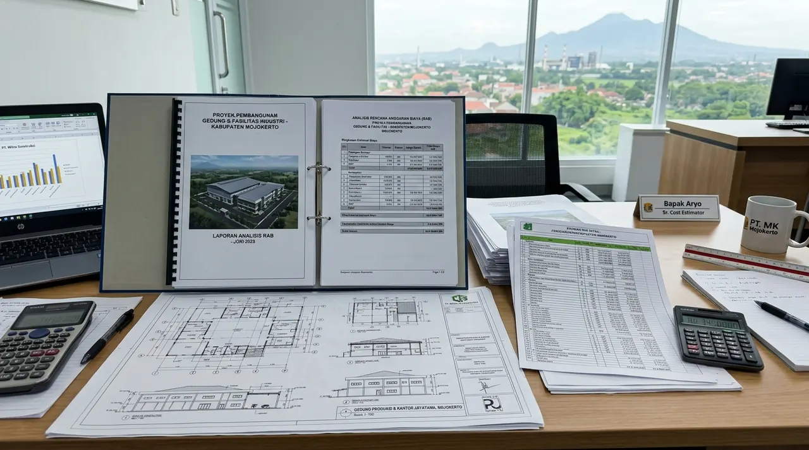
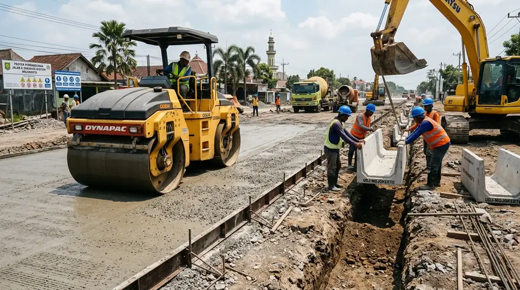
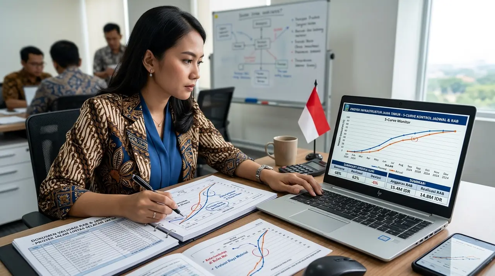

# Master SEO Content (3 Articles Konstruksi Industri Mojokerto & Manajemen Konstruksi Jatim)
*Diterbitkan otomatis untuk publikasi 30 September 2026*

---

# ARTIKEL 1: Jasa Kontraktor Bangunan Industri di Kawasan Ngoro Mojokerto (NIP)

```
Meta Title: Kontraktor Pabrik Ngoro Mojokerto (NIP) Konstruksi Baja WF
Slug: /blog/kontraktor-kawasan-industri-ngoro-mojokerto
Meta Description: Jasa kontraktor pabrik & gudang di Ngoro Industrial Park (NIP) Mojokerto. Rangka baja bentang lebar, standarisasi K3, drainage industri & perizinan PBG/SLF.
Focus Keyphrase: kontraktor ngoro mojokerto
Search Intent: Commercial / B2B Transactional
Answer Intent: Rekomendasi / Rekayasa Industri / Kepatuhan Standar NIP
Primary Entity: Jasa Kontraktor Bangunan Industri Ngoro Mojokerto
Secondary Entities: Kontraktor Ngoro Industrial Park (NIP), Jasa Bangun Pabrik Mojokerto, Konstruksi Baja WF Mojokerto, Rancang Bangun Gudang NIP
Query Fan-Out:
- Bagaimana standar teknis konstruksi pabrik di dalam kawasan Ngoro Industrial Park (NIP)?
- Berapa estimasi biaya pembangunan gedung workshop baja WF di wilayah Ngoro Mojokerto?
- Apa saja persyaratan AMDAL, PBG, dan Sertifikat Laik Fungsi (SLF) industri di Pemkab Mojokerto?
Audience: Manajemen perusahaan PMA/PMDN, direktur operasional pabrik, investor industri manufaktur, dan manajer fasilitas kawasan Ngoro Mojokerto.
Suggested Schema: Article, Product, FAQPage, BreadcrumbList
Author: Tim Spesialis Kontraktor Bangunan
Last Updated: 2026-09-30
Images:
- /blog/kontraktor-kawasan-industri-ngoro-mojokerto-01.webp | Alt: Kontraktor ngoro mojokerto pembangunan fasilitas pabrik manufaktur industri baja di kawasan nip
- /blog/kontraktor-kawasan-industri-ngoro-mojokerto-02.webp | Alt: Konstruksi portal frame baja wf bentang lebar dan kolom pedestal beton bertulang di Ngoro Mojokerto
```

# Jasa Kontraktor Bangunan Industri di Kawasan Ngoro Mojokerto (NIP)

**Kontraktor bangunan industri di Ngoro Mojokerto (NIP) menghadirkan rekayasa konstruksi presisi untuk pabrik manufaktur dan gudang berbentang lebar dengan pemenuhan standar regulasi lingkungan kawasan dan sertifikasi keselamatan K3.**

Kawasan Industri Ngoro atau *Ngoro Industrial Park* (NIP) di Kabupaten Mojokerto telah berkembang menjadi salah satu pusat investasi industri manufaktur, keramik, otomotif, kemasan, hingga produk makanan-minuman berorientasi ekspor terpenting di Jawa Timur. Membangun fasilitas produksi di NIP membutuhkan kontraktor yang tidak hanya piawai dalam rekayasa sipil struktur baja dan pondasi lereng Gunung Penanggungan, melainkan juga patuh terhadap regulasi pengelola kawasan (estate regulation), standar keselamatan K3 berskala internasional, serta kepengurusan izin terpadu di Kabupaten Mojokerto.

### Ringkasan Inti
* **Kepatuhan Terhadap Regulasi Kawasan NIP:** Koordinasi menyeluruh dengan pengelola kawasan terkait tata saluran air limbah, beban listrik gardu trafo, batas sempadan bangunan, dan akses kontainer.
* **Geoteknik Lereng & Daya Dukung Tanah:** Analisa pondasi tanah batuan keras berkerikil (*gravel/hard silt*) khas lereng Mojokerto selatan yang membutuhkan pemadatan dan pondasi telapak/strauss bertulang kokoh.
* **Struktur Baja Bentang Lebar (*Long-Span Portal*):** Menggunakan profil baja WF SNI bersertifikat uji tarik dengan perakitan sambungan torsi tinggi (*high-strength bolted connections*) tanpa pengelasan liar di lapangan.
* **Perizinan Terpadu PBG & SLF Industri:** Jaminan kelengkapan berkas teknis as-built drawing, uji hidran pemadam, uji instalasi petir, hingga penerbitan Sertifikat Laik Fungsi (SLF) industri.

---

<h2 id="keunggulan-konstruksi-ngoro">Standar Mutu Konstruksi Pabrik di Koridor Ngoro Mojokerto</h2>

**Pabrik modern di Ngoro menuntut integrasi antara struktur fisik yang kuat, efisiensi sirkulasi udara alami, dan jalur utilitas mesin presisi.**

Keunggulan layanan Kontraktor Bangunan di Ngoro Mojokerto:
1. **Penerapan Sistem Manajemen K3 Konstruksi (SMK3):** Setiap pekerja dilengkapi Alat Pelindung Diri (APD) berstandar SNI, sertifikasi bekerja di ketinggian (*Working at Height*), dan pengawasan harian oleh Ahli K3 Konstruksi bersertifikat Kemnaker.
2. **Lantai Beton Tahan Beban Dinamis Mesin:** Pengecoran plat lantai dengan mutu beton Ready Mix K-350 hingga K-400, diperkuat *double wiremesh* M10 dan taburan *hardener non-metallic* untuk ketahanan abrasi lalu lintas forklift 5 ton.
3. **Sistem Drainase Bebas Genangan:** Perancangan saluran terbuka dan tertutup beton *u-ditch* yang terhubung langsung ke saluran primer kawasan NIP untuk mencegah genangan air saat curah hujan ekstrem.


*Gambar 1: Pembangunan pabrik manufaktur modern berstruktur baja bentang lebar di kawasan Ngoro Mojokerto.*

---

<h2 id="tahapan-kerja-nip">Tahapan Alur Pelaksanaan Proyek Industri di NIP Mojokerto</h2>

**Pelaksanaan sistematis dimulai dari site development, perizinan estate, konstruksi fisik, komisioning mekanikal-elektrikal, hingga serah terima laik fungsi.**

* **Tahap 1 - Penyelidikan Tanah & Desain DED:** Uji sondir dan pengeboran bor mesin (*core drill*), dilanjutkan penyusunan gambar kerja arsitektur, perhitungan struktur SAP2000, serta desain jalur pipa hidran & kelistrikan pabrik.
* **Tahap 2 - Pekerjaan Tanah & Pondasi:** Cut and fill presisi, pemadatan tanah subgrade per layer dengan vibro roller 10 ton, dan pengecoran pondasi telapak/pedestal beton bertulang.
* **Tahap 3 - Fabrikasi & Ereksi Rangka Baja WF:** Perakitan profil baja di workshop terkontrol, pengecatan primer zinkromate, dan instalasi lapangan menggunakan mobile crane kapasitas 35-50 ton.
* **Tahap 4 - Pengecoran Plat Lantai & Cladding:** Pengecoran plat lantai metode jidar laser, aplikasi hardener, serta penutupan atap dan dinding menggunakan seng spandek zincalume berinsulasi peredam panas.
* **Tahap 5 - Testing & Commissioning Utilitas:** Uji tekan pipa hidran, uji beban struktur lantai, uji tahanan grounding petir (< 2 ohm), dan pengurusan berkas SLF.


*Gambar 2: Ereksi portal frame baja WF dan penyiapan kolom pedestal beton pada proyek industri di Mojokerto.*

---

<h2 id="tabel-komparasi-ngoro">Tabel Estimasi Biaya & Spesifikasi Fasilitas Pabrik di Ngoro</h2>

**Tabel panduan klasifikasi bangunan industri di kawasan Ngoro Mojokerto.**

| Tipe Bangunan | Estimasi Biaya / m² | Spesifikasi Utama Struktur | Peruntukan Industri |
| :--- | :--- | :--- | :--- |
| **Gudang Logistik Finished Goods** | Rp 2.600.000 – Rp 3.300.000 | Rangka Baja WF 250-350, Lantai K-300 tebal 15 cm, Atap Spandek 0.45mm | Pergudangan Pallet, Distribusi Barang |
| **Pabrik Manufaktur Standar** | Rp 3.400.000 – Rp 4.200.000 | Baja WF 350-500, Lantai K-350 tebal 20 cm + Hardener, Kanopi Loading Dock | Industri Kemasan, Otomotif, Tekstil |
| **Pabrik Makanan / Higienis** | Rp 4.200.000 – Rp 5.800.000 | Cleanroom Panel Sandwich PUF, Lantai Epoxy PU Screed 3 mm, Ruang AHU | Makanan & Minuman, Farmasi, Kosmetik |
| **Gedung Kantor Pabrik & Lab** | Rp 3.800.000 – Rp 4.800.000 | Struktur Beton Bertulang K-250, Kusen Aluminium Alexindo, Fasad ACP | Kantor Manajemen, Laboratorium QC |

---

<h2 id="faq">Pertanyaan yang Sering Diajukan (FAQ)</h2>

### Apakah Kontraktor Bangunan memiliki pengalaman bekerja di dalam kawasan NIP?
Ya, tim teknis kami sangat memahami prosedur kerja (*Working Permit*), standar jam kerja, dan koordinasi teknis utilitas dengan pihak pengelola kawasan Ngoro Industrial Park (NIP).

### Bagaimana penanganan pengadaan air bersih dan instalasi pengolahan limbah (IPAL)?
Kami melayani instalasi ground water tank (GWT), sistem pompa booster, hingga pembangunan bak pengolahan limbah (IPAL/WTP) berstruktur beton kedap air beraditif kristalin anti-bocor.

### Apakah dokumen gambar DED sudah siap diajukan untuk sidang PBG Kabupaten Mojokerto?
Seluruh dokumen teknis kami disusun dan ditandatangani oleh arsitek berlisensi STRA serta insinyur struktur ber-SKA HAKI resmi, sehingga dijamin lolos verifikasi SIMBG Pemkab Mojokerto.

---

<h2 id="kesimpulan">Kesimpulan Praktis</h2>

Membangun fasilitas industri di Ngoro Mojokerto memerlukan mitra kontraktor yang tanggap terhadap regulasi kawasan, berpengalaman dalam rekayasa baja berat, dan menjunjung tinggi keselamatan kerja. Hubungi Kontraktor Bangunan sekarang untuk mendiskusikan Request for Proposal (RFP) proyek Anda.

---

# ARTIKEL 2: Estimasi Biaya Konstruksi Bangunan Gedung & Pabrik di Mojokerto 2026

```
Meta Title: Estimasi Biaya Konstruksi Bangunan & Pabrik di Mojokerto 2026
Slug: /blog/biaya-konstruksi-bangunan-mojokerto
Meta Description: Panduan rincian biaya konstruksi gedung, ruko & pabrik di Mojokerto 2026. Analisa AHSP pekerjaan tanah, struktur baja WF, dinding precast & tata air kawasan.
Focus Keyphrase: biaya konstruksi mojokerto
Search Intent: Commercial / Informational
Answer Intent: Estimasi Biaya / Rincian BoQ / Panduan Anggaran Proyek
Primary Entity: Estimasi Biaya Konstruksi Bangunan di Mojokerto
Secondary Entities: Biaya Bangun Pabrik Mojokerto, Harga Baja WF Mojokerto 2026, RAB Bangunan Komersial Mojokerto, Biaya Konstruksi per Meter Jawa Timur
Query Fan-Out:
- Berapa estimasi biaya konstruksi gedung dan pabrik per meter persegi di Mojokerto tahun 2026?
- Apa perbandingan biaya konstruksi di Mojokerto dibandingkan Surabaya atau Sidoarjo?
- Bagaimana cara menghitung RAB struktur pondasi dan konstruksi baja di kawasan industri Mojokerto?
Audience: Pengembang properti, manajer pengadaan (procurement), investor komersial, dan pemilik bisnis yang merencanakan konstruksi di Mojokerto.
Suggested Schema: Article, Product, FAQPage, BreadcrumbList
Author: Tim Spesialis Kontraktor Bangunan
Last Updated: 2026-09-30
Images:
- /blog/biaya-konstruksi-bangunan-mojokerto-01.webp | Alt: Biaya konstruksi mojokerto analisa rencana anggaran biaya rab bangunan gedung dan fasilitas industri
- /blog/biaya-konstruksi-bangunan-mojokerto-02.webp | Alt: Pekerjaan pemadatan jalan beton rigit pavement dan saluran drainase u ditch proyek di Mojokerto
```

# Estimasi Biaya Konstruksi Bangunan Gedung & Pabrik di Mojokerto 2026

**Estimasi biaya konstruksi bangunan komersial dan fasilitas industri di Mojokerto pada tahun 2026 berkisar antara Rp 2.700.000 hingga Rp 4.500.000 per meter persegi, menawarkan efisiensi biaya logistik material dan upah kerja lokal yang sangat kompetitif di Jawa Timur.**

Kabupaten dan Kota Mojokerto terus menjadi primadona bagi relokasi dan ekspansi investasi industri berkat akses langsung jalan tol Trans Jawa (Tol Sumo dan Kertosono-Mojokerto). Dibandingkan dengan Surabaya atau Sidoarjo, Mojokerto menawarkan efisiensi biaya konstruksi yang menarik, terutama dari ketersediaan agregat pasir dan batu kali lokal dari lereng Gunung Welirang-Penanggungan, serta Upah Minimum Kabupaten (UMK) yang lebih bersahabat untuk pos upah tenaga kerja tukang konstruksi.

### Ringkasan Inti
* **Tingkat Efisiensi Anggaran:** Biaya konstruksi di Mojokerto rata-rata 10% hingga 15% lebih ekonomis dibandingkan proyek sejenis di Surabaya atau Gresik.
* **Biaya Peruntukan Bangunan:** Gudang dan workshop berada di rentang Rp 2.700.000 – Rp 3.400.000/m², gedung kantor/komersial Rp 3.500.000 – Rp 4.500.000/m².
* **Keunggulan Material Lokal:** Biaya pengadaan pasir pasang, pasir cor, dan batu belah pondasi lebih murah karena dekat dengan kuari resmi Mojokerto selatan.
* **Metode Kontrak Transparan:** Penerapan kontrak lump-sum fix price berbasis BoQ detail melindungi pemilik proyek dari risiko pembengkakan anggaran (*cost overrun*).

---

<h2 id="analisa-pos-biaya-mojokerto">Analisa Pos Biaya Utama dalam Proyek Konstruksi di Mojokerto</h2>

**Alokasi anggaran konstruksi terbagi secara proporsional guna menjamin integritas struktur dan penyelesaian estetika arsitektur.**

Berikut jabaran pos pekerjaan pokok:

1. **Pekerjaan Sipil & Pondasi (22% – 28%):** Pembersihan semak kavling, galian tanah keras, pondasi batu kali/telapak beton, serta pembesian balok sloof bertulang.
2. **Pekerjaan Rangka Struktur (32% – 38%):** Pengadaan profil baja WF/H-Beam SNI, plat sambungan, baut Grade 8.8, pengecatan anti-karat, serta ereksi dengan mobile crane.
3. **Pekerjaan Arsitektur & Dinding (18% – 24%):** Pasangan dinding bata ringan, plester aci, pintu geser industri, serta penutup atap zincalume dengan insulasi aluminium foil.
4. **Pekerjaan Lantai Heavy Duty (14% – 18%):** Pengecoran plat beton K-300/K-350 tebal 15-20 cm dengan tulangan wiremesh dan finishing trowel floor hardener.
5. **Pekerjaan MEP & Infrastruktur Luar (8% – 12%):** Saluran air kotor beton precast U-Ditch, perkerasan jalan lingkungan paving block K-300, dan panel kelistrikan utama.


*Gambar 1: Analisa teknis estimasi anggaran biaya konstruksi pabrik dan gedung komersial di Mojokerto.*

---

<h2 id="simulasi-rab-workshop-mojokerto">Simulasi RAB Pembangunan Gedung Workshop Dimensi 20 x 40 Meter (800 m²)</h2>

**Simulasi biaya pembangunan gedung workshop rangka baja di wilayah Mojokerto dengan luas bangunan 800 m².**

| No | Uraian Pekerjaan | Volume | Satuan | Harga Satuan (Rp) | Subtotal (Rp) |
| :---: | :--- | :---: | :---: | :---: | :---: |
| 1 | Pekerjaan Persiapan, Bowplank & Sondir | 1 | Ls | 25.000.000 | 25.000.000 |
| 2 | Pondasi Footplate Beton Bertulang & Sloof K-250 | 800 | m² | 320.000 | 256.000.000 |
| 3 | Struktur Baja WF Rafter & Kolom (Terpasang) | 26.500 | Kg | 28.000 | 742.000.000 |
| 4 | Penutup Atap Zincalume 0.45mm + Insulasi Glasswool | 980 | m² | 210.000 | 205.800.000 |
| 5 | Plat Lantai Beton K-350 t=15cm + Wiremesh M8 + Hardener | 800 | m² | 540.000 | 432.000.000 |
| 6 | Pasangan Dinding Bata Ringan t=3m + Plester Aci | 520 | m² | 275.000 | 143.000.000 |
| 7 | Pintu Rolling Shutter & Pintu Darurat Steel | 2 | Unit | 38.000.000 | 76.000.000 |
| 8 | Instalasi Penerangan Lampu LED & Panel Distribusi | 1 | Ls | 85.000.000 | 85.000.000 |
| 9 | Saluran Keliling U-Ditch 40x40 & Paving Parkir | 1 | Ls | 115.000.000 | 115.000.000 |
| **TOTAL** | **Estimasi Total Nilai Anggaran Konstruksi (Exclude PPN)** | | | | **Rp 2.079.800.000** |

*Rata-rata biaya diperoleh adalah sekitar **Rp 2.599.000 / m²**, memberikan efisiensi luar biasa bagi investasi fasilitas usaha.*


*Gambar 2: Pekerjaan infrastruktur luar, jalan rigit beton, dan saluran drainase U-Ditch pada kawasan proyek.*

---

<h2 id="faq">Pertanyaan yang Sering Diajukan (FAQ)</h2>

### Apakah biaya di Mojokerto bisa lebih hemat jika menggunakan kontraktor lokal?
Kontraktor Bangunan memadukan standar manajemen rekayasa modern dengan pemanfaatan sub-kontraktor material dan tenaga kerja lokal Mojokerto, sehingga menghasilkan harga kompetitif tanpa menurunkan standar mutu.

### Bagaimana jika kondisi lahan berkontur miring atau berlereng?
Kami melakukan pemetaan topografi total station terlebih dahulu untuk menghitung volume cut and fill seimbang (*balanced cut-and-fill*) guna menekan biaya pembuangan atau pengurukan tanah luar.

### Berapa lama masa pemeliharaan yang dicantumkan dalam kontrak kerja?
Masa pemeliharaan purna jual resmi kami berikan selama 3 hingga 12 bulan kalender, didukung tim respon cepat untuk perbaikan jika ditemukan kendala teknis.

---

<h2 id="kesimpulan">Kesimpulan Praktis</h2>

Efisiensi biaya konstruksi di Mojokerto adalah keuntungan strategis bagi para pelaku usaha. Pastikan anggaran proyek Anda dikelola secara transparan dan profesional bersama Kontraktor Bangunan. Hubungi kami untuk konsultasi dan survei gratis di lokasi Anda.

---

# ARTIKEL 3: Jasa Manajemen Konstruksi & Pengawasan Proyek Profesional di Jawa Timur

```
Meta Title: Jasa Manajemen Konstruksi & Pengawasan Proyek di Jawa Timur
Slug: /blog/jasa-manajemen-konstruksi-pengawasan-jatim
Meta Description: Jasa konsultan manajemen konstruksi (MK) & supervisi proyek di Jawa Timur (Surabaya, Gresik, Sidoarjo, Malang). Pengawasan mutu, jadwal Kurva S & audit biaya RAB.
Focus Keyphrase: jasa manajemen konstruksi jatim
Search Intent: Commercial / B2B Consulting
Answer Intent: Rekomendasi Jasa Konsultan / Standar Supervisi / Pengendalian Mutu
Primary Entity: Jasa Manajemen Konstruksi dan Pengawasan Proyek Jawa Timur
Secondary Entities: Konsultan Pengawas Proyek Surabaya, Audit Struktur Gedung Jatim, Manajemen Proyek Bangunan Malang, Pengendalian Biaya dan Mutu Konstruksi
Query Fan-Out:
- Apa tugas dan tanggung jawab konsultan manajemen konstruksi (MK) dalam proyek bangunan?
- Berapa tarif atau biaya jasa pengawasan proyek konstruksi di wilayah Jawa Timur?
- Bagaimana cara konsultan MK mengendalikan deviasi jadwal (Kurva S) dan mencegah pembengkakan anggaran?
Audience: Pemilik proyek (owner), investor gedung komersial, pengembang properti, dan instansi swasta yang membutuhkan tim independen untuk mengawasi kontraktor di Jawa Timur.
Suggested Schema: Article, Product, FAQPage, BreadcrumbList
Author: Tim Spesialis Kontraktor Bangunan
Last Updated: 2026-09-30
Images:
- /blog/jasa-manajemen-konstruksi-pengawasan-jatim-01.webp | Alt: Jasa manajemen konstruksi jatim tim konsultan pengawas proyek memeriksa gambar kerja dan kepatuhan mutu lapangan
- /blog/jasa-manajemen-konstruksi-pengawasan-jatim-02.webp | Alt: Validasi rencana anggaran biaya rab dan pengendalian jadwal kurva s manajemen proyek di Jawa Timur
```

# Jasa Manajemen Konstruksi & Pengawasan Proyek Profesional di Jawa Timur

**Jasa manajemen konstruksi dan pengawasan proyek di Jawa Timur memastikan proyek hunian mewah, gedung perkantoran, dan fasilitas komersial selesai tepat waktu, tepat mutu teknis SNI, dan tanpa pembengkakan anggaran melalui supervisi independen profesional.**

Banyak pemilik proyek (*project owner*) menghadapi kendala klasik saat membangun properti: progres kerja terlambat, tagihan klaim biaya membengkak tanpa rincian jelas, hingga kualitas mutu cor beton dan pembesian yang menyimpang dari gambar kerja DED awal. Tanpa kehadiran pihak ketiga yang independen dan ahli, pemilik proyek berada pada posisi yang rentan dirugikan. Layanan Manajemen Konstruksi (MK) dari Kontraktor Bangunan bertindak sebagai wakil pemilik proyek (*Owner’s Representative*) yang mengawal seluruh siklus proyek dari tahap pra-konstruksi, lelang tender kontraktor, pengawasan harian di lapangan, hingga masa serah terima akhir.

### Ringkasan Inti
* **Trilogi Pengendalian Proyek:** Mengendalikan secara ketat tiga pilar utama: Mutu Material & Kerapian (Quality), Ketepatan Jadwal Kalender (Time), dan Pengendalian Finansial Anggaran (Cost).
* **Supervisi Lapangan Harian (*Site Supervision*):** Penempatan *Site Inspector* sipil, arsitektur, dan MEP bersertifikat untuk mengawasi setiap tahapan pengecoran, pembesian, dan instalasi mekanikal.
* **Audit Opname Prestasi & Pembayaran:** Verifikasi fisik riil di lapangan sebelum menyetujui sertifikat pembayaran (*Payment Certificate*) termin kontraktor pelaksana.
* **Pencegahan Sengketa Kontrak (*Dispute Prevention*):** Menjamin administrasi proyek tertib melalui Berita Acara Perubahan Kerja (*Change Order*), notulensi rapat mingguan, dan pelaporan Kurva S berkala.

---

<h2 id="peran-manajemen-konstruksi">Tugas Pokok Konsultan Manajemen Konstruksi (MK) di Jawa Timur</h2>

**Konsultan MK menjamin setiap rupiah yang diinvestasikan pemilik proyek menghasilkan mutu fisik bangunan yang sesuai dengan spesifikasi teknis.**

Cakupan layanan Manajemen Konstruksi mencakup 4 tahapan esensial:

### 1. Tahap Pra-Konstruksi (Pre-Construction Phase)
* **Value Engineering (VE):** Menelaah gambar DED dan BoQ untuk menemukan peluang efisiensi biaya tanpa menurunkan kekuatan struktural atau estetika.
* **Manajemen Pengadaan & Tender Kontraktor:** Menyusun dokumen lelang, melakukan klarifikasi penawaran harga (*tender clarification*), dan memberikan rekomendasi kontraktor pelaksana terbaik kepada pemilik proyek.

### 2. Tahap Pengawasan Pelaksanaan Konstruksi (Construction Phase)
* **Inspeksi Material On-Site (*Material Approval*):** Memastikan besi beton yang datang adalah besi ulir SNI full, semen baru, dan pasir bebas lumpur sebelum diizinkan digunakan.
* **Persetujuan Izin Kerja (*Approval of Work/Shop Drawing*):** Memeriksa gambar kerja detail kontraktor dan memberikan izin pengecoran (*Request for Inspection/RFI*) hanya jika bekisting dan tulangan sudah sempurna.
* **Monitoring Deviasi Kurva S:** Membandingkan progres rencana dengan realisasi aktual setiap minggu. Jika terjadi deviasi minus, konsultan MK segera menerbitkan Surat Peringatan dan menyusun strategi pemulihan (*catch-up plan*).

### 3. Tahap Pengendalian Finansial & Administrasi
* Audit pengukuran volume bersama (*joint measurement*) untuk memastikan kontraktor tidak menagih melebihi persentase pekerjaan yang selesai.
* Pengelolaan klaim pekerjaan tambah-kurang secara objektif dan adil berdasarkan harga satuan kontrak awal.

### 4. Tahap Pasca-Konstruksi & Serah Terima (Post-Construction Phase)
* Pembuatan daftar cacat minor (*defect list / punch list*) sebelum serah terima pertama (PHO).
* Pengawasan perbaikan masa retensi hingga serah terima akhir (FHO) dan penyerahan dokumen *As-Built Drawings* serta manual operasi perawatan gedung.


*Gambar 1: Tim konsultan manajemen konstruksi melakukan supervisi teknis kepatuhan pembesian beton di lapangan.*

---

<h2 id="tabel-komparasi-manajemen-konstruksi">Tabel Perbandingan Proyek: Menggunakan Konsultan MK vs Tanpa Pengawas</h2>

**Tabel analisis risiko dan efisiensi proyek bangunan di wilayah Jawa Timur.**

| Parameter Evaluasi | Tanpa Konsultan Pengawas (Mandiri) | Didampingi Konsultan Manajemen Konstruksi |
| :--- | :--- | :--- |
| **Kepatuhan Terhadap Gambar DED** | Kontraktor kerap mengubah spesifikasi material demi margin sepihak | Setiap item material dan dimensi diawasi ketat sesuai RKS & BoQ |
| **Pengendalian Jadwal Kerja** | Rawan molor berbulan-bulan tanpa pertanggungjawaban | Jadwal dikontrol via Kurva S mingguan; penalti tegas jika lalai |
| **Akurasi Pembayaran Termin** | Pemilik sering membayar lebih cepat daripada progres fisik riil | Pembayaran baru disetujui setelah diverifikasi opname fisik lapangan |
| **Pencegahan Kebocoran & Retak** | Cacat baru ketahuan setelah rumah/gedung dihuni | Tes rendam waterproofing dan slump test beton dilakukan di awal |
| **Waktu & Energi Pemilik Proyek** | Pemilik stres harus setiap hari mengawasi tukang di lokasi | Pemilik cukup memantau laporan komprehensif mingguan/bulanan |


*Gambar 2: Audit dan verifikasi berkas Rencana Anggaran Biaya (RAB) serta kurva kemajuan jadwal proyek.*

---

<h2 id="skema-biaya-mk">Struktur Biaya Jasa Manajemen Konstruksi di Jawa Timur</h2>

Tarif layanan Manajemen Konstruksi dihitung berdasarkan skema transparan:
1. **Persentase Nilai Proyek (Percentage of Construction Cost):** Umumnya berkisar antara 2,5% hingga 5% dari total nilai anggaran fisik bangunan, tergantung pada kompleksitas proyek.
2. **Skema Biaya Bulanan (*Lump-Sum Monthly Retainer*):** Biaya tetap per bulan yang mencakup penempatan tim inspektur pengawas penuh waktu (*full-time site engineer*) di lokasi proyek Anda.

---

<h2 id="faq">Pertanyaan yang Sering Diajukan (FAQ)</h2>

### Kapan waktu paling tepat untuk melibatkan konsultan Manajemen Konstruksi?
Waktu paling ideal adalah sejak tahap perancangan awal atau pra-tender. Dengan demikian, konsultan MK dapat membantu melakukan *Value Engineering* dan menyaring kontraktor pelaksana yang berkualitas.

### Area mana saja di Jawa Timur yang dicakup oleh layanan Manajemen Konstruksi kami?
Kami melayani pengawasan proyek di seluruh Jawa Timur, termasuk Surabaya, Sidoarjo, Gresik, Mojokerto, Pasuruan, Malang Raya, Kediri, Madiun, Jombang, hingga Banyuwangi.

### Apakah konsultan MK memiliki kewenangan menghentikan pekerjaan yang salah?
Ya, konsultan MK memiliki wewenang kontraktual untuk menerbitkan Surat Penghentian Sementara Pekerjaan (*Stop Work Order*) jika kontraktor pelaksana melakukan pelanggaran fatal terhadap mutu atau keselamatan K3.

---

<h2 id="kesimpulan">Kesimpulan Praktis</h2>

Menggunakan jasa manajemen konstruksi profesional bukan merupakan biaya tambahan, melainkan investasi perlindungan aset yang menghemat puluhan hingga ratusan juta rupiah dari risiko overbudget dan kegagalan struktur. Percayakan supervisi proyek Anda di Jawa Timur kepada Kontraktor Bangunan.
